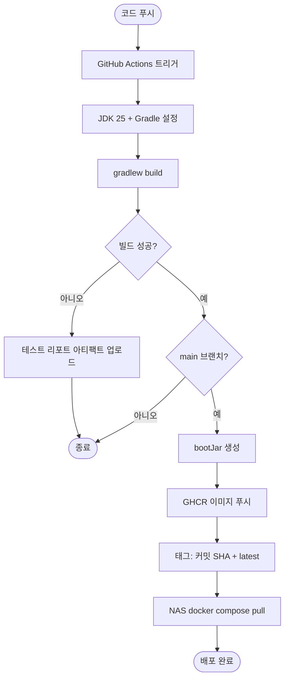

# [초기 셋업] Kotlin DSL 전환 및 Gradle 멀티모듈 골격 구성

## 개요

기능 명세서만 존재하던 상태에서 **기술 설계서를 확정**하고, 그에 맞춰 **Spring Boot 4.1.0 기반 프로젝트 골격**을 올렸다.

설계 단계에서 스택·모듈 구조·재고 정합성 설계·운영 방식을 모두 결정했고, 그중 실행 가능한 부분(빌드 구성, 애플리케이션 설정, 인프라, CI)을 먼저 구현했다. **멀티모듈 전환은 본 이슈 브랜치에서 이어서 진행한다.**

## 진행 상황

| 항목 | 상태 |
|---|---|
| 기술 설계서 확정 | 완료 (`3017ebf`) |
| Spring Initializr 골격 도입 | 완료 (`55205bb`) |
| Kotlin DSL 전환 | 완료 (`1a85abf`) |
| 의존성 구성 | 완료 |
| 프로파일 분리 · JPA/Flyway 설정 | 완료 |
| Docker Compose · Dockerfile | 완료 |
| GitHub Actions 빌드 파이프라인 | 완료 |
| **Gradle 멀티모듈 6개 전환** | **미착수 — 본 이슈 잔여 범위** |
| 공통 코드 (`BaseTimeEntity`, `UuidV7`) | 미착수 — 멀티모듈 전환과 함께 진행 |
| Flyway 초기 마이그레이션 | 미착수 — 도메인 엔티티 정의 이슈로 이관 |

## 기능 흐름

빌드부터 배포까지의 경로다. 개발 환경에서 Gradle 배포판 접근이 제한되므로 **빌드 검증을 CI에 위임**하는 구조다.



이미지 태그를 커밋 SHA로 고정했기 때문에 **롤백은 이전 SHA 태그를 pull 하는 것으로 끝난다.**

## 변경 사항

### 설계 문서

- `docs/superpowers/specs/2026-07-29-palim-tech-design.md`: 기술 설계서 신규 작성. 스택 결정 근거, 모듈 구조와 의존 방향, 코드 규약(UUIDv7·엔티티 작성·소프트 삭제 정책), 재고 정합성 설계, 채널 어댑터, Outbox 파이프라인, 테스트 전략, 운영 방식, Phase 1~6 개발 순서, 리스크를 정의

### 빌드 구성

- `build.gradle.kts`: Groovy DSL에서 전환. Spring Boot 4.1.0 / Java 25 toolchain 유지
- `settings.gradle.kts`: 동일 전환
- `build.gradle`, `settings.gradle`: 제거

추가한 의존성은 다음과 같다.

| 구분 | 의존성 |
|---|---|
| Web / View | web, thymeleaf, security, validation |
| 영속성 | data-jpa, flyway-core, flyway-database-postgresql, postgresql |
| 메시징 | amqp |
| 운영 | actuator |
| 채널 호출 제한 | `resilience4j-spring-boot4:2.4.0` |
| 식별자 | `java-uuid-generator:5.2.0` (UUIDv7) |
| 코드 생성 | lombok (compileOnly + annotationProcessor) |
| 테스트 | starter-test, testcontainers(junit-jupiter / postgresql / rabbitmq), spring-security-test |

### 애플리케이션 설정

- `src/main/resources/application.yaml`: 공통 설정. `ddl-auto: validate`, `open-in-view: false`, `hibernate.jdbc.time_zone: UTC`, Flyway 활성화, 가상 스레드 활성화, Actuator health/info 노출
- `src/main/resources/application-local.yaml`: 로컬 개발용 고정값 + SQL 로깅
- `src/main/resources/application-prod.yaml`: 운영값을 전부 환경변수로 주입
- `src/main/resources/db/migration/.gitkeep`: Flyway 마이그레이션 디렉터리 확보

### 인프라

- `docker-compose.yml`: PostgreSQL 17, RabbitMQ 4(management). 두 서비스 모두 healthcheck 정의, 데이터는 named volume에 보존
- `Dockerfile`: JRE 25 런타임 전용 이미지. 전용 계정으로 실행(비 root), `MaxRAMPercentage=75`로 컨테이너 메모리 한도에 맞춰 힙 조정
- `.env.example`: DB·RabbitMQ·암호화 마스터키·텔레그램·관리자 계정 항목 정의 (실제 값 미포함)
- `.gitignore`: 기존 항목 유지하며 Gradle 관련 항목 병합 (`.gradle/`, wrapper 예외, `HELP.md`, `*.zip`)

### CI

- `.github/workflows/build.yml`: 전체 브랜치 push와 main 대상 PR에서 `./gradlew build` 수행. 실패 시 테스트 리포트를 아티팩트로 업로드. main일 때만 GHCR 이미지 푸시

## 주요 구현 내용

### 기본키를 UUIDv7으로 정한 이유

랜덤 UUIDv4를 기본키로 쓰면 B-tree 인덱스 삽입 위치가 매번 무작위라 페이지 분할·WAL 증가·캐시 미스가 누적된다. 주문 테이블처럼 계속 적재되는 곳에서 특히 불리하다. UUIDv7은 상위 48비트가 밀리초 타임스탬프라 시간순 정렬된다.

생성은 Hibernate에 맡기지 않고 **애플리케이션에서 수행**하기로 했다. 저장 전에 식별자가 확정되므로 로그·알림 메시지·Outbox 레코드에 즉시 쓸 수 있고 ORM에 종속되지 않는다.

**여기에 딸려오는 필수 조건이 하나 있다.** 애플리케이션이 식별자를 미리 할당하면 Spring Data JPA의 `save()`가 기존 엔티티로 오판해 `persist()` 대신 `merge()`를 호출하고, INSERT마다 불필요한 SELECT가 선행된다. 엔티티에 `@Version Long version`(primitive `long`이 아닌 wrapper)을 두면 Spring Data JPA가 그 값의 null 여부로 신규를 판정해 해소된다. 이 필드는 재고 수동 조정과 자동 차감이 충돌할 때의 갱신 유실 감지에도 함께 쓰인다.

### 시각 타입을 `Instant`로 고정한 이유

채널 API는 KST와 UTC를 섞어서 응답한다. 주문 시각에 타임존 모호성이 유입되면 중복 판정과 수집 커서 계산이 어긋나고, 그것이 곧 재고 이중 차감으로 이어진다.

그래서 전 계층 `Instant` / DB `timestamptz`로 통일하고 `hibernate.jdbc.time_zone: UTC`를 설정에 못박았다. `LocalDateTime`은 리포트 출력 직전의 표시 변환에만 쓴다.

### Outbox와 RabbitMQ를 함께 쓰는 이유

기능 명세서 4.3이 *"알림 발송 대상은 PostgreSQL에 먼저 기록한 후 큐에 투입한다"* 고 규정하는데, 이것이 곧 Outbox 패턴이다. 즉 RabbitMQ와 택일 관계가 아니라 순차 결합이다.

주문 저장과 Outbox 삽입을 같은 트랜잭션으로 묶고, 커밋 후 relay가 RabbitMQ로 발행한다. 이렇게 하면 RabbitMQ가 중단돼도 Outbox 행이 남아 재기동 시 이어서 발송되므로 **인수조건 A-14가 구조적으로 충족된다.** Outbox 없이 RabbitMQ만 쓰면 주문 커밋 후 큐 발행이 실패하는 순간 알림이 영구 소실된다.

### 의존성 좌표를 추정하지 않고 확인한 이유

Spring Boot 4는 Spring Security 7 계열을 쓰기 때문에, 3.x 시절 좌표를 그대로 옮기면 빌드가 깨지거나 런타임에 어긋난다. 저장소에서 실제 아티팩트 존재를 확인한 결과 두 가지가 갈렸다.

- `resilience4j-spring-boot4` 2.4.0이 존재 → Spring Boot 4용 아티팩트로 채택 (`-spring-boot3` 대신)
- `thymeleaf-extras-springsecurity7`은 **존재하지 않음** (6용인 3.1.5.RELEASE만 있음) → 이번 커밋에서 제외

## 검증 결과

개발 환경에서 Gradle 배포판 다운로드가 차단되어(`SSL peer shut down incorrectly`) 로컬 빌드가 불가능하므로, **검증은 GitHub Actions 결과로 수행했다.** 설계서 2.2가 규정한 *"빌드는 CI에서 수행하므로 실제 배포 경로에 영향이 없다"* 는 구조가 그대로 적용된 것이다.

### 1차 빌드 — `compileTestJava` 실패

```
Could not find org.testcontainers:junit-jupiter:.
Could not find org.testcontainers:postgresql:.
Could not find org.testcontainers:rabbitmq:.
```

버전이 비어 있다. **Spring Boot 4의 dependency-management가 Testcontainers 버전을 더 이상 관리하지 않는다.** Spring Boot 3.x에서는 `spring-boot-dependencies`가 이를 대신 관리해줬기 때문에 버전 없이 선언하는 관행이 굳어져 있는데, 4.x로 오면서 깨진 것이다.

수정하면서 한 가지가 더 걸렸다. Testcontainers 최신 BOM은 2.0.5인데, **2.0.5에서는 `postgresql`·`rabbitmq`·`junit-jupiter` 모듈 좌표가 전부 404**였다. 2.x에서 모듈 구조가 개편된 것으로 보인다. 좌표가 그대로 존재하는 **1.21.4 계열 BOM으로 고정**했다.

```kotlin
testImplementation(platform("org.testcontainers:testcontainers-bom:1.21.4"))
```

### 함께 확인된 것 — Kotlin DSL과 Lombok

같은 빌드에서 `compileJava` · `bootJar` · `jar` · `assemble`은 **모두 성공**했다. 이로써 두 가지가 확인됐다.

- **Kotlin DSL 전환에 문법 오류가 없다**
- **Lombok annotation processor가 Java 25에서 등록에 실패하지 않는다** — 설계서 2.3이 "착수 첫날 검증 항목"으로 지정했던 부분이다

다만 이는 **부분 검증**이다. 현재 소스에 Lombok 애너테이션을 실제로 사용하는 코드가 없기 때문에, `@Getter`·`@Builder`가 붙은 엔티티를 작성한 뒤 다시 확인해야 완전한 검증이 된다. 그 시점에 실패하면 **Java 21 LTS로 하향한다** — `record`·`sealed`·pattern matching은 21에 모두 있어 코드 스타일은 바뀌지 않는다.

## 주의사항

### Thymeleaf 템플릿에서 `sec:` 네임스페이스가 필요해지면 재확인해야 한다

위에 적은 대로 `thymeleaf-extras-springsecurity`의 Security 7 대응 버전이 아직 없다. 관리자 화면에서 `sec:authorize` 같은 속성이 필요해지는 시점에 호환 버전 출시 여부를 다시 확인해야 한다. 그때까지는 컨트롤러에서 권한 판단 결과를 모델에 담아 전달하는 방식으로 우회할 수 있다.

### 소프트 삭제를 공통 상위 클래스에 전역 적용하면 안 된다

이 도메인은 삭제 개념이 거의 없다. 주문은 삭제하지 않고 상태 전이로 처리하며, SKU 단종은 `active` 플래그, 재고·전송 이력은 감사 기록이라 삭제 자체가 금지다.

여기에 `@SQLRestriction`을 전역으로 걸면, **F-04의 "매핑 완료 후 미매핑 주문 재고 소급 반영"에서 대상 행이 조용히 필터링돼 재고가 무증상으로 틀어질 수 있다.** 필터링된 사실을 인지할 방법이 없다는 점이 더 위험하다. 개별 엔티티에만, 필요할 때 적용한다.

소프트 삭제를 적용하는 곳에서는 유니크 제약과 충돌하므로 PostgreSQL 부분 인덱스(`WHERE deleted_at IS NULL`)로 해소한다. `@SQLRestriction`은 JPQL에만 적용되고 네이티브 쿼리에는 적용되지 않는다는 점도 함께 기억해야 한다.

### 개발 착수 전 확인이 필요한 항목이 남아 있다

기능 명세서 6.1이 최우선 확인 사항으로 규정한 **Q-00**(기존 통합솔루션 사용 중에도 수작업이 남는 지점)이 미확정이다.

이것이 "통합솔루션 → ERP 이관을 수동 수행"으로 확인되면 F-07과 제외 항목의 개정이 필요하다. ERP 연동이 제외 기능이 아니라 핵심 기능이 되기 때문이다.

다만 **모듈 구조는 영향을 받지 않으며**(내보내기 어댑터가 수집기와 대칭 위치에 추가될 뿐), Phase 1~3 착수에도 지장이 없다. **Phase 4 진입 전까지 답이 확정되어야 한다.**

## 다음 작업

본 이슈의 잔여 범위다.

1. Gradle 멀티모듈 6개 전환 (`palim-domain` / `channel` / `collector` / `notifier` / `web` / `app`)
2. `palim-channel`이 `palim-domain`을 참조하면 컴파일이 실패하도록 의존 방향 강제
3. 공통 코드 작성 — `BaseTimeEntity`, `UuidV7`, JPA Auditing 설정
