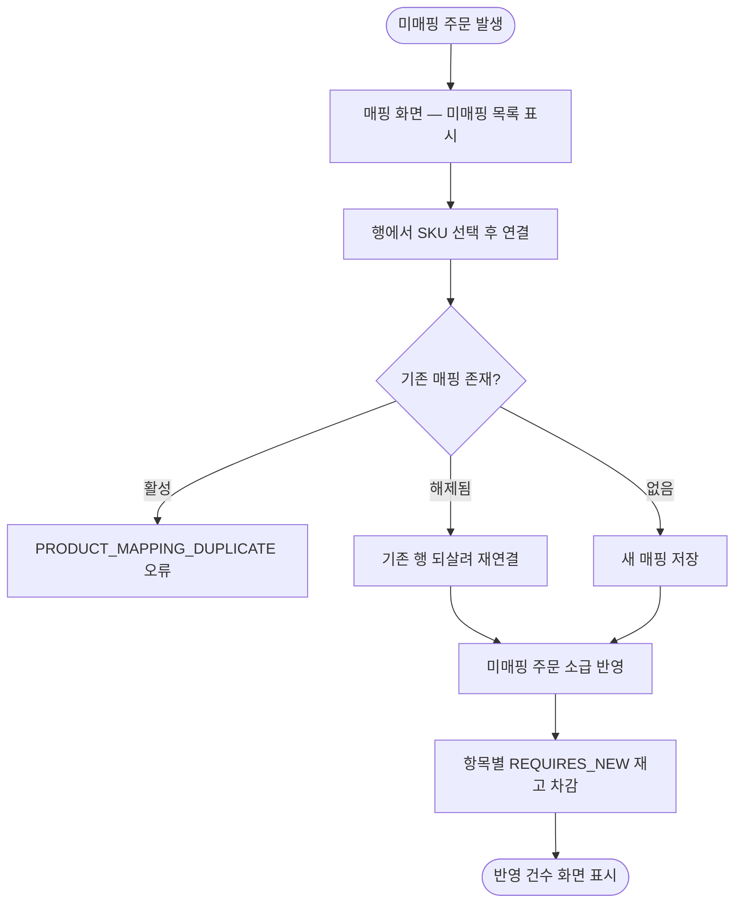

# [화면] 관리자 화면 - 채널·알림·재고·매핑 설정

## 개요

발주자가 시스템을 운영하는 데 필요한 4개 필수 화면(채널 설정 · 알림 설정 · 재고 관리 · 상품
매핑)과 로그인 화면을 구현했다. Tailwind CSS 4 + daisyUI 5 를 Gradle npm 빌드로 통합해 CDN
없이 CSP `default-src 'self'` 를 유지한다. 구현 중 매핑 도메인의 실제 결함(해제 후 재등록 시
DB 유니크 위반) 하나를 발견해 함께 수정했다.

## 기능 흐름

## 변경 사항

### 화면 (palim-web)

- `templates/layout.html`: daisyUI drawer 공통 레이아웃. 모바일 접힘·데스크톱 고정
- `templates/login.html`: 직접 작성 — Spring Security 기본 페이지는 인라인 스타일이라 CSP 에 막힌다
- `settings/ChannelAdminService·ChannelSettingController·channels.html`: 채널별 인증정보 등록.
  **값은 화면으로 되돌려주지 않는다** — `Map<String, Boolean> credentialStatus` 로 등록 여부만
- `settings/NotificationSettingController·notification.html`: 텔레그램 연결, 발송 방식, 야간 보류
- `sku/SkuAdminService·SkuController·SkuView·list.html·detail.html`: 등록·입고·폐기·실사 조정,
  변동 이력, 예상 소진일(`expectedDaysLeft`), 초과판매·불일치 경고
- `mapping/MappingAdminService·MappingController·MappingView·UnmappedLineView·list.html`:
  미매핑 주문 인라인 SKU 연결 + 즉시 소급 반영, 채널 탭별 매핑 목록

### 스타일 빌드

- `palim-web/build.gradle.kts`: `com.github.node-gradle.node` 로 Node 22 자동 다운로드,
  `buildCss` → `processResources` 의존 — CSS 없는 jar 이 만들어질 수 없다
- `package.json`·`src/main/css/app.css`: Tailwind 4 `@import`/`@source`/`@plugin` 구성

### 보안 (SecurityConfig)

- CSP `default-src 'self'`, HSTS 1년, `frameOptions.deny()`, 세션 고정 보호, 최대 1세션

### 도메인 버그 수정

- `ProductMappingRepository.findAnyBy` 추가, `ProductMappingService.connect` 수정

## 주요 구현 내용

**매핑 해제 후 재등록 유니크 위반.** `uk_product_mapping_channel_product` 인덱스에는 `active`
컬럼이 없어 해제된 매핑도 행으로 남는다. 기존 `connect()` 는 `findActiveBy` 로만 중복을 판단해,
해제 후 같은 채널 상품을 다시 등록하면 `BusinessException` 대신 DB 유니크 위반(500)이 터졌다.
해제된 행이 있으면 새 행을 만들지 않고 되살려 재연결하도록 바꿨다 — 매핑을 해제하고 다른 SKU
로 다시 붙이는 것은 운영에서 흔한 경로다.

**미매핑 주문에서 바로 연결.** 채널 상품코드를 발주자가 직접 입력하게 하면 오타가 나고, 오타
난 매핑은 영원히 매칭되지 않는다. 미매핑 목록의 각 행이 hidden 필드로 채널 코드·상품번호를
운반하고 SKU 만 선택한다.

**매핑 목록 N+1 제거.** `ProductMapping` 은 SKU 를 UUID 값으로만 참조하므로(도메인 간 의존
금지) 화면 표시용 SKU 코드·이름은 조율 계층이 합친다. `SkuService.findAllByIds` 를 추가해 한
번에 읽는다.

## 주의사항

- 소급 반영은 항목 1건 단위 `REQUIRES_NEW` — 하나가 실패해도 나머지는 처리되고, 실패분은 주기
  배치가 재시도한다. 화면의 "반영 N건" 이 대상 건수보다 적을 수 있는 것은 정상이다
- `palim-web` → `palim-collector` 의존이 이 이슈에서 추가됐다. 소급 반영 호출 때문이며, 조율
  계층 간 의존이라 아키텍처 규칙 위반이 아니다
- 대시보드·주문 조회·시스템 로그·엑셀 내보내기는 범위 외 — 후속 이슈로 분리됨
