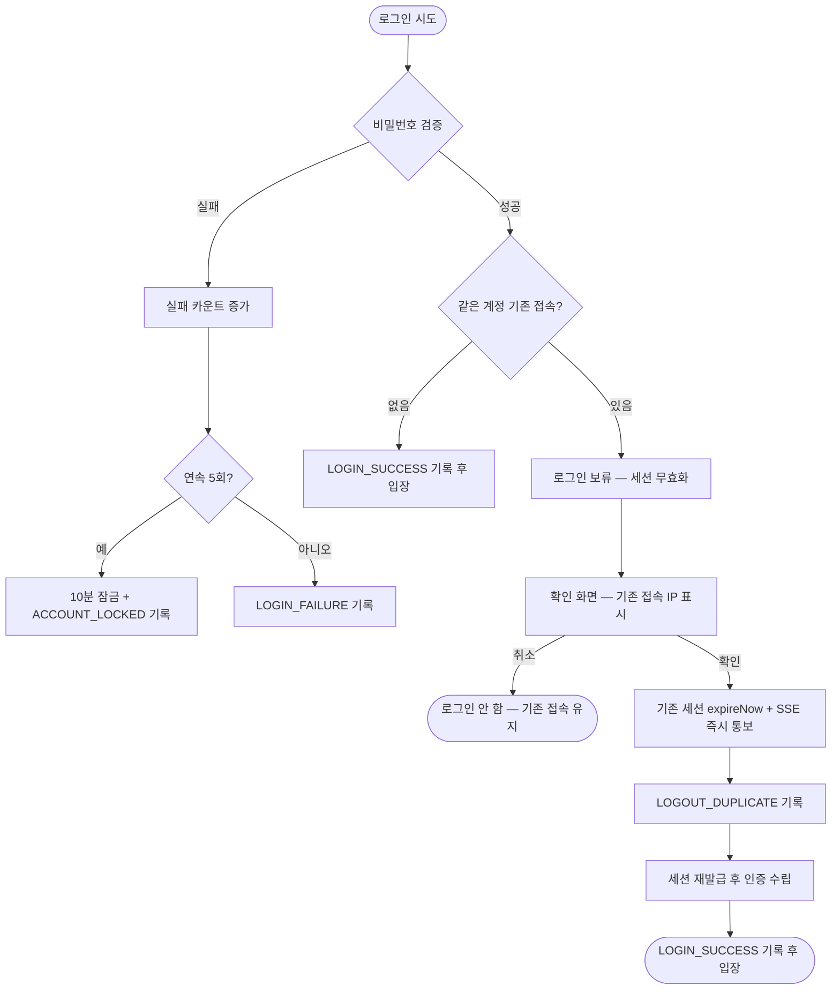

# [보안] 감사 로그 · 동시 접속 세션 제한 (중복 로그인) · 로그인 실패 잠금

## 개요

레거시 관리자 시스템의 감사추적·동시 접속 제한에서 **개념만** 가져와 재설계했다. 신규 도메인
모듈 `palim-audit`(불변 감사 기록), 중복 로그인 확인 흐름(보류 → 확인 → 기존 세션 종료 + SSE
통보), 로그인 실패 잠금(시각 기반 자동 해제)을 구현했다. 판정 근거는 `docs/09-SECURITY.md`,
결정 기록은 07-DECISIONS 018~021 에 있다.

## 기능 흐름

## 변경 사항

### 신규 모듈 `palim-audit`

- `AuditLog`: 불변 기록 — 수정 메서드·`updated_at` 없음. `actor_id` 는 FK 아님(계정 삭제·없는
  계정 시도도 기록). 길이 초과 값은 잘라서라도 남긴다
- `AuditType`: 유형 21종, 인증/조회/변경 그룹. `AuditRecord`(빌더), `AuditSearchCondition`(기간
  필수 — 전체 스캔 차단), `AuditLogSpecifications`(LIKE 와일드카드 이스케이프)
- `AuditService`: `record()` 는 `REQUIRES_NEW` + 예외 삼킴 — 기록 실패가 본 작업을 롤백시키면
  그것이 더 큰 사고다. `purgeOlderThan()` 벌크 삭제

### 인증·세션 (palim-web)

- `LoginSuccessHandler`: 중복 판정. Spring `maximumSessions` 에 맡기지 않고(-1) 직접 판정 —
  자동 축출은 발주자가 계정 유출을 알아챌 기회를 없앤다
- `PendingLogin`: 보류 상태 — **비밀번호도 Authentication 도 담지 않는다.** 2분 만료
- `DuplicateLoginController`: 확인/취소. `SessionRegistry` 조회는 **UserDetails principal 로**
  해야 한다 — 문자열로 조회하면 항상 빈 목록이라 기존 세션이 하나도 안 끊긴다 (구현 중 잡은 버그)
- `SessionWatchRegistry`·`SessionWatchController`·`session-watch.js`: SSE 즉시 통보. 레거시의
  100ms 폴링은 초당 10회 요청 + 세션 유휴 타임아웃 무력화 부작용이 있어 버렸다
- `LoginFailureHandler`·`AdminAccount.recordLoginFailure`: 연속 실패 잠금. 잠긴 상태의 실패는
  잠금을 연장하지 않는다(공격 지속만으로 정상 사용자를 영구히 잠글 수 없다). 실패 원인은
  사용자에게 구분해 알려주지 않는다 — 아이디 존재가 응답 차이로 샌다

### 감사 수집 (palim-web)

- `ClientIpResolver`: `ForwardedHeaderFilter` 위임, 기본 비신뢰(운영 프로파일만
  `forward-headers-strategy: framework`). 위조된 IP 는 없는 것보다 나쁘다
- `AuditSnapshots`: 스냅샷 JSON 직렬화 + **키 이름 기반 비밀값 마스킹** (이중 방어)
- `ViewAuditInterceptor`·`ScreenNames`: 화면 조회 자동 기록. 저장은 `AsyncAuditDispatcher` 로
  비동기 — 화면 응답에서 감사 INSERT 지연 제거. 인증·변경 기록은 동기 유지
- `AuditController`·`audit/list.html`: 날짜 프리셋·유형 멀티선택·조건 검색·페이징. 기본 필터는
  인증+변경 — 조회 행이 중요 기록을 묻는다. 전부 쿼리스트링 서버 렌더링
- `AuditRetentionScheduler`: 보존 365일(설정), KST 04:10 정리 배치

### 스키마

- `V3__audit_log_and_login_lock.sql`: `audit_log` 테이블 + 인덱스 4종,
  `admin_account` 에 `failed_login_count`·`locked_until`·`last_login_at`·`last_login_ip`

## 주요 구현 내용

**스냅샷은 JSON, HTML 금지.** 레거시는 감사 상세를 HTML 로 저장하는데 그 순간 DB 가 저장형
XSS 창고가 된다. JSON 으로 넣고 화면에서 `th:text` 로만 렌더링한다 — 이스케이프가 마지막 단이다.

**잠금은 시각 비교다.** `locked` 불린 + 해제 배치 방식은 배치가 멈추면 발주자가 자기 시스템에서
영구 잠긴다. `locked_until` 과 현재 시각 비교는 배치 없이 스스로 풀린다.

**감사 3줄 보장.** 중복 로그인 전체 흐름이 `LOGIN_BLOCKED_DUPLICATE` → `LOGOUT_DUPLICATE` →
`LOGIN_SUCCESS` 세 줄로 재구성된다.

## 주의사항

- `record()` 가 예외를 삼키는 판단은 이 시스템이 규제 감사 대상이 아니라는 전제다. "기록 없이는
  작업도 없다"가 요구되면 예외를 전파하도록 바꿔야 한다 (07-DECISIONS 018 재검토 조건)
- 보류 경합(두 브라우저 동시 확인)은 잠그지 않는다 — 확인 시점에 기존 세션을 다시 조회하므로
  최종 상태는 항상 "마지막 확인자 1세션"이다
- `ActiveSessionRegistry` 는 인메모리 — 단일 인스턴스 운영 전제. 다중 인스턴스로 가면 재설계 대상
- SSE 가 끊겨도 기능은 성립한다 — 다음 요청에서 `ConcurrentSessionFilter` 가 만료를 적용한다.
  SSE 는 즉시성만 담당
