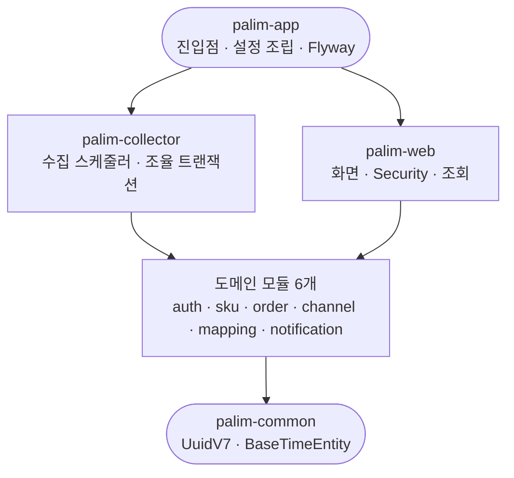
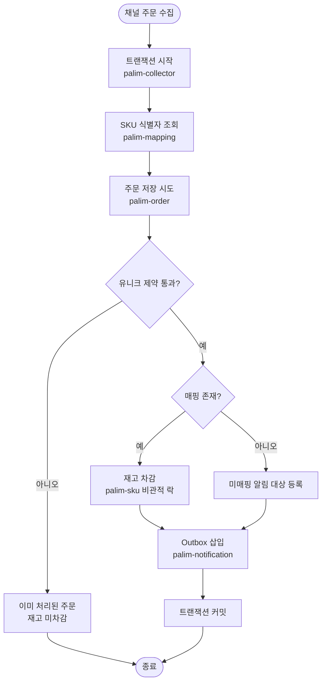

# [구조] 도메인 단위 멀티모듈 전환 (10개 모듈)

## 개요

단일 모듈이던 프로젝트를 **도메인 축 멀티모듈 10개**로 전환했다.

원칙은 하나다 — **도메인 모듈은 자기 도메인만 안다.** 여러 도메인을 관통하는 책임은 조율 계층(`palim-collector`, `palim-web`)이 갖는다.

머지 커밋: `449dac2`

## 기능 흐름

### 모듈 의존 구조



`palim-app`이 최상위인 이유는 진입점이 여기 있어 하위 모듈의 빈을 스캔해야 하기 때문이다. `collector`와 `web`은 목적이 달라 서로를 의존하지 않는다.

### 수집 조율 트랜잭션

도메인 4개를 관통하는 한 트랜잭션이다. 이 트랜잭션을 여는 곳은 `palim-collector` 하나뿐이다.



주문 저장·재고 차감·Outbox 삽입이 한 트랜잭션이라는 점이 핵심이다. 하나라도 밖으로 새면 재고가 틀어지거나(A-02) 알림이 소실된다(A-14).

## 변경 사항

### 빌드 구성

- `settings.gradle.kts`: 10개 모듈 `include`
- `build.gradle.kts`: Spring Boot 플러그인을 `apply false`로 두고 공통 설정(Java 25 toolchain, BOM import, Lombok, JUnit)을 `subprojects`로 이관. 루트는 부트 jar를 만들지 않는다
- 모듈별 `build.gradle.kts` 10개: 각자 필요한 의존성만 선언
- `palim-app`에만 `org.springframework.boot` 플러그인 적용 → 부트 jar는 이 모듈에서만 생성

### 소스 이동

- 기존 `src/` → `palim-app/` (`PalimApplication`, `application*.yaml`, Flyway 경로)
- `IntegrationTest` → `palim-common/src/testFixtures/` (`java-test-fixtures` 적용)

### 신규 코드

- `palim-common`: `UuidV7`(UUIDv7 생성), `BaseTimeEntity`(`@Getter` + JPA Auditing, `Instant` 사용)
- `palim-web`: `SecurityConfig` — 관리자 1계정, `/actuator/health`는 인증 제외
- `PalimApplication`: `@EnableJpaAuditing`, `@EnableScheduling` 추가
- 각 도메인 모듈: `package-info.java`로 책임과 의존 금지 규칙 명시

### 인프라

- `Dockerfile`: jar 경로를 `palim-app/build/libs/`로 수정
- `.github/workflows/build.yml`: 이미지 job의 jar 생성을 `:palim-app:bootJar`로 수정

### 문서

- 기술 설계서 3장을 도메인 축 구조로 전면 개정 (3.1~3.6)

## 주요 구현 내용

### 모듈을 나누는 목적은 jar 크기가 아니다

`bootJar`는 실행 가능한 단일 파일이라 전체 런타임 의존성의 **합집합**을 포함한다. 모듈별로 의존성을 좁혀도 최종 jar 크기는 줄지 않는다. `palim-sku`가 JPA만 쓰고 `palim-channel`이 HTTP 클라이언트만 써도, `palim-app`이 둘을 다 의존하는 순간 최종 jar에는 양쪽이 모두 들어간다.

크기가 줄어드는 것은 모듈을 **별도 프로세스로 배포**할 때다. 본 시스템은 NAS 한 대에 JVM 하나로 올리는 단일 배포이므로 해당하지 않는다.

실제로 얻는 것은 **컴파일 타임 격리**다. `palim-sku`에 web 의존성을 주지 않았으므로 재고 도메인 코드에서 `@Controller`나 `HttpServletRequest`를 **쓸 수가 없다.** 규칙을 문서가 아니라 컴파일러가 강제한다. 여기에 빌드 속도(변경 모듈만 재컴파일), 의존 방향 강제, 향후 프로세스 분리 여지가 따라온다.

즉 얻으려는 것은 작은 jar가 아니라 **실수할 수 없는 구조**다.

### 도메인 간 참조는 UUID 값으로만

`palim-order`가 `palim-sku`를 모르므로 JPA 연관관계를 만들 수 없다.

```java
private UUID skuId;              // O
// private Sku sku;              // X — palim-sku 의존이 생긴다
```

여기서 앞서 정한 **UUIDv7 기본키가 실질적 이득으로 돌아온다.** 식별자를 애플리케이션에서 생성하므로 저장 전에 확정되어, 다른 모듈의 엔티티를 몰라도 참조를 표현할 수 있다. `@GeneratedValue` 시퀀스였다면 저장 전에 식별자가 없어 이 구조가 훨씬 번거로워진다.

DB 레벨 외래키는 Flyway로 정상 부여한다. 모듈 독립성은 코드 차원의 문제이고 데이터 정합성은 별개다. 단 미매핑 주문을 저장해야 하므로(F-04) `order_line.sku_id`는 nullable이다.

### 텔레그램 발송은 별 모듈로 빼지 않았다

초기 설계에는 `palim-notifier`가 있었으나 제거했다. 발송은 Outbox를 소유한 `palim-notification` 도메인의 외부 연동 인프라다. 별 모듈로 빼면 **Outbox 상태 전이와 발송이 모듈 경계를 넘나들어 오히려 결합이 늘어난다.**

반면 `palim-collector`는 유지했다. 수집 조율은 여러 도메인을 관통하는 독립된 책임이고 화면과 목적이 전혀 다르다. `palim-app` 하나에 몰아넣으면 배치 코드와 화면 코드가 섞인다.

## 검증 결과

CI 빌드 통과 (1분 3초).

| 항목 | 결과 |
|---|---|
| 10개 모듈 전체 컴파일 | 통과 |
| Testcontainers PostgreSQL 통합 테스트 | 통과 |
| `palim-app`에서만 부트 jar 생성 | 확인 |
| **Lombok + Java 25** | **완전 검증 통과** |

마지막 항목이 중요하다. 이전까지는 Lombok 애너테이션을 실제로 사용하는 코드가 없어 "annotation processor 등록에 실패하지 않는다" 수준의 부분 검증이었다. 이번에 `BaseTimeEntity`가 `@Getter`를 실제로 사용한 상태로 컴파일을 통과했으므로, **설계서 2.3이 대비해둔 Java 21 LTS 하향 시나리오는 폐기해도 된다.**

## 주의사항

### `implementation`은 컴파일 classpath로 전이되지 않는다

`palim-app`이 `@EnableJpaAuditing`을 선언하는데, 하위 모듈을 `implementation`으로 의존하면 **JPA가 컴파일 classpath로 전이되지 않아** import가 실패한다. `implementation`은 런타임 classpath에만 전이되기 때문이다.

`palim-app`에 `spring-boot-starter-data-jpa`를 명시적으로 선언해 해결했다. 앞으로 조율 계층에서 하위 모듈의 라이브러리를 직접 참조하는 코드를 쓸 때 같은 문제를 만나게 된다. **해당 모듈이 그 의존성을 직접 선언하는 것이 맞다** — `api`로 뚫어서 우회하면 모듈별 의존성 최소화 원칙이 무너진다.

### 도메인 모듈에 다른 도메인 의존을 추가하면 안 된다

편의상 `palim-order`에 `palim-sku`를 넣고 싶어지는 순간이 온다. 그러면 이 구조가 무너진다. 도메인 간 협력이 필요하면 조율 계층(`collector`, `web`)에서 처리한다.

현재는 이 규칙이 각 모듈의 `build.gradle.kts`와 `package-info.java`로만 표현되어 있다. **자동 검증 장치는 없다.** ArchUnit 같은 도구로 강제할 수 있으나 도입하지 않았다.

### 트랜잭션을 도메인 서비스에서 열면 안 된다

도메인 서비스에 `@Transactional`을 붙이는 것이 습관인데, 이 구조에서는 금지다. 도메인이 각자 트랜잭션을 열면 **재고는 차감됐는데 주문은 롤백되는 상태**가 발생한다. 트랜잭션을 여는 곳은 `palim-collector`(수집)와 `palim-web`(화면 조작) 두 계층뿐이다.

### 통합 테스트 컨테이너는 singleton이다

`palim-common`의 `IntegrationTest`는 static 블록에서 컨테이너를 기동하고 종료하지 않는다. `@Container`로 클래스 단위 lifecycle을 맡기면 **이 클래스를 상속한 첫 테스트가 끝날 때 컨테이너가 중지되어 이후 테스트가 연결에 실패한다.** 종료는 Testcontainers의 Ryuk이 처리한다.

## 후속 작업

- 실제 엔티티 필드 정의 및 Flyway 스키마 (`V1__init.sql`)
- 채널 어댑터 구현 — Phase 1은 쿠팡부터 수직 슬라이스로 관통
- 관리자 화면 실제 구현

### 개발 착수 전 확인이 필요한 항목

기능 명세서 6.1이 최우선 확인 사항으로 규정한 **Q-00**(기존 통합솔루션 사용 중에도 수작업이 남는 지점)이 여전히 미확정이다.

본 구조는 어느 답이 나와도 견딘다 — ERP 연동이 필요해지면 `palim-collector`와 대칭 위치에 내보내기 조율 계층이 추가될 뿐이다. 다만 **Phase 4(엑셀 내보내기) 진입 전까지는 답이 확정되어야 하며**, A로 확인될 경우 개발 범위와 견적이 변경된다.
