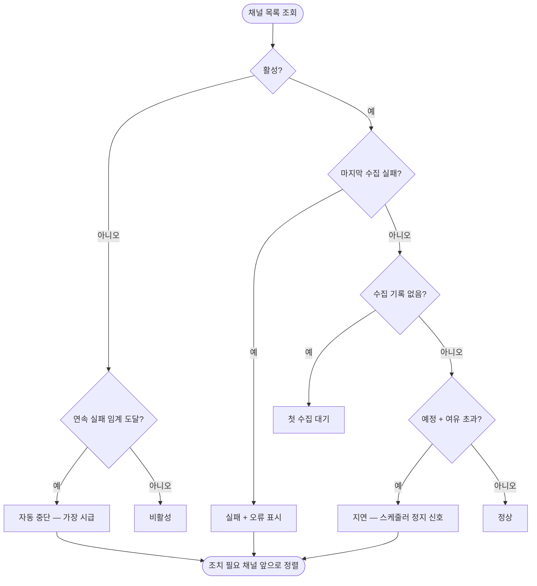

# [화면] 수집 상태 모니터 - 채널별 수집 현황·커서·실패·다음 예정

## 개요

채널별 수집 현황을 한 화면(`/monitor/collect`)에 모았다. "수집이 며칠째 멈췄는데 아무도 모름"
이 이 시스템 최악의 장애다 — 수집이 멈추면 재고 차감이 끊기고 그 상태로 판매가 계속되면
오버셀이 쌓인다. 텔레그램 알림을 놓쳐도 확인할 곳이 생겼다. 신규 테이블 없이 `Channel` 이
이미 갖고 있던 상태 필드만으로 구성했다.

## 기능 흐름

## 변경 사항

### palim-web

- `monitor/CollectHealth.java`: 상태 6종 enum — 표시 이름·badge 색·`needsAttention()`
- `monitor/CollectStatusView.java`: 판정과 표시 문자열 생성을 팩토리 한 곳에 모음.
  KST 변환, 상대 시간("9분 후"·"2분 전까지 수집됨") 포함
- `monitor/CollectMonitorController.java`: 조치 필요 채널 우선 정렬 + 요약 배너
- `templates/monitor/collect.html`: 채널별 카드. 자동 중단·지연에는 조치 방법까지 표시
- `layout.html` 운영 메뉴 · `ScreenNames` 조회 감사 등록

## 주요 구현 내용

**판정 순서가 전부다.** 자동 중단(`!enabled && 실패 ≥ 임계`)을 비활성보다 먼저 검사한다 —
순서를 바꾸면 "시스템이 멈춘 것"이 "발주자가 끈 것"으로 보인다. 판정을 템플릿 조건으로
조합하지 않고 `judge()` 한 곳에 모아 테스트로 고정했다.

**지연(STALE) 상태가 이 화면의 존재 이유다.** 실패는 기록이라도 남지만 프로세스 정지·스레드
고갈은 아무 기록 없이 멈춘다. 예정 시각 + `max(주기×2, 5분)` 을 넘기면 지연으로 판정한다.
하한 5분은 주기가 짧은 채널이 스케줄러 틱 하나 밀린 것을 지연으로 오판하지 않기 위함이다.

**수집 커서를 노출한다.** `collectedUntil` 은 "이 시각 이전 주문은 수집됐다"는 뜻이므로,
커서 뒤처짐이 곧 "재고에 반영되지 않은 판매 구간"이다. 화면 하단에 이 해석을 함께 적었다.

## 주의사항

- 수동 수집 트리거 버튼은 범위 외 — 채널 API 호출 제한(특히 쿠팡 영구 차단)과 얽혀 별도 판단
  필요
- 지연 판정은 화면 조회 시점 계산이다. 지연을 능동적으로 알리는 것은 감시 배치(palim-monitor)
  영역이며, 현재 수집 실패 알림(A-10)이 그 역할의 일부를 한다
- 이 화면은 자동 새로고침하지 않는다. 필요해지면 SSE 재사용을 검토하되, 관리자 1명 화면에
  실시간성이 필요한지부터 판단할 것
