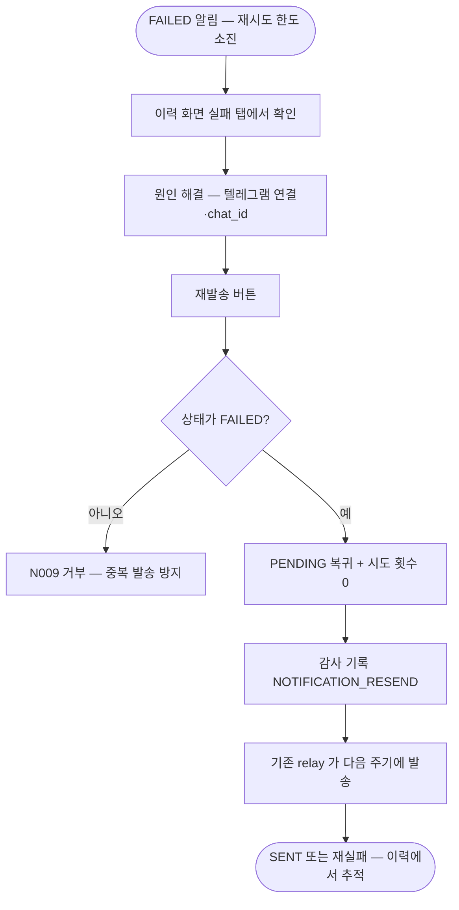

# [화면] 알림 발송 이력 - Outbox 조회·실패 건 수동 재발송

## 개요

Outbox 이력 화면(`/monitor/notifications`)과 실패 건 수동 재발송을 구현했다. "텔레그램이 안
왔다"가 발생했을 때 시스템이 안 보낸 건지(적체·실패) 텔레그램이 죽은 건지 구분할 수단이
생겼고, "사람이 확인해야 한다"고 설계만 되어 있던 FAILED 상태에 실제 확인·조치 경로가 붙었다.

## 기능 흐름

## 변경 사항

### palim-notification

- `NotificationOutbox.retryManually()`: FAILED → PENDING 상태 전이. 그 외 상태는
  `NOTIFICATION_NOT_RETRYABLE` 거부. `isFailed()` 추가
- `NotificationType`: 표시 이름 추가 (화면·메시지 공용)
- `OutboxService.findHistory()`(상태 필터 + 페이징, 최신순 고정)·`retryManually()`
- `NotificationOutboxRepository.findByStatus(Pageable)`

### palim-web

- `monitor/NotificationHistoryView·Service·Controller`: 이력 화면 조율. 재발송은 감사 기록과
  같은 트랜잭션
- `templates/monitor/notifications.html`: 상태 탭(기본 실패)·목록·payload 접기·재발송 버튼
- `layout.html` 메뉴 · `ScreenNames` 조회 감사 등록

### palim-common

- `ErrorCode.NOTIFICATION_NOT_RETRYABLE("N009", CONFLICT)` + 한/영 메시지

## 주요 구현 내용

**시도 횟수를 0 으로 초기화한다.** FAILED 는 재시도 한도(5회)를 이미 소진한 상태다. 리셋하지
않으면 재발송 첫 실패에 `attemptCount >= maxAttempts` 가 다시 참이 되어 즉시 FAILED 로
돌아간다 — 재발송이 사실상 1회짜리가 된다. `lastError` 는 다음 시도가 덮어쓸 때까지 남겨
원인 문맥을 유지한다.

**새 발송 경로를 만들지 않았다.** 재발송 버튼은 상태만 되돌리고, 발송은 기존 relay 가 다음
주기(약 30초)에 처리한다. 화면 요청 스레드에서 텔레그램 API 를 직접 호출하는 경로를 추가하면
재시도·긴급 판단 기준이 두 곳으로 갈라진다.

**SENT 는 되돌릴 수 없다.** 발송된 알림을 PENDING 으로 되돌리면 같은 알림이 중복 발송된다.
FAILED 단일 상태에서만 전이를 허용하고 도메인 메서드가 거부한다 — 화면 버튼 노출 여부
(`retryable`)와 무관하게 도메인이 최종 방어선이다.

## 주의사항

- 재발송은 감사 로그(`NOTIFICATION_RESEND`) 대상 — 중복 발송 문의가 오면 "누가 언제
  되돌렸는지"가 답이 된다
- SENT 이력은 계속 쌓인다. 보존기간 정리 배치는 적체 규모를 보고 별도 판단하기로 했다
  (이슈 범위 외 명시)
- payload 는 `th:text`/`pre` 로만 출력한다 — 채널에서 유입된 문자열이 포함되므로 이스케이프가
  저장형 XSS 방어의 마지막 단이다
