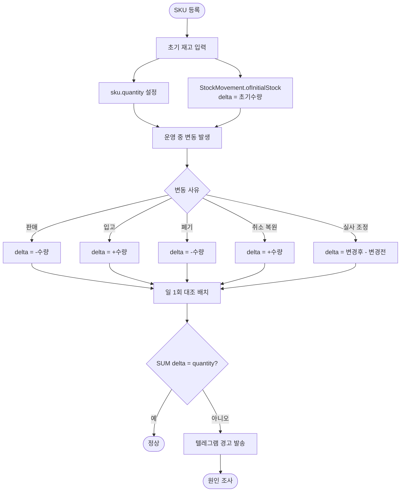
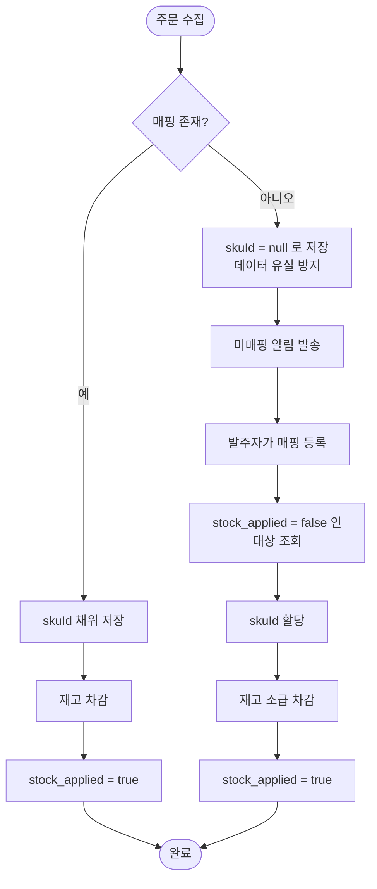

# [도메인] 엔티티 정의 및 Flyway 초기 스키마

## 개요

도메인 엔티티 12개, Repository 12개, enum 8개와 Flyway 초기 스키마(테이블 12개)를 정의했다. 기능 명세서가 요구하는 데이터를 모두 담고, 기술 설계서 4~5장의 코드 규약과 정합성 설계를 코드로 옮겼다.

머지 커밋: `5593ca6`

| 모듈 | 엔티티 |
|---|---|
| `palim-common` | `ChannelCode` (공유 값 타입) |
| `palim-sku` | `Sku`, `StockMovement` |
| `palim-order` | `Order`, `OrderLine` |
| `palim-mapping` | `ProductMapping` |
| `palim-channel` | `Channel`, `ChannelCredential`, `StockPushLog`, `StockPushSetting` |
| `palim-notification` | `NotificationOutbox`, `NotificationSetting` |
| `palim-auth` | `AdminAccount` |

## 기능 흐름

### 재고 정합성 자기 검산

본 시스템은 스스로를 "재고의 유일한 기준"으로 정의한다. 원본을 자처하는 시스템이 자신의 불일치를 감지하지 못하면 틀어진 상태로 장기간 운영되고, 발주자는 실물 재고 불일치를 발견한 시점에야 인지하게 되어 원인 추적이 불가능해진다.



두 지점이 핵심이다. **초기 재고 이력**이 없으면 이 식이 절대 성립하지 않고, **실사 조정의 delta**가 절대값이 아니라 차이여야 성립한다.

### 미매핑 주문 소급 반영

매핑되지 않은 상품의 주문이 들어와도 데이터를 버리지 않는다. 방치하면 재고가 조용히 틀어지므로 즉시 알리고, 매핑 후 소급 반영한다(F-04).



`stock_applied` 플래그가 소급 반영의 근거다. 이 값이 없으면 "매핑은 됐지만 재고는 아직 안 빠진" 상태를 구분할 수 없다.

## 변경 사항

### 엔티티 · Repository

- `palim-common`: `ChannelCode`
- `palim-sku`: `Sku`, `StockMovement`, `InsufficientStockException`, `StockChangeReason`, `StockReferenceType`, Repository 2개
- `palim-order`: `Order`, `OrderLine`, `OrderStatus`, Repository 2개
- `palim-mapping`: `ProductMapping`, Repository
- `palim-channel`: `Channel`, `ChannelCredential`, `StockPushLog`, `StockPushSetting`, `CollectStatus`, `StockPushStatus`, Repository 4개
- `palim-notification`: `NotificationOutbox`, `NotificationSetting`, `NotificationType`, `OutboxStatus`, `OrderAlertMode`, Repository 2개
- `palim-auth`: `AdminAccount`, Repository

### 스키마

- `V1__init.sql`: 테이블 12개, 유니크 제약 6개, 외래키 6개, 조회 인덱스 10개(부분 인덱스 2개 포함)

### 빌드

- 루트: 공통 테스트 의존성 추가
- `palim-app`: `spring-boot-flyway` 추가, 통합 테스트용 도메인 모듈 추가

### 테스트

- `SkuTest`, `StockMovementTest`: 도메인 규칙 단위 테스트 (Spring 컨텍스트 없음)
- `StockConsistencyIntegrationTest`: 재고 스냅샷과 이력 누적합 일치 검증 4개
- `OrderLineUniqueConstraintIntegrationTest`: 중복 차단 검증 4개

## 주요 구현 내용

### 초기 재고 이력이 없으면 대조 배치가 성립하지 않는다

작업 중 발견한 설계 누락이다.

설계서 5.3의 대조 배치는 `SUM(stock_movement.delta) == sku.quantity`를 검산한다. 그런데 `Sku.register()`가 초기 재고를 받으면서 대응하는 이력을 남기지 않으면 **누적합이 항상 초기 수량만큼 적게 나와, 정상 상태를 매번 불일치로 오판한다.**

`StockMovement.ofInitialStock()`을 추가했다. 도입 시점에 발주자가 실물 재고를 실사해 입력하는 1회성 작업이므로 조정(`ADJUSTMENT`)으로 기록한다.

실사 조정도 같은 이유로 주의가 필요하다. 절대값으로 덮어쓰는 변경이지만 `delta`에는 **변경 전후의 차이**가 들어가야 한다.

```java
public static StockMovement ofAdjustment(UUID skuId, int quantityBefore, int quantityAfter, String memo) {
    return manual(skuId, quantityAfter - quantityBefore, StockChangeReason.ADJUSTMENT, quantityAfter, memo);
}
```

### 옵션 식별자가 NULL이면 유니크 제약이 무력화된다

`product_mapping`의 `channel_option_no`는 옵션 없는 상품에서 NULL이다. PostgreSQL은 NULL을 서로 다른 값으로 취급하므로, 일반 UNIQUE 제약으로는 **옵션 없는 상품의 중복 매핑이 걸러지지 않는다.**

```sql
CREATE UNIQUE INDEX uk_product_mapping_channel_product
    ON product_mapping (channel_code, channel_product_no, COALESCE(channel_option_no, ''));
```

표현식 유니크 인덱스로 NULL을 빈 문자열과 동일하게 다룬다. 엔티티에는 `@UniqueConstraint`를 걸지 않아 `ddl-auto: validate`와 충돌하지 않는다.

조회 쪽에도 같은 함정이 있다. **파생 쿼리 메서드는 null 파라미터를 `= null`로 번역해 결과가 항상 비므로**, 매핑 조회는 명시적 JPQL로 `is null` 비교를 처리했다.

### 중복 방지를 위한 비정규화

`order_line`에 `channel_code`·`channel_order_no`를 주문에서 중복 저장했다. 유니크 제약을 **라인 단위**로 걸어야 하기 때문이다. 이 제약이 중복 수집을 막는 유일한 방어선이라 비정규화를 감수했다.

### 안전한 쪽을 기본값으로

`StockPushSetting.createDefault()`는 전송 비활성 + 시뮬레이션 활성으로 시작한다. F-08은 채널에 데이터를 기록하는 유일한 경로이고, 재고 계산 오류로 0을 전송하면 상품이 전 채널에서 품절 처리되어 매출 손실이 발생한다.

### 시각 타입의 의도적 예외

전 계층 `Instant`가 원칙이지만, `NotificationSetting`의 `quietHours`·`dailyReportTime`은 `LocalTime`이다. 절대 시각이 아니라 **하루 중 시점**이기 때문이다. 자정을 넘는 구간(22:00~07:00)을 지원하도록 판정 로직을 따로 작성했다.

## 검증 결과

CI 빌드 통과.

| 완료 조건 | 결과 |
|---|---|
| `./gradlew build` 통과 | 통과 |
| Flyway 적용 후 `ddl-auto: validate` 통과 | **통과** — 엔티티 12개와 스키마가 일치한다는 증거 |
| 재고 스냅샷과 이력 합계 일치 | 통과 (판매·입고·폐기·실사·취소복원 혼합 포함) |
| 중복 라인 재삽입 차단 | 통과 |
| 비관적 락 조회 동작 | 통과 |

## 주의사항

### Spring Boot 4는 Flyway 자동 구성을 별도 모듈로 분리했다

**이번 작업에서 가장 위험했던 함정이다.**

`Schema validation: missing table [admin_account]`만 보면 스키마 SQL이 틀렸다고 판단하기 쉽다. 그런데 **Flyway 로그가 한 줄도 없었다.** 마이그레이션이 실패한 게 아니라 아예 실행되지 않은 것이다.

Boot 3에서는 `flyway-core` 존재만으로 자동 구성이 감지됐지만, Boot 4는 autoconfigure를 기술별 모듈로 쪼갰고 Flyway는 starter가 없다.

```kotlin
implementation("org.springframework.boot:spring-boot-flyway")   // 이게 없으면 조용히 실행되지 않는다
implementation("org.flywaydb:flyway-core")
implementation("org.flywaydb:flyway-database-postgresql")
```

**조용히 실패한다는 점이 위험하다.** 기동은 성공하고, `ddl-auto: validate`가 없었다면 테이블 없는 상태로 떠서 첫 쿼리에서야 터진다. 설계서가 `validate`를 고정해둔 것이 방어막으로 작동했다.

같은 성격의 함정이 이미 한 번 있었다. Testcontainers 버전도 Boot 3에서는 BOM이 관리해줘서 버전을 생략하는 관행이 굳어져 있었는데 Boot 4에서 깨졌다. **Boot 3 시절의 관례가 조용히 무효가 되는 유형**이므로, 앞으로 자동 구성이 필요한 기술을 추가할 때는 `spring-boot-{기술}` 모듈이 별도로 있는지 먼저 확인해야 한다.

### `@NoArgsConstructor`와 파라미터 없는 생성자는 충돌한다

`NotificationSetting`은 설정 기본값이라 인자가 필요 없어 `private NotificationSetting()`으로 작성했는데, `@NoArgsConstructor(PROTECTED)`가 이미 같은 시그니처를 만들어 컴파일이 실패했다. 다른 엔티티 11개는 생성자가 파라미터를 받아 이 문제를 겪지 않았다.

기본값을 생성자 인자로 올려 해결했다. 앞으로 인자 없이 기본값만 채우는 엔티티를 만들 때 다시 만나게 된다.

### 단일 행 설정 테이블은 아직 초기화되지 않는다

`StockPushSetting`과 `NotificationSetting`은 단일 행으로 운영하지만, **초기 행을 만드는 로직이 아직 없다.** SQL로 INSERT 하지 않은 이유는 기본키가 UUIDv7이고 애플리케이션에서 생성해야 하기 때문이다(`gen_random_uuid()`는 v4다).

두 Repository의 `findFirstByOrderByCreatedAtAsc()`는 현재 항상 빈 값을 반환한다. 서비스 계층에서 없으면 `createDefault()`로 만드는 초기화가 필요하다. **이것 없이 F-02·F-08 기능을 붙이면 NPE 또는 설정 누락으로 동작하지 않는다.**

### 도메인 모듈 간 의존 금지는 자동 검증되지 않는다

`order_line.sku_id`처럼 UUID 값으로만 참조하는 규칙은 현재 각 모듈의 `build.gradle.kts`와 `package-info.java`로만 표현되어 있다. 편의상 `palim-order`에 `palim-sku`를 추가하면 구조가 무너지는데 이를 막는 장치가 없다. ArchUnit 도입은 검토하지 않았다.

## 후속 작업

- **단일 행 설정 초기화** — 위 주의사항 참조. 서비스 계층 착수 시 함께 처리해야 한다
- 서비스 계층 — 조회·차감·조율 로직, 수집 조율 트랜잭션
- 채널 어댑터 — Phase 1은 쿠팡부터 수집→알림까지 수직 관통
- 관리자 화면
