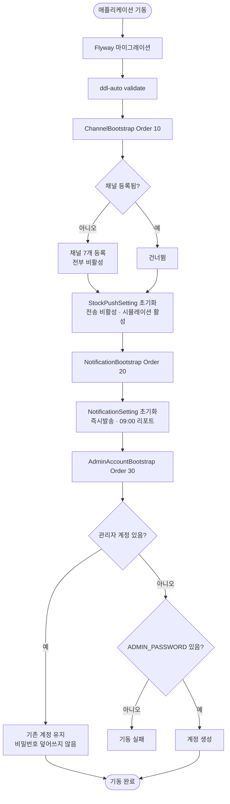
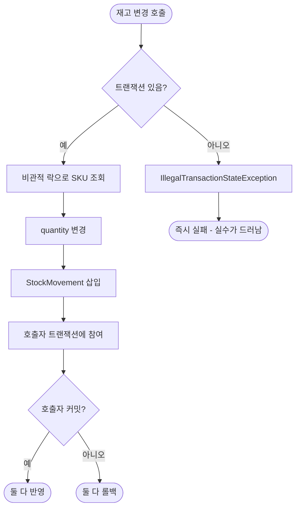

# [서비스] 도메인 서비스 계층 및 부트스트랩 초기화

## 개요

각 도메인의 서비스 계층과 부트스트랩 초기화를 구현했다. #4 에서 남긴 "단일 행 설정이 초기화되지 않는다"는 문제도 함께 해소했다.

머지 커밋: `10876a4`

| 모듈 | 내용 |
|---|---|
| `palim-common` | `PalimException`, `NotFoundException`, `DuplicateException` |
| `palim-sku` | `SkuService` — 재고 변경 5종 |
| `palim-order` | `OrderService`, `DuplicateOrderLineException` |
| `palim-mapping` | `ProductMappingService` |
| `palim-channel` | `CredentialCipher`, `ChannelService`, `ChannelCredentialService`, `StockPushSettingService`, `ChannelBootstrap` |
| `palim-notification` | `OutboxService`, `NotificationSettingService`, `NotificationBootstrap` |
| `palim-auth` | `AdminAccountService`, `PasswordEncoderConfig`, `AdminAccountBootstrap` |
| `palim-web` | `AdminUserDetailsService`, `HomeController`, 홈 화면 |

## 기능 흐름

### 기동 시 부트스트랩



`ApplicationRunner` 를 쓴 이유가 마지막 분기에 있다. 초기화 실패 시 **기동을 중단시켜야** 하는데, `ApplicationReadyEvent` 리스너에서 던진 예외는 로그만 남고 애플리케이션이 계속 뜬다.

### 트랜잭션 경계 강제



`MANDATORY` 가 없으면 첫 분기에서 auto-commit 으로 흘러가고, 재고 변경과 이력 기록이 **각각 커밋**된다. 중간 실패 시 정합성이 깨진 채 조용히 넘어간다.

## 변경 사항

### 서비스

- `SkuService`, `OrderService`, `ProductMappingService`, `ChannelService`, `ChannelCredentialService`, `StockPushSettingService`, `OutboxService`, `NotificationSettingService`, `AdminAccountService`

### 부트스트랩

- `ChannelBootstrap` — 채널 7개(명세서 F-01 기본 주기), `StockPushSetting`
- `NotificationBootstrap` — `NotificationSetting`
- `AdminAccountBootstrap` — 관리자 계정

### 보안 · 암호화

- `CredentialCipher`, `CredentialCipherException`, `PasswordEncoderConfig`, `AdminUserDetailsService`
- `SecurityConfig` — `PasswordEncoder` 빈 제거(auth 로 이관)

### 설정

- `application.yaml` — `palim.crypto.master-key`, `palim.admin.*`
- `.env.example` — 마스터키 생성 방법 명시
- `IntegrationTest` — 테스트 전용 마스터키·관리자 비밀번호 주입

### 테스트 (27개)

- `CredentialCipherTest` 7개, `TransactionBoundaryIntegrationTest` 3개, `BootstrapIntegrationTest` 6개, `SkuServiceIntegrationTest` 7개, `ChannelCredentialIntegrationTest` 4개

## 주요 구현 내용

### 재고 변경과 이력 기록을 서비스가 묶는다

`Sku.quantity` 변경과 `StockMovement` 삽입이 분리되면 대조 배치(설계서 5.3)가 즉시 불일치를 보고한다. 호출자가 둘을 각각 호출하는 구조로 두면 언젠가 한쪽을 빠뜨린다.

`SkuService` 의 변경 메서드가 두 작업을 함께 수행한다. **호출자는 `StockMovement` 를 직접 만들지 않는다.** `register` 도 초기 재고 이력을 함께 남긴다.

### 트랜잭션 경계를 런타임에 강제한다

설계서 3.4는 "도메인 서비스는 자체 트랜잭션을 열지 않고 참여만 한다"고 정했다. 그런데 `@Transactional` 을 그냥 생략하면 호출자가 트랜잭션을 잊었을 때 auto-commit 으로 동작한다.

변경 메서드에 `Propagation.MANDATORY` 를 걸었다. 컴파일 단계에서 막을 수는 없지만 첫 실행에서 반드시 드러나며, 조용히 잘못 동작하는 것보다 낫다.

### 중복 수집 판정이 트랜잭션 단위를 결정한다

`OrderService.saveOrderLine` 은 유니크 제약 위반을 `DuplicateOrderLineException` 으로 변환한다. `saveAndFlush` 를 쓰는 이유는 위반을 그 지점에서 드러내기 위함이다 — flush 하지 않으면 커밋 시점에 터져 어느 항목이 중복인지 알 수 없다.

**이 예외가 발생하면 트랜잭션은 rollback-only 가 된다.** 따라서 수집 조율은 주문 1건 단위로 트랜잭션을 열어야 한다. 여러 주문을 한 트랜잭션에서 처리하면 중복 하나 때문에 정상 주문까지 롤백된다.

### 부트스트랩을 도메인 모듈에 뒀다

`palim-app` 은 도메인 모듈을 `implementation` 으로만 의존하므로 서비스를 직접 볼 수 없다. 여기에 의존을 추가하면 모듈 격리가 무너지므로 **각 도메인이 자기 초기화를 소유**하게 했다.

채널은 전부 비활성으로 등록된다. 인증정보(P-02) 없이 수집이 시작되면 인증 실패가 반복되어 채널 측 차단 위험이 있다.

관리자 계정은 계정도 없고 비밀번호 환경변수도 없으면 기동을 실패시킨다. 반대로 계정이 이미 있으면 비밀번호를 덮어쓰지 않는다 — 재기동마다 발주자가 바꾼 비밀번호가 초기값으로 되돌아가면 안 된다.

### 인증정보 암호화

AES-GCM 을 쓴다. 인증 태그가 포함되어 암호문이 변조되면 복호화가 실패하므로, 데이터베이스 유출 후 값이 조작되는 상황도 감지된다.

저장 형식은 `base64(nonce || ciphertext || tag)` 이고 **nonce 는 암호화마다 새로 생성**한다. GCM 에서 같은 키로 nonce 를 재사용하면 평문을 복원할 수 있는 치명적 취약점이 생긴다.

평문은 `ChannelCredentialService` 경계에서만 오간다. 화면 표시용으로는 키 목록만 반환하는 `findKeys` 를 뒀다.

## 검증 결과

CI 빌드 통과.

| 완료 조건 | 결과 |
|---|---|
| `./gradlew build` 통과 | 통과 |
| 기동 시 설정 2개·관리자 계정·채널 7개 자동 생성 | 통과 |
| 재기동해도 중복 생성되지 않음 | `*IfAbsent` 로 보장 |
| 재고 변경 시 이력이 항상 함께 기록 | 통과 |
| **트랜잭션 없이 변경 서비스 호출 시 예외** | 통과 |
| 암호화 → 복호화 왕복 일치 | 통과 |
| 같은 평문의 암호문이 매번 다름 | 통과 |
| 마스터키 없이 기동 실패 | 통과 |

## 주의사항

### Spring Boot 4 는 Jackson 3 을 쓴다

**이번 작업에서 가장 파급이 큰 발견이다.**

`spring-boot-starter-json` 을 추가했는데도 `package com.fasterxml.jackson.core does not exist` 로 컴파일이 실패했다. 의존성 트리는 이랬다.

```
spring-boot-starter-json → spring-boot-jackson → tools.jackson.core:jackson-databind
```

| | Jackson 2 | Jackson 3 |
|---|---|---|
| 패키지 | `com.fasterxml.jackson.*` | `tools.jackson.*` |
| 예외 | `JsonProcessingException` (checked) | `JacksonException` (**unchecked**) |

기존 Jackson 2 코드는 import 부터 깨지고, `throws JsonProcessingException` 을 기대한 try-catch 도 컴파일되지 않는다. 앞으로 이 프로젝트에서 JSON 을 다루는 모든 코드가 영향받는다.

### 이 프로젝트에서 지금까지 밟은 Boot 4 함정

전부 같은 성격이다 — **Boot 3 시절의 관례가 조용히 무효가 된다.**

| 함정 | Boot 3 관례 | Boot 4 실제 |
|---|---|---|
| Testcontainers | BOM 이 버전 관리 | 관리하지 않음 |
| Flyway | `flyway-core` 만으로 자동 구성 | `spring-boot-flyway` 필요 |
| Jackson | `com.fasterxml.jackson` | `tools.jackson` (Jackson 3) |

검색으로 나오는 Boot 3 예제를 그대로 옮기면 반드시 걸린다. **자동 구성이 필요한 기술을 추가할 때는 `spring-boot-{기술}` 모듈이 별도로 있는지, 주요 라이브러리의 메이저 버전이 올라갔는지 먼저 확인해야 한다.**

### 조회 메서드에는 MANDATORY 를 걸지 않았다

변경만 `MANDATORY` 이고 조회는 `readOnly = true` 다. 화면에서 단순 조회를 할 때마다 트랜잭션을 열도록 강제하면 불편하기 때문이다.

부작용이 하나 있다. **조회 후 변경하는 흐름에서 두 호출이 서로 다른 트랜잭션에 놓일 수 있다.** 예컨대 `getById` 로 읽은 엔티티는 변경 메서드의 트랜잭션 밖이라 dirty checking 대상이 아니다. 변경은 반드시 변경 메서드를 통해야 하며, 조회한 엔티티에 직접 setter 성 메서드를 호출해도 반영되지 않는다.

### 텔레그램이 연결되기 전까지 알림은 쌓인다

`NotificationBootstrap` 은 텔레그램 연결 정보를 채우지 않는다. 발주자가 웹에서 등록해야 하며, 그 전에는 알림이 Outbox 에 `PENDING` 으로 쌓이기만 한다.

이는 의도된 동작이다(설계서 7장 — Outbox 가 유실을 막는다). 다만 **연결 전 기간이 길어지면 Outbox 적체 경고가 울린다.** 도입 초기에 텔레그램 연결을 우선 처리해야 한다.

### 도메인 모듈 간 의존 금지는 여전히 자동 검증되지 않는다

#4 에서 지적한 사항이 그대로다. `ProductMappingService` 는 SKU 존재 여부를 검증하지 않는다 — `palim-sku` 를 의존하지 않으므로 검증할 수 없고, 그 책임은 조율 계층에 있다. 편의상 의존을 추가하면 구조가 무너지는데 이를 막는 장치는 없다.

## 후속 작업

- **수집 조율 트랜잭션** (`palim-collector`) — 주문 1건 단위 트랜잭션, 매핑 조회 → 주문 저장 → 재고 차감 → Outbox
- Outbox relay 및 텔레그램 발송
- 쿠팡 어댑터 (Phase 1)
- 관리자 화면
