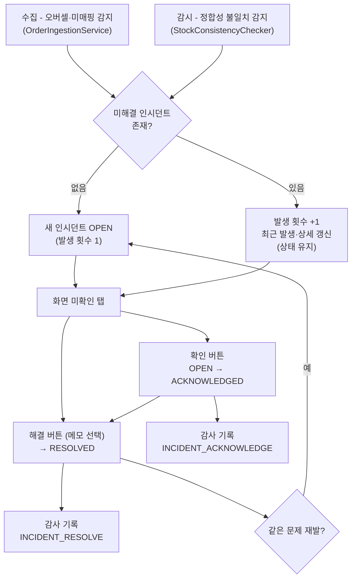

# [인시던트] 인시던트 관리 - 오버셀·정합성 불일치·미매핑 상태 관리

## 개요

인시던트 도메인 모듈(`palim-incident`)과 관리 화면(`/monitor/incidents`)을 구현했다.
오버셀·재고 정합성 불일치·미매핑 상품이 텔레그램 알림으로 흘러가고 끝나던 것이, 이제
**미확인 → 확인 → 해결** 상태로 사람이 마감할 때까지 남는다. "지금 열려 있는 문제가 몇
개인지"를 시스템이 답한다.

## 기능 흐름

## 변경 사항

### palim-incident (신설 — 13번째 모듈)

- `Incident` 엔티티: type(OVERSELL·STOCK_MISMATCH·UNMAPPED_PRODUCT) · dedupeKey ·
  status(OPEN→ACKNOWLEDGED→RESOLVED) · occurrenceCount · lastOccurredAt · 해결 메모
- `IncidentService`: `report()`(생성 또는 누적, MANDATORY) · `acknowledge()` · `resolve()` ·
  화면 조회 · `countUnresolved()`
- `IncidentRepository`: 미해결 건 비관적 락 조회 — 동시 갱신 시 낙관적 락 충돌로 수집
  트랜잭션이 구르는 것을 막는다

### palim-app

- Flyway `V4__incident.sql`: `incident` 테이블 + **부분 유니크 인덱스**
  (`dedupe_key WHERE status <> 'RESOLVED'`) + 상태·최근발생 인덱스
- 통합 테스트 `IncidentIntegrationTest` 8건, `TransactionBoundaryIntegrationTest` ·
  `ErrorCodeIntegrationTest` 확장

### palim-collector · palim-monitor

- `OrderIngestionService`: 오버셀(수집·소급 반영)·미매핑 시 `report()` — 수집 트랜잭션에
  참여하므로 롤백 시 유령 인시던트가 남지 않는다
- `StockConsistencyChecker`: 불일치 SKU 마다 `report()` — 알림 억제와 무관하게 누적

### palim-web · palim-audit · palim-common

- `IncidentController·AdminService·View` + `templates/monitor/incidents.html`:
  상태 탭(기본 미확인) · 발생 횟수 · 확인/해결 버튼(해결 메모 선택 입력) · 페이징
- `AuditType.INCIDENT_ACKNOWLEDGE`·`INCIDENT_RESOLVE`, `ScreenNames`·사이드바 등록
- `ErrorCode` 접두사 `I` 신설: `INCIDENT_NOT_FOUND`(I001)·`INCIDENT_STATUS_INVALID`(I002)

## 주요 구현 내용

**미해결 1행 강제는 부분 유니크 인덱스가 최종 방어선이다.** 정합성 불일치는 해결 전까지 매
주기 재감지된다 — 발생마다 행을 만들면 목록이 같은 문제로 도배되어 봐야 할 건이 묻힌다.
"조회 후 없으면 삽입"은 경합 순간 뚫리므로(중복 수집 방지와 같은 원리) 인덱스로 강제하고,
통합 테스트가 실제 PostgreSQL 에서 제약 동작을 검증한다.

**알림 억제와 인시던트 누적은 목적이 다르다.** `enqueueIfNotRecent` 는 스팸 방지가 목적이라
발생 사실 자체를 지운다. 인시던트는 억제와 무관하게 매 발생을 누적해 "며칠째, 몇 번째 지속
중인지"를 남긴다 — 같은 검사에서 알림은 억제되어도 발생 횟수는 올라간다.

**확인 상태에서 재발해도 미확인으로 되돌리지 않는다.** 이미 인지한 문제를 다시 미확인으로
올리면 확인 표시가 무의미해진다. 상태는 유지하고 횟수·최근 발생·상세만 갱신한다.

**RESOLVED 는 최종 상태다.** 재발은 재오픈이 아니라 새 인시던트다 — 지난 건의 해결 이력
(누가 언제 어떻게 조치했는지)을 보존한다. OPEN → RESOLVED 직행은 허용한다 (1인 운영에서
확인 클릭 강제는 수고만 늘린다).

**자동 해결은 만들지 않았다** (07-DECISIONS 022). 재검산 통과·매핑 등록 시 자동 RESOLVED 는
감시 배치·매핑 로직과 인시던트를 결합시킨다. 1인 운영에서 하루 몇 건 수준이라 수동으로
충분하다.

## 주의사항

- 미매핑 인시던트는 매핑 등록 후에도 자동으로 닫히지 않는다 — 소급 반영 확인까지가 조치이며
  해결 처리는 화면에서 한다
- 수집 실패는 인시던트 대상이 아니다 — 수집 모니터(#30)가 현재 상태를 보여준다. 이력 관리
  필요가 확인되면 그때 추가한다
- `docs/02-ARCHITECTURE`(모듈 13개·audit 표기)·`03-DOMAIN`(엔티티 표) 의 기존 누락도 함께
  보정했다. `palim-web/package-lock.json` 을 .gitignore 명시 정책대로 커밋했다 (CI 재현성)

## 검증

- 로컬 전체 빌드·테스트 통과 — Testcontainers PostgreSQL 17, 테스트 74건 (신규 16건 포함)
- CI (guard + build) 통과 후 머지
