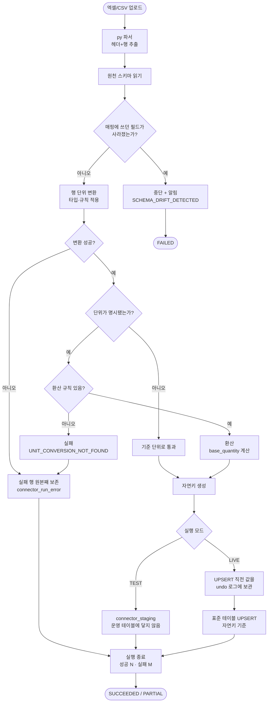
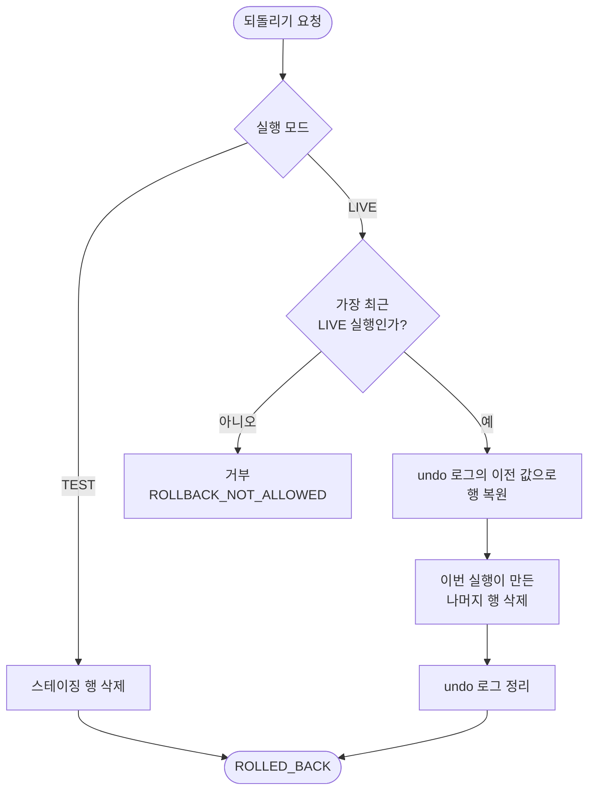

# 범용 데이터 연동 프레임워크와 물품 표준 모델 — Phase 1

## 개요

외부 시스템 데이터를 표준 모델로 들이는 과정을 **코드가 아니라 데이터로 정의**하는 엔진을
만들었다. 새 원천이 붙어도 배포가 필요 없고, 원천 양식이 바뀌면 매핑 버전을 올린다.

Phase 1 은 **엑셀/CSV 업로드 → 매핑 → 변환 → 표준 모델 적재**까지의 코어 파이프라인이다.
화면·AI 보조·cron·재고 대사(#49)는 이 위에 얹힌다. 계획한 12개 태스크를 모두 완료했고
`./gradlew build` 기준 **362건 통과**, CI 성공.

새 모듈 `palim-connector` 는 **도메인을 모른다.** 의존 방향은
`palim-connector ← palim-automation ← palim-web` 한쪽뿐이며, 연동 엔진이 도메인을 알면 다른
도메인이 붙을 때 재고 코드에 의존이 생긴다.

## 기능 흐름

되돌리기는 별도 경로다.

## 변경 사항

### 새 모듈

- `settings.gradle.kts` · `palim-connector/build.gradle.kts`: 연동 엔진 모듈 추가
- `palim-automation/build.gradle.kts`: `api(palim-connector)` 로 표준 모델 위에 도메인을 얹음

### 스키마 (V15 · V16)

- `V15__connector_framework.sql`: 정의 계층 6개(`target_model` · `target_field` · `connector` ·
  `connector_mapping` · `connector_field_map` · `unit_conversion`) + 실행 계층 5개
  (`connector_run` · `connector_run_error` · `connector_staging` · `custom_record` ·
  `connector_undo_log`) + `tenant`
- `V16__standard_models.sql`: 물품 표준 모델 4종(`std_item` · `std_stock_snapshot` ·
  `std_stock_movement` · `std_outbound_order`)과 자연키 인덱스

### 연동 엔진

- `model/`: 목표 모델·필드 정의, 표준 모델 필드 부트스트랩 4종
- `define/`: 커넥터·매핑 버전·필드 매핑 엔티티
- `source/`: `SourceReader` 인터페이스 + 업로드 구현체, 유형 레지스트리
- `excel/`: py 스크립트 호출 어댑터
- `schema/`: 드리프트 감지
- `transform/`: 변환 규칙 엔진, 타입 강제
- `unit/`: 단위 환산
- `key/`: 자연키 생성
- `write/`: 스테이징·표준 테이블 적재기, 모드별 선택
- `run/`: 실행 오케스트레이터, 되돌리기, 수량 정규화, 드리프트 가드
- `support/ColumnText`: 길이 제한 컬럼 처리

### 스크립트·배포

- `scripts/parse_stock_excel.py`: 엑셀/CSV → JSON. **pandas 미사용**
- `Dockerfile`: python3 · openpyxl 설치, `COPY scripts/` 추가

### 예외·문서

- `ErrorCode`: `K001`~`K014` 14개 + 한/영 메시지
- `07-DECISIONS.md` 026, `02-ARCHITECTURE.md` 활성 모듈, `05-INTEGRATION.md`

## 주요 구현 내용

### 연동 정의가 DB 행이다

`connector` · `connector_mapping` · `connector_field_map` 이 정의의 전부이며 코드가 아니다.
새 발주사·새 원천이 붙을 때 Java 코드를 쓰지 않고 화면에서 커넥터를 하나 더 만든다.

매핑은 **버전을 갖는다.** 실행 기록(`connector_run.mapping_version`)이 버전 번호를 값으로 들고
있어 정의를 바꿔도 "지난달 데이터가 왜 이런가"에 답할 수 있다. 덮어쓰는 구조였다면 과거를
설명할 방법이 사라진다.

### TEST 와 LIVE 의 적재 대상을 분리했다

설계 초안은 TEST 도 표준 테이블에 넣고 지우는 방식이었는데, 두 가지가 성립하지 않았다.

- UPSERT 로 덮어쓴 행은 소유 실행(`run_id`)이 바뀌어 "그 실행분만 삭제"가 불가능하다
- 지우기 전에 도메인 로직이 읽으면 오염된 결과가 나온다

TEST 는 `connector_staging` 에만 쓴다. **운영 데이터에 닿은 적이 없으므로** 부담 없이
테스트할 수 있고, 부담이 없어야 사람이 실제로 테스트한다.

### 실패 조건을 좁게 잡았다

두 곳에서 "무조건 실패"를 완화했다. 안전장치는 **과민하면 꺼지고, 꺼진 안전장치는 없는 것과
같기 때문**이다.

| 대상 | 초안 | 최종 |
|---|---|---|
| 단위 환산 | 규칙이 없으면 실패 | 단위가 **명시됐는데** 규칙이 없을 때만 실패 |
| 드리프트 | 필드 목록이 다르면 중단 | **매핑에 쓰던 필드**가 사라졌을 때만 중단 |

단위 쪽은 실측이 근거다. 확인한 두 원천 모두 단위 컬럼이 아예 없어서, 초안대로면 첫 적재부터
전량 실패했을 것이다.

### 재시도가 안전하다

목표 모델마다 자연키(`natural_key_fields`)를 정의하고 적재는 INSERT 가 아니라 **UPSERT** 다.
증분 수집은 **성공한 실행만** 커서를 전진시키고, 실패하면 같은 구간을 다시 읽는다 — 중복은
자연키가 흡수한다.

자연키 생성에서 세 가지를 막았다.

1. 구분자를 유니트 구분자(U+001F)로 — `"A|B"+"C"` 와 `"A"+"B|C"` 가 겹치지 않는다
2. 빈 값도 자리를 지킨다 — 건너뛰면 뒤 값이 앞으로 밀려 다른 조합과 같아진다
3. 길이 초과는 절단이 아니라 **해시 축약** — 앞부분이 같은 긴 키들이 하나로 합쳐지면 UPSERT 가
   남의 행을 덮어쓴다

## 주의사항

### 나중에 건드리면 위험한 곳

**`ColumnText.shortenKey` 를 단순 절단으로 바꾸면 안 된다.** 자연키는 UPSERT 의 기준이라,
서로 다른 두 행이 같은 키가 되는 순간 하나가 조용히 사라진다. 로그에도 에러에도 남지 않는다.

**`connector_undo_log` 의 `ON CONFLICT DO NOTHING` 을 제거하면 안 된다.** 원천 파일에 같은
자연키가 두 번 나오는 것은 흔한 일인데, 그때 두 번째 undo 행의 이전 값은 *이번 실행이 방금 쓴
값*이다. 복원이 최초 상태가 아니라 중간 상태로 간다.

**`connector_run_error.message` 저장 시 절단을 빼면 안 된다.** PostgreSQL 은 `varchar(n)` 초과를
조용히 자르지 않고 22001 로 트랜잭션을 중단시킨다. 실패 행을 기록하려다 실행 전체가 죽는다 —
부분 실패 허용이라는 설계가 통째로 무너진다.

**`ConnectorRunner` 에 클래스 단위 `@Transactional` 을 걸면 안 된다.** 청크가 하나의 트랜잭션으로
묶여 부분 실패를 표현할 수 없다. 마지막 행에서 터지면 앞의 999행도 함께 사라진다.

### 구현 중 드러난 것

계획서만 봐서는 안 나오고 실제로 돌려야 드러난 것들이다.

| 발견 | 영향 |
|---|---|
| `Dockerfile` 에 python3 도 `scripts/` 복사도 없었다 | py 스크립트가 운영에서 못 돈다. 기존 자막 수집 스크립트도 마찬가지였다 |
| 엑셀 날짜가 `2027-01-01T00:00:00` 으로 온다 | 날짜만 받는다고 가정하면 유통기한 필드가 전량 실패한다 |
| 테스트에서 `scripts` 상대경로가 안 맞는다 | Gradle 이 모듈 디렉터리를 작업 디렉터리로 삼는다. 운영(Docker `WORKDIR=/app`)은 맞다 |
| `ErrorCode` 접두사 화이트리스트가 테스트에 하드코딩 | 새 도메인 추가 시 반드시 걸린다 |

pandas 는 쓰지 않기로 했다. 필요한 기능이 "헤더를 읽고 각 행을 문자열로" 뿐인데 수십 MB 이고,
타입을 추론했다가 다시 문자열로 되돌리는 낭비가 있다. **CSV 는 표준 `csv` 모듈, 엑셀일 때만
`openpyxl` 을 지연 import** 하므로 CSV 만 쓰는 환경에서는 외부 의존이 아예 없다.

### 추후

- **멀티테넌시 필터 적용** — `tenant_id` 컬럼과 인덱스는 넣었지만 Hibernate `@Filter` 적용은
  Phase 2 다. 화면이 있어야 세션 컨텍스트가 생긴다
- **py 훅 실행기** — 선언적 규칙은 구현했고 훅은 화면에서 지정할 수 있어야 의미가 있다
- **실행 이력 조회 페이징** — 현재 무제한 `List` 반환. 대량 실패 시 화면 조회가 전부를 힙에 올린다
- **실패 행 보존기간** — 출고 주문 원천이면 수령자 정보가 무기한 남는다. 오너 판단으로 현행
  유지하되, 필요해지면 `run_id` 기준 삭제 배치를 추가하면 된다

### 착수 전 정리가 필요한 것

- **ERP API 인증키** — 확인한 계정이 회사 마스터가 아니어서 발급 권한이 없었다
- **WAREHOUSE API 유료 결정** — 초기 세팅비 + 월 이용료. 결정 전까지는 엑셀 업로드 경로로 진행
