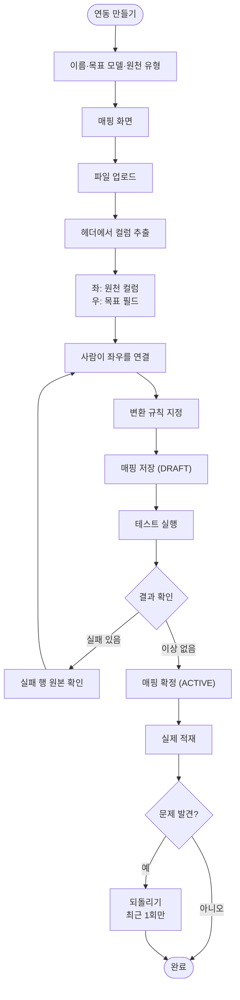
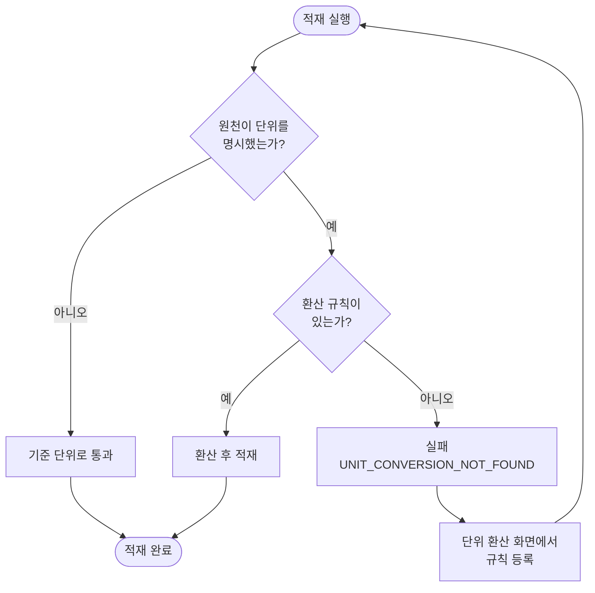

# 연동 커넥터 화면과 매핑 편집기

## 개요

#53 에서 만든 연동 엔진을 **사람이 쓸 수 있게** 하는 화면이다. 연동 정의를 데이터로 둔 이유가
"화면에서 만들기 위해서"였으므로, 화면이 없으면 그 설계가 의미를 갖지 못한다.

이번 작업으로 **엑셀을 올려 매핑을 정의하고 실제로 적재하는 전 과정**이 화면에서 완결된다.
`./gradlew build` 기준 **380건 통과**.

함께 Phase 1 에서 미뤘던 **테넌트 격리**를 적용했다. 컬럼과 인덱스만 있던 상태에서 실제
필터를 켜고, 두 번째 테넌트를 만들어 격리를 검증했다.

## 기능 흐름

단위 때문에 적재가 막혔을 때의 흐름은 별도다.

## 변경 사항

### 화면

- `templates/connector/list.html`: 커넥터 목록. 확정 여부·마지막 실행 결과를 뱃지로 구분
- `templates/connector/new.html`: 연동 만들기
- `templates/connector/mapping.html`: **매핑 편집기** — 업로드·연결·테스트·확정이 한 화면
- `templates/connector/runs.html`: 실행 이력. 되돌리기는 최근 실행에만 노출
- `templates/connector/run-detail.html`: 실패 행 원본과 변환 결과 미리보기
- `templates/connector/models.html` · `model-detail.html`: 목표 모델 조회·커스텀 정의
- `templates/connector/units.html`: 단위 환산 규칙
- `templates/layout.html`: 사이드바에 「데이터 연동」 메뉴

### 컨트롤러·서비스

- `web/connector/ConnectorController`: 목록·생성·매핑·실행·되돌리기
- `web/connector/ConnectorAdminService`: 쓰기 동작(생성·초안 저장·확정·임시파일)
- `web/connector/ConnectorQueryService`: 화면용 read model (`JdbcClient`)
- `web/connector/UnitConversionController` · `UnitConversionAdminService`
- `web/connector/TargetModelController`
- `web/connector/FieldMappingForm`: 화면 입력 → 변환 규칙 JSON

### 테넌트 격리

- `connector/tenant/TenantContext`: `ThreadLocal` 현재 테넌트
- `connector/tenant/package-info`: `@FilterDef(autoEnabled = true)` + `resolver`
- `connector/tenant/TenantScopedRepository`: `JdbcClient` 조건 강제
- 연동 엔티티 10종에 `@Filter` 적용

## 주요 구현 내용

### AI 없이 완주된다

매핑 편집기에 **AI 버튼이 없다.** 헤더에서 필드 목록을 뽑는 것은 코드가 하고, 연결은 사람이
한다. 통합 테스트 `연동 만들기부터 실제 적재까지 AI 없이 완주된다` 가 이를 검증한다.

AI 초안은 나중에 붙는 **보조** 기능이며, 그것이 없어도 제품이 성립하는지를 먼저 확인하는 것이
설계 원칙이었다.

### 막는 장치를 만들었으면 푸는 수단도 준다

원천이 단위를 명시했는데 환산 규칙이 없으면 적재가 실패한다. 이 판단 자체는 옳다 — 조용히
1:1 로 넘기면 BOX 12개가 EA 12개로 둔갑하고, 그 오류는 대사 결과가 이상해질 때까지 아무도
모른다.

문제는 **화면이 없으면 DB 를 직접 건드려야 푼다**는 것이었다. 단위 환산 화면을 같은 PR 에 넣은
이유다.

### 테넌트 필터는 선언 한 곳에서 강제한다

`@FilterDef(autoEnabled = true)` 와 `resolver` 를 쓰면 세션이 열릴 때 자동으로 켜진다. 각
서비스가 필터를 직접 활성화하고 파라미터를 넘기게 두면 **한 곳만 빠뜨려도 다른 테넌트의
데이터가 보인다.**

`JdbcClient` read model 은 JPA 를 거치지 않아 필터가 걸리지 않는다. `TenantScopedRepository`
가 조건을 채우고, `:tenantId` 가 없는 쿼리는 예외로 거부한다.

## 주의사항

### 나중에 건드리면 위험한 곳

**`TenantContext.clear()` 를 빼면 안 된다.** 스레드 풀에서 스레드가 재사용되므로 남겨두면
다음 요청이 앞 요청의 테넌트로 조회한다.

**`TenantScopedRepository.scoped` 의 `:tenantId` 검사를 완화하면 안 된다.** 조건을 깜빡한
쿼리를 조용히 통과시키면 다른 테넌트 데이터가 섞이고, 그 사실은 한참 뒤에 드러난다.

**`saveDraft` 의 `flush()` 를 빼면 안 된다.** JPA 가 flush 시점을 스스로 정하므로 삭제보다
삽입이 먼저 나가 유니크 제약을 위반한다. 매핑을 두 번 저장하는 것은 화면에서 가장 흔한
동작이다.

**단위 환산 중복 검사에 `findFactors` 를 쓰면 안 된다.** 그쪽은 전역 규칙까지 함께 찾으므로
품목별 예외 규칙을 만들 수 없게 된다.

### 통합 테스트가 잡은 버그 2건

둘 다 화면에서 흔한 동작이고 단위 테스트로는 안 잡힌다 — 리포지토리를 모킹하면 flush 순서도,
쿼리 조건의 의미도 드러나지 않는다.

| 버그 | 증상 |
|---|---|
| `deleteByMappingId` flush 누락 | 매핑을 두 번 저장하면 유니크 제약 위반 |
| 중복 검사에 조회용 쿼리 재사용 | 전역 규칙이 있으면 품목별 예외를 만들 수 없음 |

### 추후

- **실패 행 페이징** — 현재 상한 100건 고정이라 대량 실패 시 화면이 잘린다
- **테넌트 전환 UI** — 지금은 기본 테넌트 하나로 고정. SaaS 로 갈 때 로그인 세션에서 꺼낸다
- cron 스케줄러 · 증분 실전 적용 · `HTTP_API` 원천 — Phase 3
- AI 초안 채우기 — Phase 4
