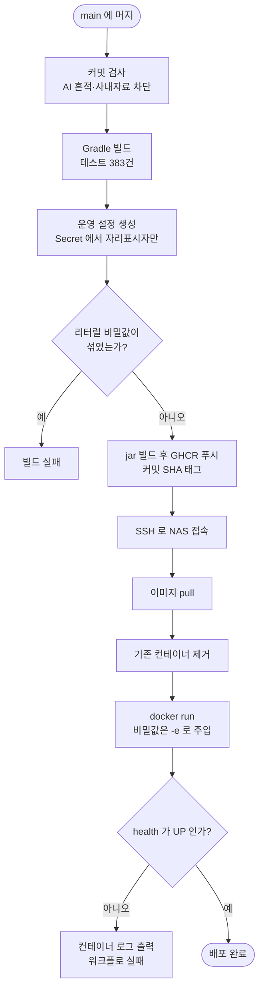
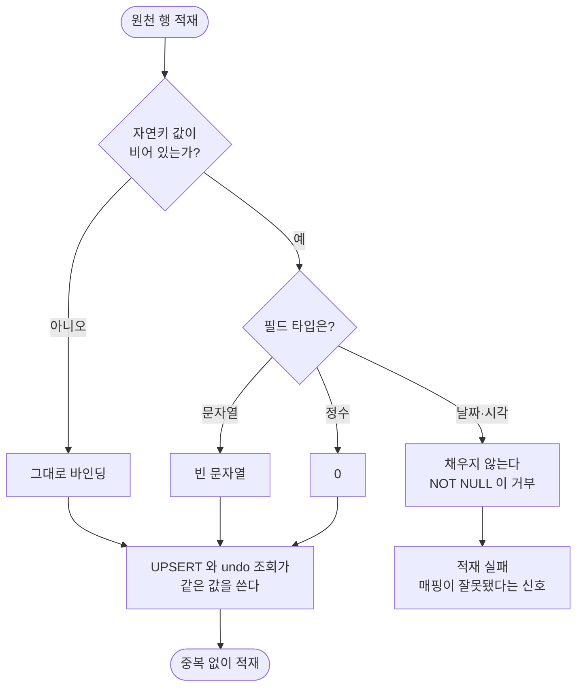

# 운영 배포 준비 — PostgreSQL 14 호환과 자동 배포 파이프라인

## 개요

palim 을 처음으로 운영 배포했다. **운영 도메인 응답까지 실측 확인**했다.

배포를 막고 있던 것은 마이그레이션의 `NULLS NOT DISTINCT`(PostgreSQL **15+**)였다.
운영 DB 는 NAS 공용 **PostgreSQL 14.15** 라 이 문법에서 Flyway 가 멈추고, V15·V16 이 통째로
미적용되어 **애플리케이션이 기동조차 못 하는** 상태였다.

이것이 지금까지 드러나지 않은 이유가 더 중요하다. **테스트가 `postgres:17-alpine` 을 쓰고
있었다.** 운영보다 세 메이저 높은 DB 로 검증하니 상위 버전 전용 문법이 전부 통과했다.
문법 실수가 아니라 **검증 대상이 운영과 달랐던** 구조적 문제다.

## 기능 흐름



자연키의 빈 값 처리가 이번 수정의 핵심이다.



## 변경 사항

### PostgreSQL 14 호환

- `V15__connector_framework.sql`: `unit_conversion.item_ref` 를 `NOT NULL DEFAULT ''` 로,
  `NULLS NOT DISTINCT` 제거
- `V16__standard_models.sql`: `warehouse_code`·`lot_code`·`document_no` 를
  `NOT NULL DEFAULT ''`, `order_line_no` 를 `NOT NULL DEFAULT 0` 으로. 인덱스 3곳에서
  `NULLS NOT DISTINCT` 제거
- `StandardModelWriter`: 자연키 `null` 을 타입별 빈 값으로 정규화. undo 조회 조건을
  `IS NOT DISTINCT FROM` 에서 `=` 로
- `UnitConversion`: `GLOBAL` 상수와 `normalizeItemRef` 추가
- `UnitConversionRepository`: `is null` 조건 제거, `findRule`·`existsRule` 이 정규화를 강제
- `UnitConverter`: `findFactors` 직접 호출을 `findRule` 로

### 검증 환경 정렬

- `IntegrationTest`: `postgres:17-alpine` → `postgres:14-alpine`
- `docker-compose.yml`: 로컬 개발 DB 도 14 로
- `StandardModelSchemaIntegrationTest`: 인덱스 정의 문자열 검사를 **행동 검증**으로 교체
- `UnitConversionAdminIntegrationTest`: 규칙 우선순위·공백 품목 검증 추가

### 운영에서만 드러났을 문제

- `application.yaml`: `spring.servlet.multipart` 상한을 50MB/60MB 로
- `SessionWatchController`: SSE 응답에 `X-Accel-Buffering: no`, `Cache-Control: no-store`

### 배포

- `.github/workflows/build.yml`: 운영 설정 생성 스텝 + `deploy` job 추가
- `CLAUDE.md`·`docs/06-OPERATIONS.md`: 운영 PostgreSQL 버전과 배포 절차 명시

## 주요 구현 내용

### `NULLS NOT DISTINCT` 를 지우는 것만으로는 안 된다

그냥 지우면 창고·로트가 없는 원천에서 `NULL != NULL` 이 되어 **같은 재고가 실행할 때마다
새 행으로 쌓인다.** 에러가 나지 않으므로 대사 수치가 조용히 부풀어 오른다.

그래서 **자연키 컬럼에서 NULL 자체를 없앴다.** `NOT NULL DEFAULT ''` 로 두면 평범한 유니크
인덱스로 같은 효과가 나고 DB 버전 의존성이 사라진다. 자연키에서 "값 없음"과 "빈 값"을
구분할 실익도 없다.

`COALESCE` 표현식 인덱스는 택하지 않았다. `StandardModelWriter` 가 `ON CONFLICT` 컬럼 목록을
평문으로 조립하므로 표현식 인덱스와 매칭되지 않는다. 그 경우 마이그레이션도 기동도 성공하고
**커넥터를 실제로 돌리는 첫 순간에** `no unique or exclusion constraint matching` 으로 죽는다.

### 비밀값을 이미지에 굽지 않는다

기존 관례는 `application-prod.yml` 을 Secret 에서 만들어 이미지에 넣는 방식이다. 그러면
이미지를 받을 수 있는 사람이 비밀번호를 전부 꺼낼 수 있다. 운영 설정에는 `${환경변수}`
자리표시자만 두고 실제 값은 `docker run -e` 로 주입했다.

워크플로가 **리터럴 비밀값이 섞였는지 검사해 빌드를 실패시킨다.** 규칙만으로는 언젠가
누군가 값을 직접 적는다.

### 곁가지로 사라진 버그

`unit_conversion` 의 "전역 규칙 = NULL" 을 빈 문자열로 바꾸자 #55 에서 잡았던 삼항 논리
조건(`(:itemRef is null and c.itemRef is null) or ...`)이 통째로 사라졌다. NULL 을 쓰지
않으면 그 실수를 할 자리가 없어진다.

## 배포 결과 (실측)

| 확인 항목 | 결과 |
|---|---|
| 컨테이너 | `palim` — `ghcr.io/cassiiopeia/palim:180658b3` |
| 포트 | 컨테이너 `8080` 을 호스트 포트에 매핑 |
| Flyway | **16개 마이그레이션 전부 적용, v16** (PG14 에서 V15·V16 정상 실행) |
| 스키마 | `std_*`·`connector*` 테이블 11개 생성 |
| 기동 | `Started PalimApplication in 65.278 seconds` |
| 헬스체크 | `{"status":"UP"}` |
| 도메인 | `GET /` → `302 /login` → **`200`, 로그인 화면 렌더** |
| TLS | 인증서 검증 통과, HSTS·`X-Frame-Options: DENY` 적용 |
| 관리자 계정 | `admin` 생성, 최초 로그인 시 비밀번호 변경 강제 (#51) |

## 주의사항

### 발견된 결함 — 기동 시 ERROR 1건

```
ERROR [scheduling-2] Unexpected error occurred in scheduled task
kr.suhsaechan.palim.common.error.BusinessException: NOTIFICATION_SETTING_NOT_INITIALIZED(N002)
```

알림 설정 부트스트랩(`01:57:30.916`)보다 스케줄 작업(`01:57:29.952`)이 **1초 먼저** 돌아서
나는 경쟁 조건이다. 설정이 만들어진 뒤에는 정상 동작하므로 기능 영향은 없지만, **재시작할
때마다 ERROR 가 한 번씩 찍힌다.** 진짜 장애와 섞이면 알아보기 어려워지므로 스케줄러 시작을
부트스트랩 이후로 미루거나, 설정이 없을 때 조용히 건너뛰도록 고쳐야 한다.

### 건드리면 위험한 곳

**Testcontainers 버전을 올리면 안 된다.** 운영 DB 를 먼저 올리지 않는 한
`postgres:14-alpine` 을 유지한다. 이번 사고가 정확히 그 불일치에서 나왔다.

**자연키에 `COALESCE` 표현식 인덱스를 쓰면 안 된다.** 위 구현 내용 참고 — 적재 첫 실행에서
죽는데 마이그레이션과 기동은 성공하므로 배포 후에야 드러난다.

**`forward-headers-strategy: framework` 는 프록시 뒤에서만 유효하다.** 포트를 직접 노출하는
환경에서 켜면 클라이언트가 `X-Forwarded-For` 를 위조해 감사 로그를 속일 수 있다.

**`naturalKeyParams` 의 정규화를 한쪽만 바꾸면 안 된다.** UPSERT 와 undo 스냅샷 조회가 같은
값을 써야 하고, 어긋나면 undo 로그가 조용히 비어 되돌리기를 눌러본 뒤에야 드러난다.

### 정리 필요

NAS 의 배포용 디렉터리에 배포 방식을 정하기 전 만들어 둔 `.env` 와
`docker-compose.yml` 이 남아 있다. 지금 배포는 compose 를 쓰지 않으므로 **아무 데서도
참조되지 않는다.** `README.txt` 로 표시만 해 두었고 삭제하지 않았다.

같은 이유로 `palim-db`(postgres:16) 컨테이너도 사용되지 않는다 — 앱은 공용 PostgreSQL 14 의
`palim` DB 에 붙어 있다.

### 남은 것

- **외부 노출 접근 제어** — 관리자 화면이 인터넷에 열려 있다. 기본 비밀번호 변경 강제와
  5회 실패 잠금은 있지만, Cloudflare Access 나 DSM 방화벽 IP 제한을 얹는 편이 안전하다
- 위 알림 스케줄러 경쟁 조건
