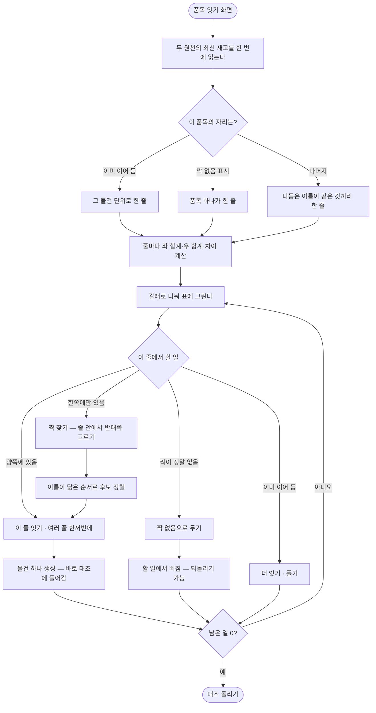

# 대조를 하러 온 화면에서 대조를 할 수가 없다

## 개요

품목 잇기 화면이 셋으로 쪼개져 있어 **무엇과 무엇이 같은지 볼 수가 없었다.** 「이을 만한 것」은
좌·우를 한 칸에 세로로 쌓았고, 「직접 골라서 잇기」는 좌·우 목록이 서로 무관하게 놓였으며,
「정해 둔 품목」은 코드·이름·단위만 보여줘 방금 무엇이 만들어졌는지 알 수 없었다. 게다가
잇기 전에 양쪽 수량 차이를 볼 방법이 없어, 잘못된 매칭은 **이어 놓고 대조를 돌려야** 드러났다.

이 셋을 **표 한 장**으로 합쳤다. 한 줄이 물건 하나이고, 물건 이름·왼쪽 품목·오른쪽 품목·
수량 차이가 나란히 놓인다. 여러 줄을 골라 한꺼번에 처리할 수 있고, 짝이 없는 품목을 표시해
두면 남은 일 개수가 0에 도달한다. 이름 다듬기 규칙 화면도 함께 만들어, 표기 습관이 다른
회사에서도 규칙을 넣어 쓸 수 있게 했다.

## 기능 흐름

## 변경 사항

### 대조표 계산 (신규)

- `palim-reconcile/.../match/MatchBoard.java`: 두 원천의 최신 재고와 이어 둔 것·짝 없음
  표시를 한 번에 읽어 **줄 단위**로 묶는다. 줄마다 좌·우 합계와 차이·백분율을 계산하고,
  갈래(할 일 / 이을 수 있는 것 / 짝을 못 찾은 것 / 이어 둔 것 / 짝 없음으로 둔 것)·검색·
  쪽 나누기를 맡는다
- `palim-reconcile/.../match/NameSimilarity.java`: 글자 두 개씩 잘라 겹치는 비율(Dice)로
  이름이 닮은 정도를 잰다. **후보를 늘어놓는 순서에만** 쓰고 판단은 대신하지 않는다
- `palim-reconcile/.../match/UnpairedItem.java`·`UnpairedItemRepository.java`·
  `UnpairedService.java`: 「이 품목은 짝이 없다」 표시. 지우지 않고 표시만 하므로 되돌릴 수 있다
- `palim-app/src/main/resources/db/migration/V24__unpaired_item.sql`: 위 표시를 담는 표

### 이름 다듬기 규칙 (신규 화면)

- `palim-reconcile/.../rule/NormalizationRuleService.java`: 규칙 추가·수정·순서·켜고끄기·삭제.
  고칠 때마다 엔진의 정규식 캐시를 비운다
- `palim-reconcile/.../rule/NormalizationPreview.java`: **지금 담긴 실제 품명**에 규칙을 걸어
  본다. 별도 스레드 + 제한 시간으로 돌리고, 입력을 감싸 인터럽트가 실제로 먹게 한다
- `palim-web/.../reconcile/RuleController.java`, `templates/reconcile/rules.html`: 목록·수정·
  순서·켜고끄기·미리보기 화면

### 품목 잇기 화면

- `palim-web/.../reconcile/UnitController.java`: 전면 재작성. 잇기(단건·여러 건)·줄 안 짝
  찾기·풀기·짝 없음 두기·되돌리기·계수 고치기. 누른 뒤 **보던 갈래·검색어·쪽·표 자리**로 돌아온다
- `palim-web/src/main/resources/templates/reconcile/units.html`: 대조표 한 장으로 재작성

### 성능·정합

- `palim-reconcile/.../rule/NormalizationEngine.java`: 규칙을 한 번만 읽는 배치 조회 추가.
  품목마다 규칙을 다시 읽던 것(N+1)을 없앴다
- `palim-reconcile/.../unit/ReconcileUnitService.java`: 물건을 통째로 푸는 길 추가
- `palim-web/.../setup/SetupService.java`: 홈의 「품목 맞추기」를 **실제 남은 일 개수**에 연결

### 정리

- `MatchCandidateFinder`·`SourceItemBrowser`·`PickForm`·`PickedView`·`PendingUnitView` 제거.
  대조표가 이들을 대신하므로 남겨 두면 어느 쪽이 진짜인지 흐려진다. 시험은
  `MatchBoardIntegrationTest`로 옮겨 안전망을 유지했다

## 주요 구현 내용

### 줄이 만들어지는 근거는 셋뿐이고, 사람이 정한 것이 앞선다

① 이미 이어 둔 것이면 **그 물건 단위로**, ② 짝 없음으로 표시해 둔 것이면 **품목 하나가 한
줄로**, ③ 나머지는 **다듬은 이름이 같은 것끼리**. 순서를 반대로 하면 규칙 한 줄을 고칠 때마다
이미 정해 둔 것이 흩어진다.

### 확인 단계를 없앴다

확인이 따로 필요했던 것은 화면이 좌·우를 나란히 못 보여주던 때다. 「erp · A0001 · 1」만 보고는
판단할 수 없으니 한 단계를 더 둔 것인데, 지금은 누르기 전에 그 줄에서 좌·우 품명과 수량 차이가
다 보인다. **보고 누른 것이 곧 확인**이고, 안전망은 확인 단계가 아니라 모든 줄에 있는 「풀기」다.

### 한쪽에만 있는 줄은 잇지 못하게 막았다

이으면 합산이 「좌 120 · 우 0」이 되어 대조가 **매일 전량 차이를 올린다.** 사람은 그것을 매칭
문제가 아니라 재고 사고로 읽고, 원인이 여기 있다는 것을 알 방법이 없다. 그 줄의 제 자리는
「짝 없음으로 두기」이고, 그래야 남은 일이 0에 도달한다.

### 화면 안에 코드를 넣을 수 없는 제약을 폼 구조로 풀었다

보안 정책이 화면 내 스크립트를 조용히 막으므로, 여러 줄 고르기는 **체크상자는 표 안에 두고
폼은 표 밖에 두는** HTML 표준 기능으로 구현했다. 그래야 줄 안에 또 다른 폼(짝 찾기)을 둘 수
있다 — 폼은 폼 안에 못 들어간다.

### 미리보기는 요청 스레드를 붙잡지 못한다

사람이 정규식을 직접 넣는 화면인데, **웹 서버는 이미 돌고 있는 요청 처리를 죽이지 않는다.**
브라우저가 기다리다 포기해도 그 처리는 계속 돌고, 몇 번 반복하면 서버 전체가 응답을 멈춘다.
그래서 미리보기를 별도 스레드에서 제한 시간을 걸고 돌리고, 입력을 감싸 취소가 실제로 먹게 했다.

## 검증

| 항목 | 결과 |
|---|---|
| 로컬 전체 빌드 | 성공 |
| 테스트 | **600건 통과 · 실패 0** |
| CI (Gradle 빌드 / 커밋 검사 / CodeQL) | 전부 success |
| 이미지 푸시 · 서버 배포 | success |
| 운영 기동 | 머지 SHA 이미지로 기동 확인 |
| 스키마 이행 | `v24` 적용 완료 (실행 0.155초) |
| 기동 로그 | 정상 시작, **오류 0건** |
| 헬스 응답 | 200 |

시험이 지키는 것: 이름이 달라도 줄 안에서 짝을 골라 이어진다 / 이은 것은 바로 대조에
들어간다 / 계수를 고치면 그만큼 곱해 견준다 / 이어 둔 물건에 더 담으면 합쳐진다 /
한쪽에만 있는 줄은 잇지 않고 할 일을 말한다 / 고른 여러 줄이 각각 한 물건이 된다 /
짝 없음으로 두면 할 일에서 빠지고 되돌릴 수 있다 / 푼 것은 다시 할 일로 돌아온다 /
누른 뒤 보던 자리로 돌아온다 / 규칙을 넣으면 다듬기 결과가 바로 달라진다 / 잘못된 정규식은
이유를 말하고 저장하지 않는다 / 미리보기가 오래 걸리면 제한 시간에 끊고 요청을 풀어 준다

## 주의사항

### 다음에 이 부분을 건드릴 때

- **합산과 미연결 조회는 반드시 함께 고친다.** 지금 두 조회 모두 물건의 「그만 쓰기」 상태를
  보지 않는다. 한쪽만 고치면 재고가 대조에서 조용히 사라진다
- **줄 열쇠를 화면이 보낸 품목 목록으로 대체하지 않는다.** 지금은 열쇠만 받아 서버가 줄을
  다시 계산한다. 화면을 띄운 뒤 다른 사람이 그 품목을 이었을 수도, 주소를 고쳐 남의 품목을
  끼워 넣었을 수도 있다
- **대조표는 요청 한 번에 두 원천의 최신 재고를 전부 읽는다.** 품목이 수천 개가 되면 이
  구조를 다시 봐야 한다. 지금 규모에서는 규칙 조회 N+1을 없앤 것으로 충분하다

### 확인하지 못한 것

미리보기의 정규식 폭주 방어 장치는 **폭주 자체를 재현하지 못했다.** 현행 자바 정규식 엔진이
고전적인 되돌아가기 패턴을 최적화로 흘려보내고, 입력 길이를 300자로 자르는 것과 겹쳐서다.
그것은 엔진 구현의 성질이지 보장이 아니므로 장치는 남겼고, 시험은 표본을 늘려
**「오래 걸리면 요청 스레드가 풀려나는가」**를 확인하는 쪽으로 세웠다.

### 이번 배포에서 겪은 것

배포 도구가 base 가 `main` 인 열린 PR을 배포 PR로 오인해, 무관한 PR의 본문을 릴리스 노트로
덮어썼다. 편집 이력에서 원문을 복구했고, 배포 PR은 명시적으로 새로 만들어 진행했다.
이 저장소에는 자동 머지 워크플로우가 없으므로 **배포 PR은 CI 통과를 확인한 뒤 직접 머지**한다.

### 남은 일

- 대조에서 「보는 범위」(창고·로트 단위 비교)를 여는 설계는 문서에만 있고 아직 구현하지 않았다
- 연동 화면이 시험 실행 이력을 실제 적재처럼 보여주는 문제는 그대로 남아 있다
