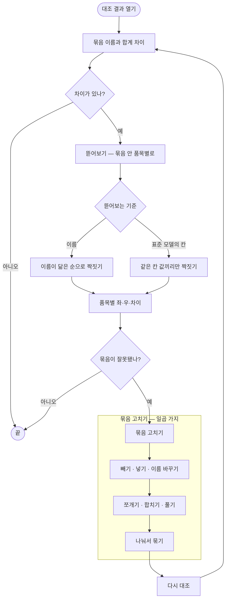
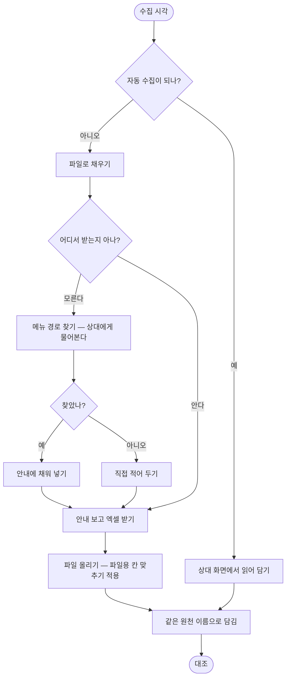

# 대조 결과가 「U-6668d23b · +11」 이라고만 말한다

## 개요

대조는 차이를 **찾아 놓고도 말하지 못했다.** 결과 화면은 `U-6668d23b`라는 내부 식별자와
`+11`이라는 합계만 내놓았다. 무엇이 11개 많은지, 어느 품목 때문인지, 애초에 저 묶음에 무엇이
담겼는지 화면 어디에도 없었다. **차이를 보러 온 사람에게 차이를 볼 수 없는 결과를 준 셈이다.**

같은 뿌리의 문제가 묶는 쪽에도 있었다. 시스템이 알아서 묶어 주기는 하는데 **그 묶음을 사람이
고칠 수가 없었다** — 빼지도, 넣지도, 쪼개지도, 합치지도 못했다. 추천이 틀리면 방법이 없었다.

그리고 마지막 문제. 이쪽 수집은 공식 API가 아니라 상대 화면을 읽어 오는 방식이라 **상대가
화면을 바꾸는 날 멈춘다.** 멈추면 그날 대조는 못 한다 — 손으로 대신할 길이 없었다.

이 세 가지를 한 이슈에서 함께 해결했다. 공통점은 **「제품이 판단을 독점하지 않는다」** 이다.
보여 주고, 고칠 수 있게 하고, 막혔을 때 우회로를 준다.

## 기능 흐름





## 변경 사항

### 결과를 사람 말로 — 그리고 뜯어볼 수 있게

- `palim-reconcile/.../match/CommonName.java`: 묶음에 담긴 품명들의 **공통 부분**을 뽑아
  이름을 짓는다. 식별자 대신 사람이 아는 이름이 나온다
- `palim-reconcile/.../match/UnitBreakdown.java`: 합계 뒤를 **품목 단위로 뜯는다.** 어느
  품목이 얼마나 다른지가 줄 단위로 나온다
- `palim-reconcile/.../match/BreakdownAxis.java`: 뜯어보는 **기준**을 값으로 만들었다
  (이름으로 / 표준 모델의 어느 칸으로 / 안 뜯기)
- `palim-web/.../reconcile/run-detail.html`: 결과 줄에 이름·표시·펼치기. 뜯어본 표는
  `th:fragment="breakdown"` 으로 잇기 화면과 **같은 조각을 쓴다**

### 묶음을 사람이 고칠 수 있게 — 일곱 가지

- `palim-reconcile/.../unit/ReconcileUnitService.java`: `rename`·`attach`(넣기)·
  `unlinkUnit`(풀기)·`merge`(합치기)·`split`(쪼개기) 추가
- `palim-reconcile/.../match/UnitSplitter.java`: **나눠서 묶기** — 하나로 묶기 전에 갈래를
  미리 보여 주고, 갈래대로 각각 잇는다
- `palim-web/.../reconcile/UnitEditController.java`: 묶음 편집 화면 일체
  (`/edit`·`/members/{id}/remove`·`/add`·`/split`·`/merge`)
- `palim-web/.../reconcile/unit-edit.html`, `unit-split.html`: 담긴 품목을 좌·우로 갈라
  보여 주고 `×`로 빼고 `+`로 넣는다

### 되돌릴 수 있게 · 헤매지 않게

- `palim-web/.../reconcile/UnitController.java`: 이은 직후 **되돌리기** 버튼, 이어진 묶음으로
  **바로 가기**, 줄 전체 고르기, 짝 후보에 **차이 미리보기**
- `palim-web/.../reconcile/MethodController.java`: 「어떻게 맞추나」 안내 화면과 맞추는 방식을
  한 자리에 모은 설정 화면

### 자동 수집이 깨졌을 때의 우회로

- `palim-connector/.../define/Intake.java`: 한 연동에 **길이 둘**(자동 수집용 / 파일 업로드용)
  이라는 개념. 같은 원천 이름으로 담기므로 대조는 무엇으로 담겼는지 몰라도 된다
- `palim-connector/.../run/ConnectorRunner.java`: 파일이 오면 파일용 칸 맞추기를 쓴다.
  **단, 원래부터 파일 연동인 것은 예외** — 이 예외를 빠뜨려 기존 연동이 전부 깨졌었다
- `palim-connector/.../source/http/MenuPathProbe.java`, `MenuPathFinder.java`:
  「어느 메뉴에서 엑셀을 받나」 를 **상대 시스템에 물어서** 알아낸다
- `V28__connector_mapping_intake.sql`: 칸 맞추기에 길 구분 추가, 활성 칸 맞추기 유니크
  인덱스를 `(연동, 길)` 로 넓힘

## 주요 구현 내용

### 뜯어보는 기준을 코드에 박지 않았다

「로트번호로 뜯어본다」 를 코드에 적으면 로트번호가 없는 회사에서는 쓸 수 없다. 그래서 기준을
**표준 모델에 실제로 정의된 칸 중에서 고르게** 했다. 고를 수 있는 칸 목록을 `target_field`
에서 읽으므로, 표준 모델이 달라지면 고를 수 있는 것도 따라 달라진다.

```java
// 문자·날짜 칸만 기준이 될 수 있다. 수량으로 뜯는 것은 뜻이 없다.
WHERE data_type IN ('STRING','DATE')
  AND field_key NOT IN ('source','base_at','collected_at')
```

기준을 SQL에 그대로 넣지 않고 **이 목록에 있는 값인지 먼저 확인한다** — 화면에서 온 문자열이
쿼리로 들어가는 자리라 검증 없이는 위험하다.

### 이름으로 짝지을 때는 원본 이름을 쓴다

뜯어본 줄을 좌·우로 짝지을 때 다듬은 이름을 쓰면 **로트 날짜가 지워져** 서로 다른 로트가 한
줄로 붙는다. 그래서 짝짓기만은 원본 품명으로 한다. 닮은 정도 내림차순으로 욕심껏 짝짓고,
남은 것은 한쪽만 있는 줄로 둔다.

### 메뉴 경로는 지어내지 않는다

처음에는 프리셋에 「① 로그인 ② 재고관리 > 재고현황 ③ 엑셀」 을 **지어서** 심었다. 실제 화면을
보지 않고 흔한 구조로 적은 것이다. **그건 안 적어 둔 것보다 나쁘다** — 사람은 그 안내를 믿고
없는 메뉴를 찾는다.

그래서 물어보게 했다. 수집이 실제로 보는 화면 코드(`template=I100`)를 이미 알고 있으므로,
로그인한 화면에서 그 코드를 가리키는 메뉴 항목의 **글자를 읽어 온다.** 상대가 메뉴를 바꾸면
다시 눌러 다시 읽으면 된다. 계정은 매일 도는 수집과 같은 자리에서 쓰이므로 **서버 밖으로
나가지 않는다.** 못 찾으면 빈 값을 주고 화면이 「직접 적어 주세요」 라고 말한다.

## 주의사항

### 「이름 다시 짓기」 추천이 더 나쁜 이름을 권했다

`초콜렛 프로틴바` 라는 좋은 이름에 대고 `초콜릿 프로틴바 70g_26.12.12` 를 권했다. 공통 부분을
뽑는 규칙이 품목이 하나뿐일 때는 그 품명을 통째로 내놓기 때문이다. **한쪽에 둘 이상 담겼고,
지금 이름보다 짧아질 때만** 권하도록 막았다.

### 파일 업로드 길이 기존 연동을 전부 깨뜨렸다

「파일이 오면 파일용 칸 맞추기를 쓴다」 는 규칙이 원래부터 파일 연동인 것까지 삼켜
`MAPPING_NOT_FOUND` 로 죽었다. 새 개념을 넣을 때 **그 개념이 이미 있던 것과 겹치지 않는지**
확인해야 한다는 사례다.

### 안내는 「연결 저장」 때만 심겼다

기본 안내를 연결 저장 시점에만 넣어서 **그 전에 만들어진 연동에는 비어 있었다.** 정작 오래 쓴
연동일수록 안내가 없는 셈이다. 「기본 안내 넣기」 를 화면에 두되 **비어 있을 때만** 넣는다 —
사람이 고쳐 둔 것을 코드가 말없이 되돌리면 다음부터는 아무도 안 적는다.

### 화면에 코드를 넣을 수 없다고 잘못 알고 있었다

CSP `script-src 'self'` 는 **화면 안에 직접 쓴 코드만** 막는다. 파일로 두고 불러 쓰는 것은
막지 않으며, 이미 그렇게 쓰는 파일이 셋 있었다. 이 오해 때문에 드래그·드롭 같은 선택지를
스스로 지워 놓고 있었다.

### 아직 남은 것

- 합계·짝 못 찾은 것 계산이 묶음의 **쓰임 여부(`is_active`)를 보지 않는다** — 풀어 둔 묶음이
  계산에 섞일 수 있다
- 연동 화면이 **시험 실행 이력을 실제로 담긴 것처럼** 보여 준다
- 이카운트 쪽 파일 안내는 아직 **확인된 메뉴 경로가 없다.** 이카운트는 공식 API 라서 화면을
  읽어 오는 방식이 통하지 않는다 — 다른 길이 필요하다
