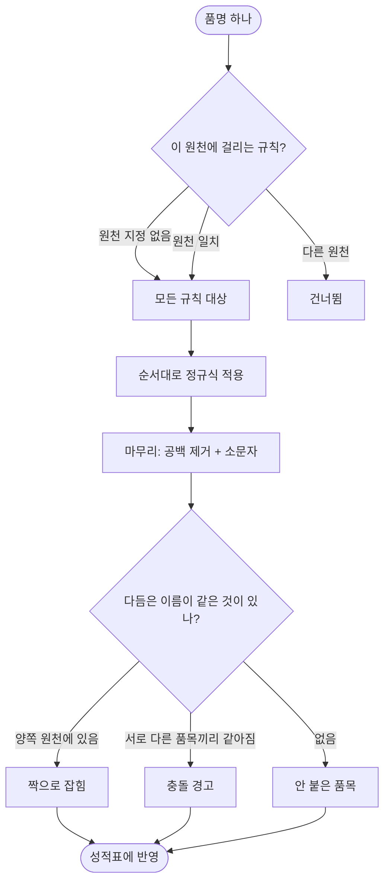
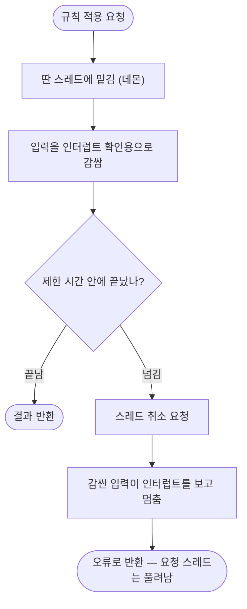

# 규칙을 고칠 수는 있는데 무엇이 나아졌는지 알 수가 없다

## 개요

이름 다듬기 규칙 화면에서 규칙을 넣고 고치고 순서를 바꿀 수 있었지만, **그렇게 해서 무엇이
나아졌는지 화면이 말해 주지 않았다.** 규칙을 고치는 목적은 짝이 되는 품목을 늘리는 것 하나인데
그 숫자가 어디에도 없었고, 결과는 다음 화면에서 「이을 수 있는 것이 줄었다」 로만 드러나 어느 규칙
때문인지 알 수 없었다.

규칙이 한 일을 **숫자로 말하게** 하고(성적표·걸린 수), 지나친 규칙이 **다른 물건을 한 물건으로
만드는 것을 경고**하고, 조작 방식을 손봤다(끌어서 순서 바꾸기·토글·프리셋). 그리고 규칙을
**원천별로** 걸 수 있게 했다.

작업 중에 **반쪽만 구현된 것 두 곳**과 **거짓 통과하던 시험 하나**를 찾아 함께 고쳤다.

## 기능 흐름

정규식은 사람이 직접 넣는 값이라 **끝나지 않을 수 있다.** 그 자리를 감싸는 흐름은 이렇다.

## 변경 사항

### 규칙이 한 일을 세는 계산

- `palim-reconcile/.../rule/NormalizationInsight.java` (신규): 규칙별 걸린 수, 짝 개수(전/후),
  충돌 무리를 한 번에 계산한다. 표본 12개가 아니라 **담긴 품명 전체**(상한 5000)를 본다
- `palim-reconcile/.../rule/NormalizationEngine.java`: `trace()` 추가 — 규칙을 하나씩 걸며
  **어느 규칙이 값을 실제로 바꿨는지** 함께 돌려준다

### 정규식 보호를 한 곳으로

- `palim-reconcile/.../rule/RegexGuard.java` (신규): 제한 시간 + 인터럽트 확인 입력.
  `NormalizationPreview` 안에 있던 두 장치를 꺼내 공용으로 만들었다
- `palim-reconcile/.../rule/NormalizationPreview.java`: 자체 타임아웃·감싸기 제거하고 `RegexGuard` 사용
- `palim-reconcile/.../match/MatchBoard.java`: 짝 맞추는 대량 루프에 제한 시간(10초)
- `palim-reconcile/.../rule/NormalizationInsight.java`: 성적 셈에 제한 시간(5초)

### 원천별 규칙

- `palim-app/src/main/resources/db/migration/V29__normalization_rule_source.sql` (신규):
  `source_code varchar(100)` 추가. NULL 이면 모든 원천 — 기존 규칙의 동작이 바뀌지 않는다
- `palim-reconcile/.../rule/NormalizationRule.java`: `sourceCode` 필드, `appliesTo(source)`,
  `moveTo(order)`
- `palim-reconcile/.../rule/NormalizationEngine.java`: `Batch` 를 record 에서 클래스로 바꿔
  **원천별로 거른 규칙 목록을 캐시**한다
- `palim-reconcile/.../match/MatchBoard.java`: `groupKeyOf` 가 품목의 원천을 넘긴다

### 화면과 조작

- `palim-web/src/main/resources/templates/reconcile/rules.html`: 성적표·충돌 경고·걸린 수 열·
  원천 선택·프리셋 버튼 추가. 순서 이동은 끌기 + `↑`/`↓` 대체 경로
- `palim-web/src/main/resources/static/js/rule-order.js` (신규): 끌어서 순서 바꾸기, 프리셋 채우기
- `palim-web/src/main/resources/templates/layout.html`: 위 스크립트 로드
- `palim-reconcile/.../rule/NormalizationPresets.java` (신규): 자주 쓰는 정규식 7종

### 서비스와 컨트롤러

- `palim-reconcile/.../rule/NormalizationRuleService.java`: `reorder(List<UUID>)`,
  `create`/`update` 에 `sourceCode` 오버로드, `availableSources()`
- `palim-web/.../reconcile/RuleController.java`: `POST /reconcile/rules/reorder`,
  `sourceCode` 파라미터, 통계 실패 시에도 화면을 여는 처리

### 시험

- `NormalizationRuleScreenIntegrationTest`: 5건 추가
- `MatchBoardIntegrationTest`: 2건 추가 (원천별 규칙이 **대조 경로에서** 동작하는지)

## 주요 구현 내용

### 성적표가 이 화면의 목적을 드러낸다

「짝이 되는 품목 N → M」 은 **규칙을 하나도 걸지 않았을 때와 견준 값**이다. 규칙을 넣은 뒤 이
숫자가 안 움직이면 그 규칙은 이 자료에 쓸모가 없다는 뜻이고, 그 판단을 화면에서 바로 할 수 있다.

원천이 셋 이상이면 **가장 많은 짝을 만드는 두 원천**으로 센다. 재고 대조는 두 곳을 견주는 일이고,
셋을 한꺼번에 센 숫자는 어느 조합을 고쳐야 하는지 말해 주지 않는다.

### 걸린 수는 «한 번 도는 동안» 기록해야 맞다

규칙 하나만 따로 걸어 세면 실제와 다른 값이 나온다 — 앞 규칙이 이미 바꿔 놓은 이름에 걸리는
규칙이 있기 때문이다. 그래서 `trace()` 가 한 번 도는 동안 값이 바뀐 규칙을 기록한다.

처음에는 규칙을 하나씩 누적 적용하며 비교했는데, **중간값에 이미 공백 제거·소문자화가 적용되어**
공백을 포함한 정규식(`\s*\(...\)`)이 다음 규칙부터 안 걸리는 문제가 있었다. 마무리 처리를
`finish()` 로 분리해 규칙 사이에 끼우지 않도록 했다.

### 충돌 경고가 가장 중요하다

규칙이 지나치면 다른 물건을 한 물건으로 만든다. 그러면 대조는 「재고가 맞는다」 고 말하는데 실제로는
합쳐진 것이라 **틀렸다는 사실조차 드러나지 않는다** — 불일치를 못 찾는 것보다 나쁘다.

실제 자료에 유통기한으로만 구분되는 품목이 있다. 기본 규칙 「괄호와 그 안의 내용을 뺀다」 가 켜져
있으므로 그런 품목은 한 이름이 된다. 이제 그런 무리가 생기면 화면이 경고하고 어느 품목들인지 보여준다.

### 정규식 입력을 없애지 않았다

어떤 품목명 체계가 올지 미리 알 수 없다. 체크박스로 가두면 그 목록에 없는 표기 습관을 가진 곳에서는
이 프로그램을 쓸 수 없다. 프리셋은 정규식을 **대신하는 것이 아니라** 입력칸을 채워 주는 출발점이고,
넣은 뒤 다른 규칙과 똑같이 고치고 끄고 지울 수 있다.

### 스크립트가 죽어도 순서를 바꿀 수 있다

끌기가 유일한 방법이면 스크립트가 막히는 순간 그 화면은 순서를 못 바꾸는 화면이 된다. `↑`/`↓`
버튼을 화면에 두고 **끌기가 살아 있을 때만 감춘다.** `static/js/post-script.js` 가 확립한 패턴을 따랐다.

### 순서 저장이 규칙을 지우지 않는다

화면을 열어둔 사이에 다른 사람이 규칙을 넣었을 수 있다. 넘어온 목록에 없는 규칙은 지우지 않고
뒤에 붙인다 — 순서 저장 한 번에 규칙이 사라지면 원인을 찾을 방법이 없다.

## 작업 중에 찾아 고친 것

### 원천별 규칙이 저장만 되고 대조에는 반영되지 않았다

`source_code` 컬럼을 만들고 화면에서 고를 수 있게 했는데, 짝을 맞추는 `MatchBoard` 는 여전히
원천 구분 없는 `batch()` 를 쓰고 있었다. **사용자가 화면에서 원천을 골라도 아무 일도 일어나지
않고, 왜 통하지 않는지 알 방법도 없는 상태**였다. 기능을 절반만 만든 것이라 시험 2건을 붙여
대조 경로에서 실제로 동작하는지 고정했다.

### 정규식 보호가 미리보기 경로에만 있었다

미리보기는 딴 스레드 + 제한 시간 + 인터럽트 확인으로 잘 막혀 있었지만, **저장된 규칙이 도는
경로에는 아무 보호가 없었다.** 표본 12개로 미리보기를 통과시킨 뒤 저장하면 그 뒤로 화면이 열릴
때마다 무보호로 수천 건이 돌고 요청 스레드가 영영 풀려나지 않는다. **그 규칙을 고칠 수 있는
화면이 바로 그 화면이라 자기 복구가 불가능**했다.

### 잘못된 정규식이 품명마다 예외를 다시 던졌다

`ConcurrentHashMap.computeIfAbsent` 는 `null` 을 저장하지 않으므로 컴파일 실패가 캐시되지 않았다.
품목 수천 건을 돌면 같은 경고가 수천 번 찍혀 정작 봐야 할 로그가 밀려난다. `Optional` 로 담아
실패도 캐시한다.

### 미리보기 표본이 한쪽 원천에 쏠렸다

`ORDER BY raw_name LIMIT 12` 라 가나다순 앞 12개만 나왔다. 한쪽 원천 이름만 뽑히면 「다듬으면
이렇게 됩니다」 는 보여도 「그래서 반대쪽과 붙습니까」 를 볼 수 없다 — 규칙을 고치는 목적이
바로 그것인데. `row_number()` 로 원천마다 고르게 뽑는다.

### 시험 하나가 거짓 통과하고 있었다

「원천별로 걸린다」 를 확인한다고 짠 시험이 밑줄 패턴(`_.*$`)을 썼는데, 기본 시드 규칙
`[-_/]+` 가 이미 밑줄을 지우고 있었다. 그래서 **시험은 통과하지만 실제로는 시드의 효과를 보고
있었다.** 시드가 건드리지 않는 기호로 바꿨다.

### 미리보기 표본 조회에 테넌트 조건이 빠져 있었다

`sampleNames()` 가 `tenant_id` 를 걸지 않아 다른 회사의 품명이 표본에 섞일 수 있었다.

## 주의사항

### 기본 시드 규칙은 끄지 않았다

「괄호와 그 안의 내용을 뺀다」·「이름에 박힌 날짜를 뺀다」 는 유통기한으로만 구분되는 품목을 합친다.
그런데 **지금 운영에서는 이 규칙에 의존해 로트를 뭉쳐 보고 있다.** 끄면 동작이 크게 바뀌므로
이번에는 충돌 경고만 붙였다. 끄는 것은 판단이 필요하다.

### 마이그레이션 파일은 이미 적용된 것을 건드리면 안 된다

`spring.flyway` 설정에 `validate-on-migrate` 가 없어 기본값(true)으로 돈다. 적용된 마이그레이션
파일을 **주석 한 줄이라도** 고치면 checksum 이 어긋나 배포에서 앱이 기동하지 않는다. 로컬은
Testcontainers 가 매번 새로 뜨므로 드러나지 않는다. 문자열 일괄 치환을 돌릴 때 `db/migration` 을
제외 경로로 지정해야 한다.

### 화면에 인라인 스크립트를 쓰면 조용히 죽는다

CSP 가 막으므로 `<script>` 블록·`onclick`·`onchange` 는 한 줄도 실행되지 않고 콘솔에만 기록이
남는다. `RenderAssertions.noInlineCode()` 가 이것을 강제한다 — 이번 작업에서 실제로 걸렸다.
`static/js/*.js` 파일 + `data-*` 속성 + JS 가 죽어도 쓸 수 있는 대체 경로가 규약이다.

### 제한 시간 값은 근거가 약하다

미리보기 2초, 성적 셈 5초, 짝 맞추기 10초로 두었다. 「사람이 기다릴 수 있는 선」 을 기준으로 잡은
값이고 실제 부하에서 측정한 것이 아니다. 품목이 많은 곳에서 정상 규칙인데 제한 시간에 걸리면
값을 올려야 한다 — 그때 로그에 `NORMALIZATION_PREVIEW_TIMEOUT` 이 남는다.

### 남은 일

`docs/superpowers/specs/2026-08-19-stock-reconcile-product-design.md` 에 재고 대조 전용 제품으로
좁히는 설계와 구현 묶음 9개를 정리했다. 이번 작업은 그중 묶음 1·5에 해당한다. 다음은 결과 화면
(묶음 7) 이고, 그 전에 결정이 필요한 항목 4건이 문서에 있다.

## 검증

- 이름 다듬기 화면 시험 12건 통과
- 대조 보드 시험 통과 (원천별 규칙 2건 신규 포함)
- 전체 384건 + 신규 7건 통과
- V29 마이그레이션은 `ALTER TABLE ADD COLUMN` + `COMMENT` 뿐이라 운영 PostgreSQL 14 에서 안전
