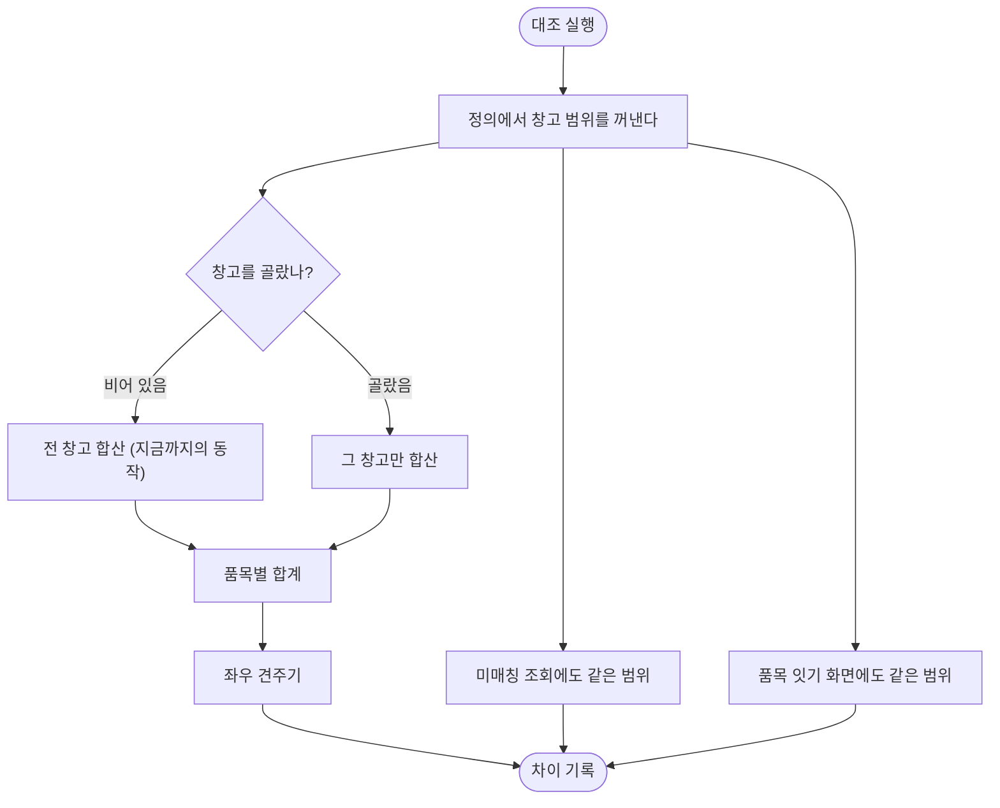

# 창고를 나누지 않고 전부 더해서 견주고 있다

## 개요

재고를 맡긴 곳은 **자기가 보관 중인 것만** 안다. 그런데 전산 쪽에는 창고가 여럿이다 — 위탁 창고,
사무실, 매장. **대조는 그것을 전부 더해서 견주고 있었다.**

`palim-reconcile` 모듈 전체에서 `warehouse` 를 한 번도 쓰지 않았다. 그런데
`std_stock_snapshot` 에는 창고 컬럼이 있고 자연키 인덱스에도 창고가 들어 있다 —
**자료 구조는 창고를 처음부터 지원했고, 견주는 쪽만 그것을 안 보고 있었다.**

대조 정의에 「견줄 창고」 를 두고, 합계·미매칭·품목 잇기 모든 조회에 같은 범위를 걸었다.
그리고 **창고를 빠뜨릴 수 없는 구조**로 바꿨다.

## 기능 흐름

## 무엇이 잘못됐나

같은 자료로 두 방식을 견줘 봤다.

| | 전 창고 합산 (전) | 위탁 창고만 (후) |
|---|---|---|
| 일치한 품목 | **3건** | **11건** |
| 수량이 다른 품목 | **17건** | 4건 |

**맞던 품목까지 틀린 것으로 나왔다.** 총합이 벌어지는 것보다 이쪽이 나쁘다 — 사람이 「이건 왜
안 맞지」 하고 붙잡는 줄이 실제로는 멀쩡한 줄이기 때문이다.

품목 잇기 화면도 같았다. 맡기지 않은 창고에만 있는 품목이 「상대쪽에 짝이 없음」 으로 떠서,
있지도 않은 짝을 찾게 했다.

## 변경 사항

### 창고 범위를 정의에 둔다

- `V30__reconcile_warehouse_scope.sql`: `reconcile_definition` 에 `left_warehouses` /
  `right_warehouses` 추가 (varchar(1000), NULL 허용)
- `define/WarehouseScope.java` (신규): 창고 목록 값 객체. 쿼리 조각과 바인딩 값을 함께 만든다
- `define/ReconcileDefinition.java`: `leftScope()` / `rightScope()` / `changeWarehouses()`

### 창고를 빠뜨릴 수 없게

- `define/Pairing.java` (신규): 두 원천과 각각의 창고 범위를 한 묶음으로
- `match/MatchBoard.java`: 공개 API 를 `Pairing` 으로 전환
  (`load` / `findRow` / `findRowByItem` / `mateCandidates` / `findItem`)
- 호출부 13곳을 `Pairing.of(definition)` 으로 옮김

### 모든 조회에 같은 범위

- `engine/SnapshotAggregator.java`: `sumByUnit` / `unmatched` 에 범위 파라미터.
  창고 목록 조회 `warehouses()` 추가
- `engine/ReconcileEngine.java`: 정의에서 범위를 꺼내 넘긴다
- `match/MatchBoard.stockLines`: 좌·우 창고를 **다른 파라미터 이름**으로 바인딩

### 화면

- `templates/reconcile/detail.html`: 「견줄 창고」 체크박스 + 「고르지 않았음」 경고
- `web/reconcile/ReconcileController.java`: `POST /reconcile/{id}/warehouses`

## 주요 구현 내용

### 왜 값 객체와 묶음 타입을 만들었나

창고 조건이 걸려야 하는 쿼리가 한 곳이 아니다 — 합계·미매칭·뜯어보기·품목 잇기. 쿼리마다 따로
적으면 한 곳이 빠지고, **빠진 곳만 다른 숫자를 낸다.** 그러면 「합계는 이런데 뜯어보면 다르다」 가
되어 어느 쪽을 믿어야 할지 알 수 없다.

원천 이름만 넘기던 시절에는 **창고를 넘길 자리가 없어서** 빠뜨렸다. `Pairing` 으로 묶어 두면 새
조회를 만들 때 원천을 넘기는 순간 창고도 함께 넘어간다. 나중에 「로트만 본다」 같은 범위가 늘어도
여기만 넓히면 모든 조회가 따라온다.

### 비우면 전부 — 기존 정의가 안 깨진다

`left_warehouses` 가 NULL 이면 `WarehouseScope.parse(null)` → `all()` → 쿼리 조각이 빈 문자열,
바인딩 값이 빈 맵이다. **만들어지는 SQL 이 문자 하나까지 예전과 같다.**

`IN ()` 은 SQL 문법 오류라 「전부」 를 빈 목록으로 표현할 수 없다. 그래서 조건 자체를 넣지 않는
쪽으로 만들었다.

### 한 쿼리가 두 범위를 걸 때

품목 잇기 화면은 양쪽 원천을 한 번에 읽는다. 바인딩 이름이 같으면 뒤엣값이 앞을 덮어써
**양쪽이 같은 창고로 걸린다** — 화면은 멀쩡해 보이는데 한쪽이 통째로 비거나 엉뚱한 줄이 짝으로
잡힌다. 좌·우를 다른 이름으로 나눴다.

### 고를 창고는 담긴 자료에서 뽑는다

커넥터 설정이 아니라 실제로 들어온 자료에서 뽑는다. 설정에만 있고 자료가 없는 창고를 고르면
대조 대상이 통째로 비는데, 화면은 「고르긴 골랐다」 로 보여 원인을 찾기 어렵다.

**수량을 함께 보여준다.** 이름만으로는 어느 쪽이 맡긴 곳인지 알 수 없어 규모로 판단하게 된다.

## 배포 전 점검에서 잡은 것

### 빈 창고 코드를 고르면 선택이 사라졌다

창고를 구분하지 않는 원천은 `warehouse_code` 가 빈 문자열이다(그 컬럼은 `NOT NULL DEFAULT ''`).
그 창고를 고르면 저장값이 빈 문자열이 되고, 다시 읽을 때 그것은 「전부」 로 해석된다.
**화면은 「정했습니다」 라고 말하는데 대조는 여전히 전 창고를 더한다** — 고쳤다고 믿는 쪽이
안 고친 것보다 나쁘다.

값 객체가 빈 코드를 담지 않게 하고(생성자와 `parse()` 가 같은 규칙을 쓴다), 화면에서도 그 항목은
고를 수 없게 했다.

## 주의사항

### 뜯어보기는 아직 창고를 안 본다

`UnitBreakdown` · `UnitNaming` · `UnitSplitter` 는 범위를 받지 않는다. 합계는 창고로 좁혀지는데
뜯어보기는 전 창고를 보므로 **두 숫자가 어긋날 수 있다.** 창고를 고른 정의에서만 나타난다.
다음에 같은 `Pairing` 을 그쪽에도 넘겨야 한다.

### 저장 형태는 컬럼 두 개다

창고 짝은 개별 대응이 아니라 **집합 대 집합**이라 별도 표가 조인만 늘린다. 나중에 창고별로
결과를 쪼갤 일이 생기면 그때 표로 옮긴다.

### 「창고 구분 없음」 은 고를 수 없다

코드가 빈 창고는 체크박스가 비활성이다. 창고가 하나뿐인 원천이라 「전체」 와 뜻이 같기도 하다.

## 검증

- 창고 필터 2건 추가 — 고르지 않으면 합산되어 차이가 나고, 고르면 그 창고만 견준다
- 빈 코드 처리 1건 추가
- 전체 391건 통과
- `V30` 은 `ALTER TABLE ADD COLUMN` 둘 + `COMMENT` — 운영 PostgreSQL 14 에서 안전
