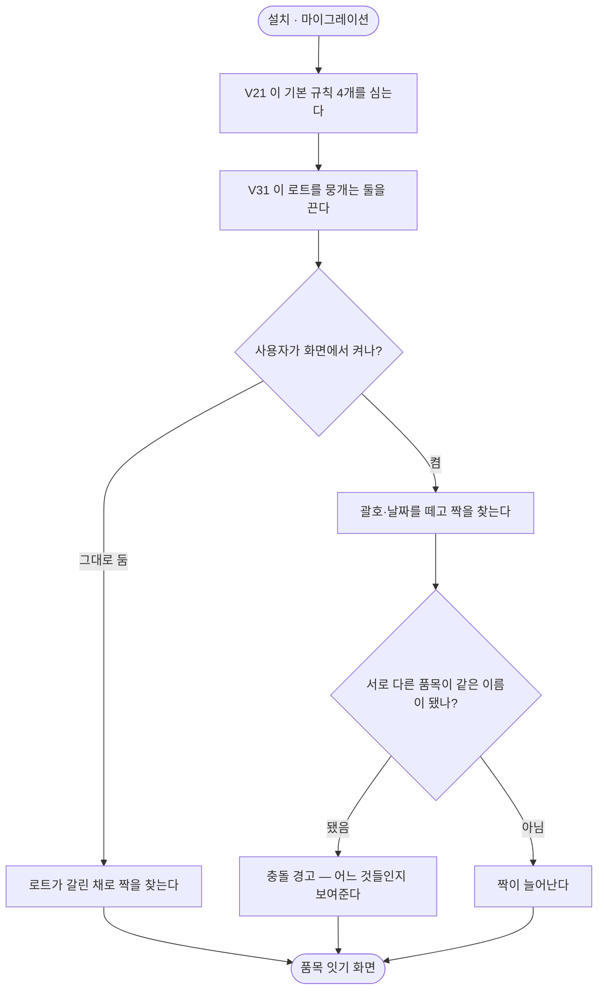

# 기본 규칙이 켜진 채로 설치되어 서로 다른 품목을 합친다

## 개요

설치하면 이름 다듬기 규칙 네 개가 **켜진 채로** 들어간다. 그중 둘 —
「괄호와 그 안의 내용을 뺀다」·「이름에 박힌 날짜를 뺀다」 — 이 **소비기한으로만 구분되는 서로
다른 품목**을 한 물건으로 만든다.

그러면 대조는 「맞는다」 고 말하는데 실제로는 합쳐진 것이다. **불일치를 못 찾는 것보다 나쁘다 —
틀렸다는 사실조차 드러나지 않는다.**

발주사 확인 결과 소비기한별로 별도 품목으로 관리한다(입고 시점마다 기한이 다르다). 즉 이 기본
규칙은 그곳에서 틀렸고, 같은 방식으로 관리하는 곳이라면 어디서든 틀린다.

## 기능 흐름



## 변경 사항

- `V31__normalization_seed_off.sql` (신규): 로트를 뭉개는 시드 규칙 둘을 끈다.
  **지우지 않는다** — 소비기한을 이름에 붙이지 않는 곳에서는 화면에서 켜면 그대로 쓴다
- `rule/NormalizationRuleService.java`: `deactivateAll()` — 켜져 있는 규칙을 한 번에 끈다
- `web/reconcile/RuleController.java`: `POST /reconcile/rules/deactivate-all`
- `templates/reconcile/rules.html`: 「모두 끄기」 버튼

## 주요 구현 내용

### 왜 이름이 아니라 고정 id 로 찾는가

처음에는 `name IN (...)` 으로 찾으려 했다. 두 가지가 어긋난다.

**① 프리셋이 같은 이름을 쓴다.** 화면의 「자주 쓰는 것」 은 「괄호와 그 안의 내용을 뺀다」 를
그대로 이름으로 넣는다. 사용자가 규칙을 정리하고 프리셋으로 다시 넣어 둔 상태에서 이
마이그레이션이 돌면, **방금 의도적으로 넣은 규칙이 이유 없이 꺼진다.**

**② 이름은 화면에서 고칠 수 있다.** 고친 순간 조건이 아무것도 잡지 못한다.

id 는 V21 이 박아 둔 고정값이라 둘 다 피한다.

### 왜 「손댄 적 없는 것만」 조건을 버렸나

처음에는 `created_at = updated_at` 으로 「아무도 안 만진 것만」 끄려 했다. 그런데 **그 대리지표는
이미 깨져 있다** — 지난 배포에 들어간 끌어서 순서 바꾸기·켬끔 토글이 `updated_at` 을 갱신한다.

규칙을 한 번이라도 만진 곳에서는 이 UPDATE 가 **0행을 고치고 조용히 끝난다.** Flyway 는 성공으로
기록하고 로그도 남지 않아, 「껐다」 고 믿는 채로 켜진 상태가 유지된다. **그 침묵이 이 규칙의
위험보다 나쁘다.**

### 지우지 않고 끄는 이유

지운 규칙의 정규식은 기억에서 복원되지 않는다. 끄면 목록에 남아 언제든 되돌릴 수 있고, 무엇을
껐는지도 보인다. 켤 때는 무엇이 합쳐지는지 충돌 경고가 알려 준다.

## 이 변경이 드러낸 것 — 규칙이 두 가지 일을 겸하고 있다

시드를 끄자 시험 세 개가 깨졌다. 원인을 보니 같은 규칙이 서로 다른 목적에 함께 쓰이고 있었다.

| 목적 | 규칙이 꺼지면 |
|---|---|
| **짝 찾기** | 짝이 덜 잡힌다 — **의도한 것**(다른 물건이 안 합쳐진다) |
| **묶음 이름 짓기** | 공통 부분을 못 뽑아 **로트 날짜가 붙은 이름**이 나온다 |
| **나눠서 묶기** | 이름이 안 닮아 갈리지 않는다 |

```
기대: 클래식 850g
실제: 클래식 850g (27.03.16)     ← 특정 로트가 묶음 전체를 대표한다
```

이슈 #130 에서 고쳤던 문제가 규칙을 끄면 되살아난다. 시험은 각자 필요한 규칙을 직접 만들어
쓰게 고쳤지만, **제품에서는 남는 문제다** — 규칙을 끈 사용자는 묶음 이름이 왜 이상한지 모른다.

→ 짝 찾기용 다듬기와 표시용 다듬기를 나눠야 한다. **별건으로 남긴다.**

## 주의사항

### 대조 결과의 숫자는 바뀌지 않는다

`ReconcileEngine.run()` 은 `NormalizationEngine` 을 호출하지 않는다. 규칙은 「품목 잇기」 화면에서만
돈다. 그래서 이 변경으로 **대조 회차의 좌·우 합계나 차이 건수는 달라지지 않는다.**

바뀌는 것은 (1) 아직 안 이은 품목의 줄 구성, (2) 앞으로 새로 잇는 묶음에 붙는 이름이다.

### 이미 확정한 연결은 끊기지 않는다

연결은 다듬은 이름이 아니라 원본 `(source, item_ref)` 로 잡혀 있고, 줄을 만들 때도 다듬기 전에
묶음 id 로 먼저 빠진다. 「짝지어짐」 후보 줄이 줄어드는 것은 정상이지만 「이어 둔 것」 이 줄면
비정상이다.

### 시험이 전제를 직접 만들게 했다

규칙은 전역이고 시험이 tearDown 에서 지우지 않는다. 그래서 앞선 시험이 남긴 규칙에 기대면
**거짓 통과**가 생긴다. 기본 규칙에 기대던 시험 셋은 각자 `bracketRule()` 로 전제를 만들게 고쳤고,
시드가 꺼졌는지는 **고정 id** 로 확인한다 — 이름으로 찾으면 다른 시험이 만든 「괄호 안 내용
제거」 에 걸린다.

## 검증

- 시드가 꺼진 채로 설치되는지 (고정 id 로 확인) 1건
- 모두 끄기가 한 번에 끄되 지우지는 않는지 1건
- 규칙에 기대던 시험 셋이 자기 전제를 만들게 수정
- 전체 391건 통과
