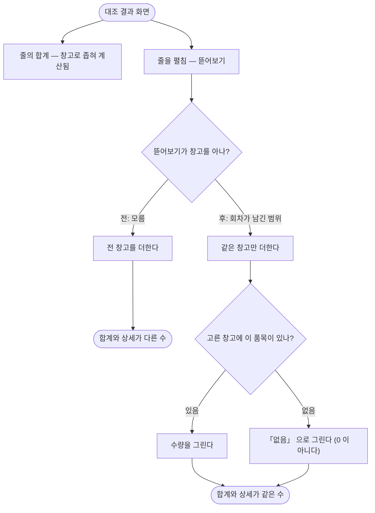

# 합계는 창고로 좁히는데 뜯어보기는 전 창고를 더한다

## 개요

대조에 「견줄 창고」 를 넣었지만 **뜯어보기·이름짓기·나누기는 그것을 받지 않았다.** 그래서 결과
화면에서 줄의 합계와 그 **바로 아래** 상세가 다른 수를 말했다. 두 값이 붙어 있어 어긋남이 즉시
눈에 띄는데, 어느 쪽을 믿을지 알 방법이 없다.

원인은 그 셋이 원천을 **이름 두 개로** 받아 창고를 넘길 자리가 없었던 것이다. `Pairing` 이 존재하는
이유가 정확히 그것인데 아직 옮기지 않은 자리였다.

## 기능 흐름

## 변경 사항

### 견주는 방식을 한 묶음으로

- `define/CompareField.java` (신규): 견줄 수 있는 수치 칸의 허용 목록. 집계 클래스 안에 갇혀
  있던 것을 꺼냈다
- `define/Pairing.java`: `compareField` 추가. 「원천 + 창고 + 견줄 칸」 이 함께 다닌다

### 창고를 받지 않던 세 곳

- `match/UnitBreakdown.java`: `of()` 를 `Pairing` + `At` 으로. 시각 셋을 `At` 으로 묶어 인자가
  아홉 개가 되는 것을 막았다. `parts()` 에 창고 조건과 견줄 칸 반영
- `match/UnitNaming.java`: `suggest()` / `suggestions()` 를 `Pairing` 으로. `names()` 에 창고
  조건과 **확정 멤버 조건** 추가
- `match/UnitSplitter.java`: `split()` 을 `Pairing` 으로. `linkSeparately()` 의 죽은 인자 제거,
  밖에서 안 쓰는 `preview()` 를 내부로

### 회차가 자기가 본 범위를 남긴다

- `V32__reconcile_run_scope.sql` (신규): `reconcile_run` 에 `left_warehouses` /
  `right_warehouses` / `compare_field`
- `run/ReconcileRun.java`: `recordScope(Pairing)` / `scopeOf(left, right)`
- `engine/ReconcileEngine.java`: 실행 시 기록
- `web/reconcile/ReconcileController.java`: 상세를 **회차가 남긴 범위**로 뜯어본다

### 곁들여

- `engine/SnapshotAggregator.java`: 허용 목록을 공용으로 전환, `sum()` 의 `NULL` 방어

## 주요 구현 내용

### 창고 조건은 `ON` 절에 붙인다

`WHERE` 로 내리면 `LEFT JOIN` 이 사실상 `INNER JOIN` 이 되어, 범위 밖 창고에만 있는 품목이 줄에서
**통째로 사라진다.** 그러면 그 품목을 빼거나 옮길 자리도 함께 사라진다 — 화면이 깔끔해지는 대신
막다른 길이 생긴다.

### 「없음」 과 「0개」 를 가른다

`ON` 조인이 끊기면 수량이 빈다. 그것을 `0` 으로 그리면 **「재고가 0 이다」 라는 없는 이야기**가
된다. 실제로는 그 창고에서 안 보기로 한 것뿐이다. 줄 단위 설명이 이 화면의 존재 이유이므로
여기서 거짓말하면 화면 전체를 못 믿는다.

`Part.inStock()` 은 이미 있었고 주석도 「0 과 다르다 — 「없음」 이다」 라고 적혀 있었는데,
화면(`leftText()` / `rightText()`)이 그것을 보지 않고 있었다.

### 이름은 「무엇」 이지 「얼마」 가 아니다

품명을 창고 조건이 걸린 조인에서 뽑으면 범위 밖 품목의 이름이 비어 화면에 **품목코드**가 나온다.
무슨 물건인지 모르는 줄은 사람이 손대지 않고, 손대지 않는 줄이 쌓이면 화면 전체를 안 보게 된다.

이름은 창고와 무관한 상관 서브쿼리로 따로 가져온다. 처음에는 서브쿼리가 `m.tenant_id` 를
참조했는데 그것이 `GROUP BY` 에 없어 SQL 이 깨졌다 — 이미 바인딩된 값을 쓰도록 고쳤다.

### 「기준을 잘못 골랐다」 는 오진단을 막는다

「고른 기준이 이 자료에 없다」 판정은 **재고가 실제로 있는 품목만** 보고 한다. 범위 밖 품목은
조인이 끊겨 기준 값도 비는데, 그것까지 세면 원인이 창고인데도 기준 탓을 하게 된다. 사람은
통하지 않을 처방을 들고 다른 기준을 고르러 간다.

### 회차가 범위를 남겨야 하는 이유

남기지 않으면 지난 회차의 상세가 **오늘의 정의**로 다시 계산된다. 창고를 고르기 전에는 늘 전
창고였으므로 「언제나 같은 답」 이었지만, 범위가 생긴 뒤로는 설정을 바꾸는 순간 저장된 합계와
화면의 상세가 어긋난다. 그리고 **회차마다 맞기도 하고 틀리기도** 해서 「늘 틀린다」 보다 원인을
찾기 어렵다.

### 이름 재료를 확정 멤버로 맞췄다

`UnitNaming.names()` 가 `confirmed_at` 을 보지 않아, 합계·뜯어보기와 **멤버 집합 자체**가 달랐다.
「한쪽에 품목이 둘 이상일 때만 다시 짓기를 제안한다」 는 판정이 미확정 멤버 때문에 부풀어,
실제로는 1↔1 인 묶음까지 후보로 올라왔다.

## 주의사항

### 기준 시각을 고르는 조회에는 창고를 걸지 않는다

좁히면 그 창고에 자료가 없는 회차를 건너뛰어 **더 옛 시각**을 고르게 되고, 대조와 화면이 서로
다른 회차를 견주게 된다. **시각은 「언제」 이고 창고는 「얼마」 다.** 다음 사람이 「여기도
빠졌네」 하고 고치지 않도록 주석으로 못 박았다.

같은 이유로 `SnapshotAggregator.warehouses()` 도 범위를 받지 않는다 — 이것이 「고를 것을 만들어
주는」 조회라, 이미 고른 범위로 좁히면 한 번 고른 뒤에는 다른 창고를 고를 수 없게 된다.

### 화면에 「무엇을 보고 있는지」 를 아직 안 쓴다

창고를 고르면 값이 바뀌는 화면이 넷인데(품목 잇기·편집·결과·상세), 「견줄 창고」 를 말하는
화면은 대조 상세 하나뿐이다. 나머지 셋은 **조용히 숫자만 바뀐다.** 별건으로 남긴다.

### 시험이 잡은 것

`ON` 절로 창고를 거른 직후, 범위 밖 품목이 「0개」 로 그려지고 이름이 품목코드로 떨어지는 것을
회귀 시험이 아니라 **검토**가 먼저 찾았다. 그래서 「줄이 사라지지 않는다」 만 보는 시험이 아니라
「없음으로 그려지고 이름을 잃지 않는다」 까지 단언하는 시험을 넣었다.

## 검증

- 창고를 고르면 뜯어보기도 그 창고만 더한다 (합계와 같은 수)
- 범위 밖 품목이 줄에 남되 「없음」 으로 그려지고 이름을 잃지 않는다
- 회차가 그때 본 범위를 남기고, 정의를 바꿔도 그 값이 안 변한다
- 전체 394건 통과
- `V32` 는 `ALTER TABLE ADD COLUMN` 셋 + `COMMENT` — 운영 PostgreSQL 14 에서 안전
