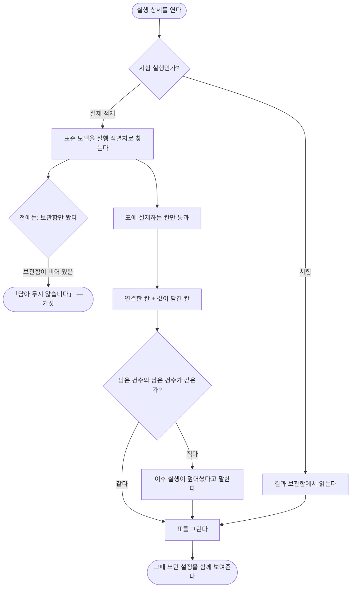

# 적재는 됐는데 무엇이 담겼는지 볼 수가 없다

## 개요

실제 적재가 **성공**했는데 실행 상세 화면이 **「보여줄 내역이 없습니다. 실제 적재는 결과를 따로
담아 두지 않습니다」** 라고 말했다. 바로 위에는 「45건 중 성공 45건」 이 적혀 있었다.

담아 두고 있었다. `StandardModelWriter` 는 적재할 때마다 `run_id` 를 함께 넣고 덮어쓸 때도
갱신하며, 표준 모델에는 실행 식별자 인덱스까지 있다. **화면이 시험 실행용 보관함만 보고 있었을
뿐이다.** 화면은 그 빈 상태를 「결과가 없다」 로 읽고 **없는 정책을 지어냈다.**

## 기능 흐름

## 변경 사항

### 담긴 것을 찾아온다

- `web/connector/ConnectorQueryService.java`: `landed()` 신설 — 표준 모델을 `run_id` 로 조회.
  담을 표는 `connector_run → connector → target_model` 을 따라가 찾고, 정렬은 그 모델의
  **자연키 순**이다. `runFieldMaps()` 는 **그때 쓰던** 연결을 준다
- `web/connector/ConnectorController.java`: 실행 방식에 따라 보관함 / 표준 모델을 가른다.
  실패 원인 묶기에 쓰던 원천 칸 정보도 활성 연결이 아니라 **실행 시점 연결**에서 가져온다

### 화면이 아는 표를 하나로

- `web/connector/RunResultTable.java` (신규): 화면이 쓰는 유일한 표. 시험·실제를 모두 흡수
- `web/connector/StagingTableView.java`: 표를 만들던 역할을 넘기고 **저장된 JSON 을 읽는 규칙**만
  남았다. 값을 손대지 않는다는 기존 판단은 그대로다
- `web/connector/LandedNotice.java` (신규): 담은 건수와 남은 건수의 차이를 문장으로

### 화면

- `templates/connector/run-detail.html`: 「담긴 모습」 표, 담긴 표 이름, 덮어쓰기 안내,
  접이식 「이 실행의 설정」(가져온 곳·담은 곳·실행 방식·시각·칸 연결) 추가.
  **사실이 아닌 안내 문구 삭제**

### 시험

- `integration/RunDetailScreenIntegrationTest.java` (신규): 5건
- `docs/07-DECISIONS.md`: 051 추가

## 주요 구현 내용

### 연결하지 않은 칸도 담겼으면 보여준다

연결한 칸만 그리면 **단위 환산 결과**(`base_quantity`)가 화면에서 통째로 사라진다. 그 칸은 연결
없이 `QuantityNormalizer` 가 채우기 때문이다. 그런데 **대조가 더하는 것이 정확히 그 칸이다.**
「넣은 값이 무엇으로 환산돼 담겼나」 를 볼 수 없으면 대조가 틀렸을 때 짚을 곳이 없다.

> **운영 실측**: 문제의 실행은 연결이 **6칸**인데 값이 담긴 칸은 **12칸**이었다. 연결만 그렸다면
> `base_quantity`·`base_at`·`source`·`base_unit` 등 여섯 칸이 화면에서 빠졌을 것이다.

반대로 **연결한 칸은 값이 없어도 세운다.** 「연결했는데 안 담겼다」 가 사람이 봐야 할 실패이고,
빼 버리면 그 사실을 알 길이 없다.

### `run_id` 는 「마지막으로 담은 실행」 이다

`ON CONFLICT` 에서 `run_id = EXCLUDED.run_id` 로 갱신하므로, 같은 자리를 다시 담으면 주인이 새
실행으로 넘어간다. 지난 실행의 상세를 열면 담았던 45줄 중 12줄만 남아 있을 수 있다.

말하지 않으면 「45건 성공」 아래에 12줄짜리 표가 놓여 **둘 중 하나는 거짓인데 어느 쪽인지 알 수
없다.** 덮어쓰기는 정상이므로 경고색을 쓰지 않고, **되돌린 실행일 때만** 경고로 말한다.

### 그때 쓰던 연결을 따라간다

지금 활성 연결이 아니라 `connector_run.mapping_id` 를 따라간다. 연결을 고친 뒤 옛 실행을 열면
화면이 그때 담긴 값과 다른 이야기를 하기 때문이다.

### 표 이름은 바인딩할 수 없다

담을 표는 대상 모델마다 다르므로 SQL 에 **이어 붙일 수밖에 없다.** 부르는 쪽이 DB 에서 읽은
이름만 넘긴다 해도 그 전제가 언제 깨질지는 알 수 없으므로, 이어 붙이기 직전에 소문자·숫자·
밑줄 63자 규칙으로 한 번 더 막는다. 여기서 흘려보내면 **화면 조회 한 번이 임의 SQL 실행이 된다.**

정의에 있는 칸이 표에도 있으리라는 보장도 없다. 없는 칸을 `SELECT` 에 넣으면 조회가 통째로
죽어 **한 칸 때문에 실행 결과 전부를 못 보게 되므로**, `information_schema` 로 실재하는 칸만
통과시킨다.

## 검증

### 시험

| 무엇을 | 결과 |
|---|---|
| 실제 적재 상세가 담긴 줄을 보여준다 | 통과 (옛 문구가 사라졌는지까지 단언) |
| 연결하지 않은 `base_quantity` 도 보여준다 | 통과 — **반증 실험 확인** |
| 이후 실행이 덮어쓴 줄은 사정을 말한다 | 통과 |
| 그때 쓰던 칸 연결을 보여준다 | 통과 |
| 시험 실행은 예전 그대로 | 통과 (회귀 없음) |

전체 **655건 통과**. 마이그레이션 없음 — 스키마를 건드리지 않고 조회만 바뀐다.

**반증 실험**: 「값이 담긴 칸 추가」 로직을 빼고 돌리자 해당 시험 **하나만** 실패했다. 새 코드가
아닌 다른 이유로 통과하는 시험이 아님을 확인했다.

### 운영 실측 (배포 후)

- 컨테이너가 이번 커밋 이미지로 정상 기동
- 문제의 실행이 `success_count = 45`, 표준 모델에 `run_id` 로 **45건 그대로** 남아 있음
  → 화면이 45줄을 전부 그린다. 덮어쓰기가 없어 안내 문구도 뜨지 않는다
- 칸 선별 조회를 **운영 PostgreSQL 14 에서 직접 실행**해 12칸이 정확히 나오는 것을 확인

## 주의사항

### 기준 시각을 고르는 조회에는 손대지 않았다

이 변경은 **한 실행이 담은 것**만 본다. 대조가 「어느 시점을 견줄까」 를 고르는 조회는 그대로다.
실행 단위 조회를 그쪽으로 옮기면 자료가 있는 회차를 건너뛰게 된다.

### 200줄에서 끊는다

미리보기 상한이 200이라 그보다 큰 실행은 앞부분만 보인다. 화면이 「처음 N줄」 과 「남아 있는
총 건수」 를 나란히 적어 잘렸다는 사실을 숨기지 않는다. 전체를 봐야 할 일이 생기면 내려받기가
필요하다 — 별건으로 남긴다.

### 칸이 많은 모델은 표가 옆으로 길어진다

값이 담긴 칸을 모두 세우므로 원천이 넓으면 가로 스크롤이 길어진다. 지금은 「담긴 것을 감추지
않는다」 를 우선했다. 접거나 고를 수 있게 하는 것은 실제로 불편해진 뒤에 판단한다.

### 표준에 없는 값은 접어 둔다

`attributes` 는 표에 세우지 않고 접이식으로 둔다. 통째로 펼치면 표가 옆으로 끝없이 늘어나
정작 봐야 할 수량·품목이 화면 밖으로 밀린다. 빈 껍데기면 접는 자리 자체를 만들지 않는다.
