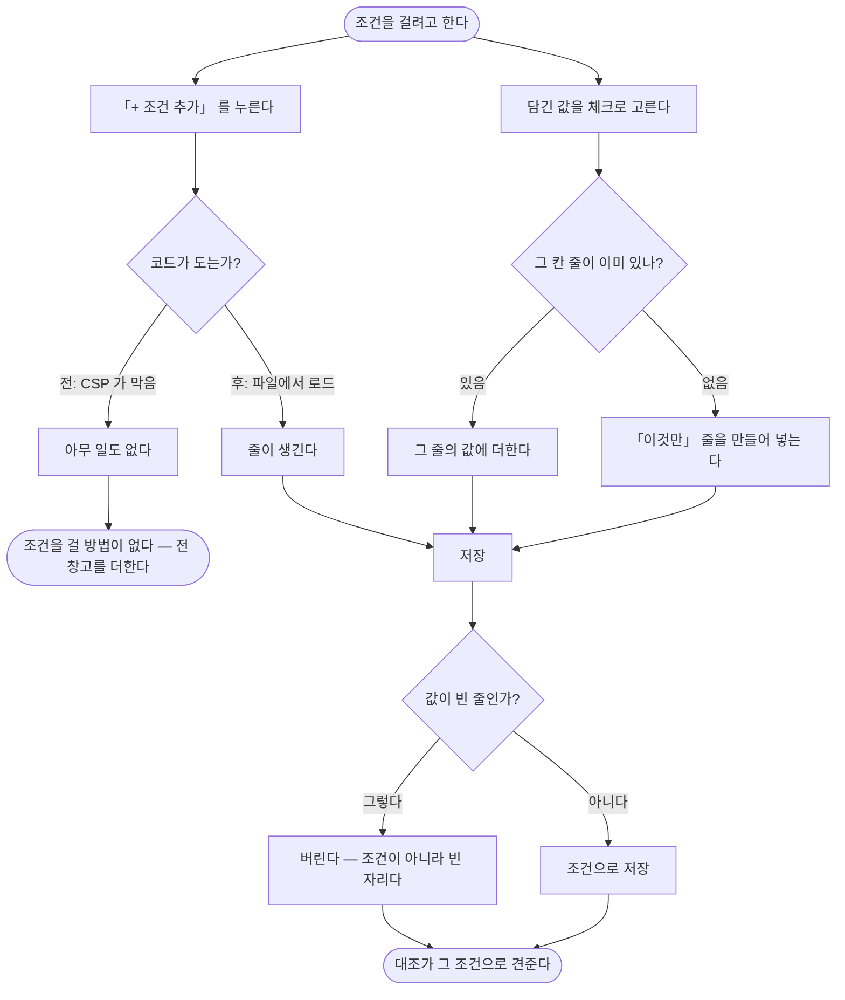

# 볼 조건을 걸 수가 없어서 전 창고를 더해 견주고 있다

## 개요

**조건 편집이 눌리지 않았다.** 「+ 조건 추가」 를 눌러도 줄이 생기지 않고 「지우기」 도 듣지
않았다. 줄을 더하고 지우는 코드가 **화면 안에 박혀 있었고**, CSP 가 `script-src 'self'` 라
브라우저가 그것을 한 줄도 실행하지 않았다.

화면은 200 으로 멀쩡히 열리고 버튼도 보인다 — 눌러도 아무 일이 없을 뿐이라 눈으로는 찾기
어렵다. 그동안 운영 대조는 조건을 걸지 못해 **전 창고를 더해서** 견뎠고, 맞는 품목까지 틀린
것으로 보였다.

## 기능 흐름

## 변경 사항

### 박힌 코드를 파일로

- `static/js/filter-rows.js` (신규): 줄 더하기·지우기 + **담긴 값 골라 넣기**
- `templates/layout.html`: 스크립트 등록
- `templates/reconcile/detail.html`: 박힌 `<script>` 제거

### 값을 고를 수 있게

- `templates/reconcile/detail.html`: 「담긴 값 보기」 → **「담긴 값 골라 걸기」**. 체크박스로
  바꾸고, 창고가 여럿이면 펴 둔다
- `web/reconcile/FilterEditView.java`: `labelOf()` · `picked()` · `pickable()` 추가

### 코드가 죽어도 조건은 걸린다

- `templates/reconcile/detail.html`: 걸린 조건이 없으면 **빈 줄 하나**를 띄운다
- `reconcile/filter/FilterOperator.java`: `needsValue()` — 무엇을 버려도 되는지 한 곳에서 정한다
- `web/reconcile/FilterController.java`: 값이 빈 줄은 버린다

### 화면이 보낸 값을 손대지 않는다

- `web/reconcile/FilterController.java`: `@RequestParam List<String>` → 원시 파라미터

### 시험

- `integration/FilterScreenIntegrationTest.java`: 5건 추가 (11 → 16건)

## 주요 구현 내용

### 이것 때문에 대조가 틀린 답을 냈다

| 품목 | 이카운트 전 창고 | 위탁 창고만 | 3PL |
|---|---|---|---|
| 노슈거 198g (26.11.26) | 355 | **331** | **331** |
| 노슈거 198g (27.10.14) | 1,035 | **1,015** | **1,015** |
| 노슈거 198g (27.10.15) | 246 | 246 | 246 |

창고를 좁히면 **정확히 맞는다.** 화면에 뜨던 `+24`·`+20` 은 전부 맡기지 않은 창고가 더해진
값이다. 원천 전체로도 위탁 21,219 ↔ 3PL 21,213 인데, 전 창고를 더하면 22,074 가 되어 861
차이로 보였다.

### 목록만 보여주는 것은 그 목록을 반만 쓰는 것이다

담긴 값 목록은 접힌 채 **읽기 전용**이었다. 창고가 「300 정도로지스」 인 것을 확인해도 조건
칸에 `300` 을 손으로 옮겨 적어야 했다. **옮겨 적다 틀리면 조건이 아무것도 거르지 않는데
화면은 「걸려 있다」 고 말한다.**

값을 여럿 고를 수 있어야 하므로 새 줄은 「이것만」(`IN`)으로 시작한다. 「같음」 이면 두 번째
값을 고르는 순간 조건이 조용히 뜻을 잃는다.

값이 빈 칸은 **고를 수 없게** 막았다. 걸어도 아무것도 거르지 않는데 걸린 것처럼 보인다 —
창고를 주지 않는 원천이 여기 해당한다(그쪽은 전부가 곧 한 창고다).

### 빈 줄이 저장을 통째로 막았다

값을 안 적은 줄이 값 없는 `IN` 이 되어 저장 전체가 거부됐다. **지우려던 사람이 지우지도
못한다.** 값이 필요한 연산자인지 물어보고 빈 줄은 버린다.

### Spring 이 값을 손대고 있었다

`@RequestParam List<String>` 으로 받으면 두 가지가 일어난다 — **값을 콤마로 쪼개고, 빈 문자열을
지운다.**

둘 다 여기서는 사고다. 빈 값이 사라지면 세 목록의 길이가 어긋나 「줄 수가 맞지 않습니다」 로
저장이 거부되고(위의 빈 줄 문제가 실제로 이것이었다), 창고명처럼 사람이 붙인 이름에 콤마가
들어가면 조건이 조용히 두 값이 되어 **다른 뜻**이 된다.

원시 파라미터로 읽어 둘 다 없앴다. 값을 잇는 글자는 세로줄 하나뿐이다.

## 검증

| 무엇을 | 결과 |
|---|---|
| 화면에 박힌 코드가 없다 | 통과 — **이 화면 시험이 그 단언을 부르지 않아 통과했었다** |
| 걸린 조건이 없어도 빈 줄이 하나 떠 있다 | 통과 |
| 담긴 값을 체크로 고를 수 있다 | 통과 |
| 빈 줄만 보내면 조건이 **지워진다** | 통과 — 성공 안내까지 단언 |
| 값에 콤마가 있어도 쪼개지지 않는다 | 통과 |

전체 **752건 통과**. 마이그레이션 없음.

**반증 실험**: `needsValue()` 를 빼자 해당 시험 하나만 실패했다. 다른 이유로 통과하는 시험이
아님을 확인했다.

**배포 후 실측**: 컨테이너가 이번 이미지로 기동했고, `/js/filter-rows.js` 가 HTTP 200 으로
내려온다 — 이제 버튼이 실제로 듣는다.

## 주의사항

### 「거부돼서 안 남은 것」 과 「지워져서 안 남은 것」 은 결과가 같다

빈 줄 시험을 처음에는 「저장 뒤 조건이 없다」 로만 단언했다. 그러면 **저장이 막혀도 통과한다.**
성공 안내가 떴는지까지 봐야 둘이 갈린다 — 실제로 그 단언을 넣고 나서야 진짜 실패가 드러났다.

### 박힌 코드는 티가 안 난다

화면은 200 으로 열리고 버튼도 보인다. 이 정책은 유지하되 **어긴 화면이 시험에서 걸리게** 하는
것이 유일한 방어다. 새 화면을 만들 때 `noInlineCode()` 를 부르지 않으면 같은 일이 반복된다.

전체 화면을 훑어 박힌 코드·`onclick`·인라인 `style` 이 더 없는 것은 확인했다.

### 조건을 걸어야 대조가 맞는다

이 작업은 **걸 수 있게** 만든 것이지 걸어 둔 것이 아니다. 운영 대조 정의는 아직 조건이 비어
있어 전 창고를 더한다. 대조 상세에서 위탁 창고를 골라야 위 실측대로 맞는다.

### 3PL 쪽은 창고로 좁힐 수 없다

그쪽은 창고 칸을 받지 않아 값이 전부 비어 있다. 명세상 **3PL 전체가 곧 위탁 창고**이므로
좁힐 필요가 없지만, 화면에서 그쪽 창고를 고르려 하면 고를 것이 없다.
