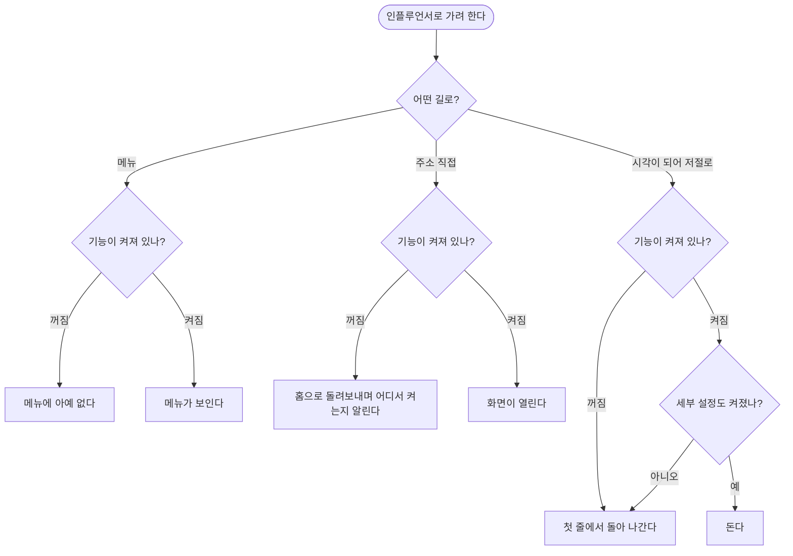

# 쓰지 않는 기능이 화면에 남아 있고 저절로 돌고 있다

## 개요

이 제품은 **재고 대조 전용**으로 방향을 다시 틀었다. 인플루언서 기능은 지금 쓰지 않지만
나중에 다시 켤 것이므로 **코드를 한 줄도 지우지 않고** 설정 화면의 스위치 하나로 끈다.
기본값은 **꺼짐**이다 — 아직 준비 중인 기능이라 새로 올린 사람은 재고 대조만 본다.

조사해 보니 「메뉴만 감추면 된다」 가 아니었다.

## 기능 흐름

## 변경 사항

### 스위치 하나

- `automation/influencer/InfluencerFeature.java` (신규): 판정을 한 곳에 모은다
- `automation/influencer/InfluencerFeatureConfigDefinitions.java` (신규): 정의 1건, 기본 꺼짐

### 주소를 막는다

- `web/influencer/InfluencerAccessInterceptor.java` (신규): `/influencer/**` 를 잡아 홈으로
  돌려보내고 **어디서 켜는지** 함께 알린다
- `web/config/WebMvcConfig.java`: 인터셉터 등록

### 메뉴에서 감춘다

- `web/influencer/InfluencerMenuAdvice.java` (신규): 모든 화면에 값을 채운다
- `templates/layout.html`: 인플루언서 묶음을 조건부로

### 저절로 도는 것을 멈춘다

- `influencer/batch/InfluencerNightlyBatch.java` · `trend/TrendWeeklyBatch.java` ·
  `rising/RisingWeeklyNotifier.java`: 진입 첫 줄에 마스터 가드

### 설정 화면에서 찾을 수 있게

- `web/settings/SystemConfigController.java`: 「인플루언서 기능」 을 **첫 탭**으로

### 시험

- `integration/InfluencerToggleIntegrationTest.java` (신규): 25건
- `automation/influencer/InfluencerFeatureGateTest.java` (신규): 4건
- `integration/AllScreensRenderIntegrationTest.java`: 인플루언서 4개를 전용 시험으로 이관
- `docs/07-DECISIONS.md`: 052 추가

## 주요 구현 내용

### 메뉴만 감추면 감춰지지 않는다

`/influencer/**` 에 **접근 규칙이 하나도 없었다.** `.anyRequest().authenticated()` 만 걸려
있고 컨트롤러에 권한 애노테이션도 없어, 로그인한 사람은 **주소만 알면 그대로 다 썼다.**

열린 입구는 화면 5개(사이드바에 없는 채널 상세 포함)와 **상태를 바꾸는 POST 7개**였다. 그중
AI 심사와 채널 수집은 **누르면 외부 요금과 하루치 할당량을 쓴다.**

> 「감췄다」 와 「껐다」 는 다르다. 감춘 상태는 **감췄다고 믿는 사람**을 만들어서, 실제로 도는
> 것보다 나쁘다 — 도는 줄 알면 확인이라도 한다.

### 지금도 저절로 돌고 있었다

| 언제 | 무엇 |
|---|---|
| 매일 03:00 | 야간 수집 — 할당량 소모 |
| 월요일 04:00 | 트렌드 집계 — **기본값이 켜짐이라 손대지 않아도 돈다** |
| 월요일 09:00 | 주간 알림 — 메시지 발송 |

트렌드 집계는 급상승 낱말을 되먹여 **다음 수집 대상을 스스로 늘린다.** 마스터를 꺼도 이 하나가
살아 있으면 「껐는데 도는」 상태가 된다.

### 마스터 가드는 세부 설정보다 «앞» 에 둔다

기존 세부 가드를 지우지 않고 그 앞에 넣었다. 「기능은 쓰되 이 배치만 끈다」 는 기존 운영
선택지를 없애지 않기 위해서다.

### 읽는 시점

설정값을 빈 만들 때 읽으면 설정을 DB 에 심는 초기화가 아직 돌지 않아 **앱이 뜨지 않는다.**
쓸 때마다 읽는다 — 덤으로 설정을 바꾸면 재기동 없이 먹는다.

### 메뉴 값은 모든 화면이 받아야 한다

좌측 메뉴는 레이아웃에 있고 레이아웃은 화면 전부가 쓴다. 값을 안 채운 화면에서는 **레이아웃이
잘린다.** 이 저장소에는 표현식이 터지면 500 이 아니라 **200 인 채로 페이지가 끊기는** 함정이
있어 잘려도 열린 것처럼 보인다. 그래서 어느 컨트롤러가 그리든 값이 있도록 한 곳에서 채운다.

### 마이그레이션을 만들지 않는다

설정 초기화가 기동할 때 정의에는 있고 DB 에 없는 키를 스스로 넣는다. **이미 있는 값은 덮어쓰지
않으므로** 켜 둔 것이 배포마다 꺼지지 않는다. 인플루언서 표도 지우지 않는다 — 다시 켜면 자료가
이어져야 한다.

## 검증

| 무엇을 | 결과 |
|---|---|
| 기본값이 꺼짐 | 통과 |
| 꺼지면 화면 5개가 막힌다 (숨은 채널 상세 포함) | 통과 |
| 꺼지면 **값을 바꾸는 POST 7개**가 막힌다 (CSRF 토큰이 있어도) | 통과 |
| 메뉴에서 사라지되 레이아웃이 **끝까지** 그려진다 | 통과 |
| **재고 대조·연동 화면 6개가 그대로 200** | 통과 |
| 켜면 화면과 메뉴가 되살아난다 (재기동 없이) | 통과 |
| 저절로 도는 셋이 협력 객체를 하나도 안 부른다 | 통과 |
| 켜도 세부 설정이 꺼져 있으면 그대로 멈춘다 | 통과 |

전체 **777건 통과**. 마이그레이션 없음.

**배포 후 실측**: 컨테이너 정상 기동, 로그에 「시스템 설정 준비 — 신규 1건」 — 새 키가 정확히
하나 심겼다. DB 에서 `influencer.enabled = false` 확인.

## 주의사항

### 시험이 거짓으로 통과할 뻔했다

스케줄러 시험을 처음에는 **빈 설정**을 넘겨 만들었다. 그러면 세부 가드가 어차피 막아 **마스터
가드를 지워도 통과한다.** 세부를 켜 둔 상태로 바꾸고 나서야 반증이 성립했다 — 마스터를 빼자
셋이 정확히 실패했다.

### 건드리면 안 되는 것

- **모듈 의존** — 재고 대조 화면이 인플루언서 모듈을 통해 연동 모듈을 전이로 받는다.
  정리했다면 **대조·연동 화면이 컴파일부터 깨졌다**
- **파이썬 실행 설정과 `scripts/`** — 엑셀 파싱이 같은 설정을 쓴다. 「파이썬은 인플루언서
  것」 으로 묶어 정리하면 연동 파일 적재가 즉시 멈춘다
- **알림 발송 경로 전체** — 재고 대조 알림과 공유다. 인플루언서 알림만 막는 손잡이는 그
  배치의 진입 지점뿐이다
- **캐시 설정** — 앱 전체에서 유일한 캐시 구성이 인플루언서 쪽에 있다. 나중에 「정리」 하면
  대조에 캐시를 넣었을 때 조용히 동작하지 않는다

### 다시 켤 때

설정 → 시스템 설정 → 「인플루언서 기능」 → 켜기. 재기동이 필요 없다.

다만 이미 쌓인 탐색 목록 때문에 **첫 야간 수집이 곧바로 할당량을 크게 쓴다.** 켜기 전에 그것을
비울지 판단한다.

### 남겨 둔 것

세부 설정 카테고리 6개(69건)는 그대로 보인다. 숨기면 화면은 깔끔하지만 **다시 켤 탭까지
사라질** 위험이 있어 손대지 않았다.
