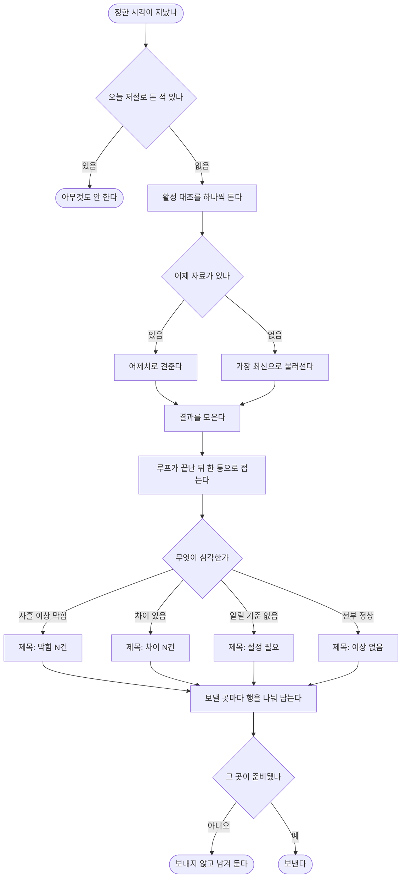

# 대조 결과가 메일로 오지 않고, 실행 시각은 재배포해야 바뀐다

## 개요

범위서가 요구한 두 가지 — 「하루 한 통, **제목이 상황에 따라 달라져 열지 않아도 오늘 볼 일이
있는지 판단**」 과 「실행은 매일 아침 7시, 전일 기준 — **화면에서 바꿀 수 있게**」 — 가 모두
없거나 다르게 동작하고 있었다.

여섯 단계로 나눠 각 단계가 그 자체로 배포 가능하도록 했다.

| 단계 | 끝났을 때 되는 것 |
|---|---|
| 1 | 동작은 그대로, 발송 큐가 **보낼 곳**을 안다 |
| 2 | 설정이 들어 있으면 **메일이 실제로 나간다** |
| 3 | **화면에서 메일 서버를 넣고 「테스트 메일」로 확인** |
| 4 | **매일 한 통이 오고 제목만으로 판단된다** |
| 5 | **재배포 없이 화면에서 실행 시각을 바꾼다** |
| 6 | **전일 기준으로 견준다** |

## 기능 흐름

## 변경 사항

### 발송 큐가 보낼 곳을 안다

- `V36__outbox_channel.sql` (신규): 목적지 칸 + 곳별 인덱스
- `notification/NotificationChannel.java` (신규), `NotificationOutbox.java`
- `notification/OutboxService.java`: 적재 시점에 곳마다 **행을 나눈다**
- `telegram/NotificationRelay.java`: 자기 곳으로 갈 것만 가져간다
- `web/monitor/NotificationHistoryView.java` · `templates/monitor/notifications.html`: 「보낼 곳」 열

### 메일 서버를 담고 실제로 보낸다

- `V37__delivery_setting.sql` (신규): 설정 표와 비밀값 표를 **나눠서**
- `notification/delivery/DeliverySetting.java` · `DeliverySettingService.java` ·
  `DeliverySettingBootstrap.java` · `MailScope.java` (신규)
- `notification/secret/NotificationSecret*.java` (신규 3개): AES-256-GCM
- `notification/delivery/SmtpMailSender.java` · `MailRelay.java` · `MailMessageFactory.java` (신규)
- `ErrorCode.java` + `errors.properties` · `errors_en.properties`: 셋
- `application.yaml`: 메일 상태 점검 끄기

### 발송 관리 화면

- `web/settings/DeliveryController.java` · `DeliveryView.java` (신규)
- `templates/settings/delivery.html` (신규): 상태 / 메일 서버 / 받는 사람 / 정기 실행
- `layout.html` · `ScreenNames.java` · `AllScreensRenderIntegrationTest.java`

### 하루 한 통

- `payload/ReconcileDigestPayload.java` (신규): 제목 계산이 여기 있다
- `engine/ReconcileDigestAssembler.java` · `DefinitionOutcome.java` (신규)
- `engine/ReconcileScheduler.java`: 루프 **밖**에서 한 번만
- `telegram/TelegramMessageFactory.java`: 첫 줄이 메일 제목과 같은 문자열

### 실행 시각을 화면에서

- `engine/ReconcileScheduleKeys.java` · `ReconcileScheduleConfigDefinitions.java` (신규)
- `engine/ReconcileScheduler.java`: 시각 고정에서 **폴링**으로
- `V38__reconcile_run_trigger.sql` (신규) · `run/ReconcileTrigger.java` (신규)

### 전일 기준

- `engine/SnapshotAggregator.java`: 날짜 구간 안의 최신 시각
- `engine/BaseAtResolver.java` · `ReconcileEngine.java`

## 주요 구현 내용

### 무음이 다섯 가지를 동시에 뜻했다

이상이 없으면 아무것도 오지 않았는데, 그 무음은 이걸 전부 뜻했다 — 오늘 깨끗함 / 전부 첫
관찰이라 보류 / 알릴 기준을 안 정함 / 며칠째 막힘 / 보낼 곳이 연결 안 돼 쌓이는 중.

특히 **짝을 못 찾은 품목과 알릴 기준 미설정은 영영 알림으로 나가지 않았다.** 견주는 범위가
조용히 줄어드는데 그 사실이 알림 경로에 한 번도 등장하지 않았다.

> 「열지 않아도 판단」 하려면 무음이 사라져야 한다. **이상이 없어도 매일 보낸다.**

### 통이 세 축으로 갈려 있었다

대조 정의마다, 「차이」 와 「막힘」 이 따로, 일일 리포트는 또 다른 시각. 셋을 다 접는 유일한
자리가 **대조를 다 돌린 뒤**다.

### 막힘은 본문엔 하루째부터, 제목엔 사흘째부터

예전 「고장 한 번에 부름 한 번」 은 막힘이 별개 알림이라 매일 부르면 소음이 됐기 때문이었다.
이제 요약이 어차피 매일 오므로 담는 것 자체는 소음이 아니다. 다만 하루 못 돈 것까지 제목에
올리면 **정작 안 풀리는 막힘이 안 보인다.**

### cron 은 화면에서 바뀔 수 없다

시각 표현은 **기동할 때 한 번** 읽혀 등록된다 — 원리적으로 불가능하다. 게다가 그 설정 키는
**어떤 설정 파일에도 없어서** 바꾸려면 없는 키 이름을 알아내 비밀 설정을 고치고 다시 배포해야
했다. 재기동이 아니라 재배포다.

폴링으로 바꾸면 「오늘 이미 돌았나」 를 이력으로 판단할 수밖에 없는데, 거기 사람이 누른 「지금
맞춰 보기」 가 섞여 있으면 **한 번 눌렀다는 이유로 그날 자동 대조가 통째로 건너뛰어진다.**
그래서 무엇이 시작했는지 남긴다.

### 발송기를 빈으로 두지 않는다

메일 서버 정보를 DB 에 두면 스프링이 만들어 주는 발송기를 쓸 수 없다. 억지로 쓰면 두 가지가
터진다 — 설정이 없는 환경(시험 전부)에서 **컨텍스트가 아예 안 뜨고**, 상태 점검이 실제 메일
서버에 접속해 **메일 서버가 죽으면 멀쩡한 앱의 배포가 실패한다.**

저장된 값으로 직접 조립한다. 「준비되지 않았으면 보내지 않고 남겨 둔다」 가 **시험이 실제
메일 서버에 접속하지 않는 실질적 장치**다.

### 비밀번호

되보여주지 않는다 — 확인용으로 한 번만 보여주는 자리가 있으면 그 자리가 곧 유출 경로다.
**비우고 저장하면 그대로 둔다** — 그러지 않으면 다른 값 하나를 고칠 때마다 다시 쳐야 하고,
잊고 저장하면 발송만 조용히 실패한다.

## 검증

전체 **789건 통과**. 마이그레이션 셋(`V36`·`V37`·`V38`) 전부 PostgreSQL 14 문법.

| 무엇을 | 결과 |
|---|---|
| 아직 안 넣었으면 「대기 중」 이라고 말한다 | 통과 |
| **저장된 비밀번호가 화면에 다시 안 나온다** | 통과 |
| **비우고 저장하면 기존 것이 남는다** | 통과 |
| 잘못된 받는 주소는 저장이 막힌다 | 통과 |
| 준비 전 「테스트 메일」은 **서버에 접속하지 않는다** | 통과 |
| **차이가 없어도 요약은 온다** | 통과 |
| **하루에 여러 번 돌아도 통은 하나다** | 통과 |
| 하루 이틀 막힌 것은 제목에 없되 **본문에는 있다** | 통과 |
| 사람이 눌러 본 횟수가 「며칠째」 로 둔갑하지 않는다 | 통과 |
| **정한 시각을 아직 못 읽어도 터지지 않는다** | 통과 |

**배포 후 실측**: 마이그레이션 셋 성공, 설정 자동 시드(신규 2건), 발송 설정 1행 생성,
`/js` 정적 자원 정상, **기동 로그에 오류 없음**.

## 주의사항

### 시험이 세 번 문제를 먼저 찾았다

1. **알림 종류를 추가하니 컴파일이 깨졌다** — 문구 switch 에 `default` 가 없어 새 종류를
   놓치지 못하게 만든 장치가 의도대로 작동했다
2. **「전일 기준」 으로 바꾸자 스케줄러 시험 셋이 깨졌다** — 어제 자료가 없으면 대조가 막히기
   때문이다. **운영에서도 똑같이 일어날 일**이라 설계를 고쳤다(없으면 물러서기). 시험이
   아니었으면 배포하고 나서 알았다
3. **요약이 전역 집계라 시험끼리 서로의 통을 봤다** — 하루 한 통이라는 성질 자체가 그렇게
   만든 것이다

### 배포하고 나서 하나 더 나왔다

기동 직후 정기 대조가 **설정이 커밋되기 전에** 읽어 터졌다. 로그에 오류가 매번 찍히면 진짜
문제와 구분되지 않으므로 조용히 넘기고 다음 주기에 다시 보게 고쳤다.

**시험으로 잡히지 않는 종류였다** — 시점 문제라 단위·통합 시험이 재현하지 못한다. 배포 후
로그를 실제로 읽은 것이 유일한 발견 경로였다.

### 암호화 키를 바꾸면 비밀값을 다시 넣어야 한다

키 버전도, 옛 키 폴백도, 재암호화 절차도 없다. 연동 쪽 비밀값이 이미 안고 있던 제약을 메일
비밀번호도 그대로 떠안는다.

### 아직 안 한 것

- **엑셀 내려받기** — 범위서에 있는데 코드에 없다. 이번 범위 밖으로 남겼다
- 텔레그램 설정은 기존 화면에 그대로 뒀다. 옮기면 감사·시험·문구가 같이 움직여 범위가 두 배가
  된다
- 「지금 맞춰 보기」 는 여전히 **가장 최신**을 본다. 방금 가져온 것을 확인하려는 동작이라
  그쪽이 맞다고 보았으나, 자동과 다른 날짜를 본다는 점은 알고 있어야 한다
