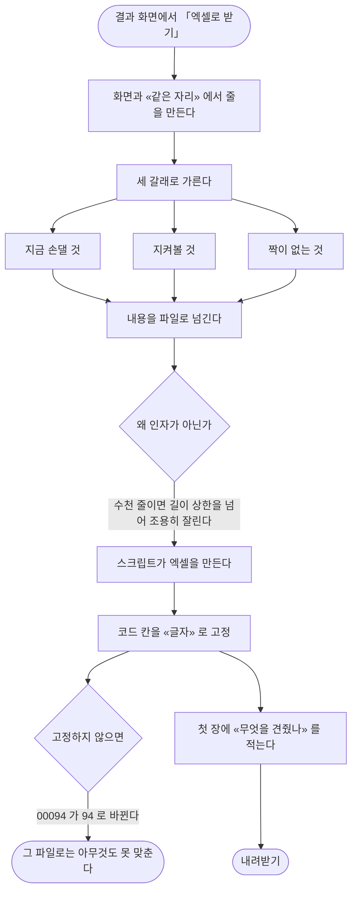

# 대조 결과를 엑셀로 내려받을 수 없다

## 개요

범위서가 결과를 보는 방법 셋을 요구했는데 — 웹 화면 · 메일 · **엑셀 내려받기** — 마지막이
없었다. 이걸로 명세의 결과 표시가 다 채워진다.

> 「이카운트에서 수정하실 때 **옆에 띄워 두고 보시라고**」

화면은 고치는 동안 계속 볼 수 없다. 다른 창에서 재고를 만지는 사이 화면을 떠나면 어디까지
봤는지 잃는다.

## 기능 흐름

## 변경 사항

- `scripts/write_reconcile_xlsx.py` (신규): 결과를 엑셀로 쓴다
- `web/reconcile/ReconcileXlsxWriter.java` (신규): 스크립트 호출. 규약 그대로 —
  인자 배열 · stdout JSON only · 인코딩 고정 · 타임아웃 + 강제 종료
- `web/reconcile/ReconcileController.java`: 내려받기 경로 + 결과 줄 조립을 **공용으로**
- `templates/reconcile/run-detail.html`: 「엑셀로 받기」
- `.github/workflows/build.yml`: CI 에 엑셀 라이브러리
- `web/reconcile/ReconcileXlsxWriterTest.java` (신규): 4건

## 주요 구현 내용

### CSV 로는 안 된다

엑셀은 CSV 를 읽을 때 값을 **숫자로 해석한다.** 품목코드 `00094` 가 `94` 로, `01002` 가
`1,002` 로 바뀐다.

**이 제품의 핵심이 그 코드를 견주는 것이다.** 내려받은 파일에서 코드가 달라지면 그 파일로는
아무것도 못 맞춘다. 같은 함정을 화면에서 이미 한 번 겪었다 — 숫자처럼 「생긴」 값을 다듬어
품목코드가 바뀌어 보였다.

진짜 엑셀 파일을 만들고 코드 칸의 서식을 글자로 둔다.

### 새 의존을 더하지 않았다

엑셀 라이브러리가 이미 배포 이미지에 있다 — 파일을 **읽는** 데 쓰고 있었다. 자바 쪽 라이브러리를
새로 더하면 같은 일을 하는 것이 둘이 된다.

### 내용을 인자가 아니라 파일로 넘긴다

결과가 수천 줄이 될 수 있는데, 명령행 길이 상한을 넘으면 그때부터 **조용히 잘린다.** 잘린
파일은 「틀린 파일」 이 아니라 **「짧은 파일」** 이라 사람이 알아채지 못한다.

### 화면과 같은 자리에서 줄을 만든다

따로 만들면 화면에는 있는데 파일에는 없는 줄이 생기고, 그때 어느 쪽을 믿을지 알 수 없다.

### 파일이 스스로 무엇인지 말한다

첫 장이 「이 대조는」 이다 — 언제 것을, **무슨 조건으로** 견줬는지. 며칠 뒤에 열면 화면과
짝지을 수 없으므로 파일이 스스로 말해야 한다. 특히 조건을 적는 이유 — 전 창고를 더한 것과
한 창고만 본 것은 **완전히 다른 표**다.

### 짝이 없는 것을 따로 담는다

화면에서 잘 안 보이던 갈래다. 견주지 못하고 빠진 품목이 쌓이면 대조 범위가 조용히 줄어든다.

## 검증

| 무엇을 | 결과 |
|---|---|
| 엑셀 파일이 만들어진다 | 통과 (zip 서명 확인) |
| **품목코드가 글자 그대로 남는다** | 통과 — 앞의 0 이 살아 있고, 글자 타입이며, 숫자 모양이 아니다 |
| 갈래마다 장이 하나씩 + 「무엇을 견줬나」 | 통과 |
| 결과가 비어도 파일은 나온다 | 통과 |

전체 **793건 통과**. 마이그레이션 없음.

**반증 실험**: 값을 숫자로 넣도록 스크립트를 바꾸자 「품목코드」 시험 하나만 실패했다.

**배포 후 실측**: 운영 컨테이너에 스크립트와 라이브러리가 있고, 실제로 엑셀을 만들어 확인했다.

## 주의사항

### CI 에 라이브러리를 넣었다

이 시험은 스크립트를 **실제로 실행**한다. 없으면 건너뛰게 만들 수도 있었지만 **건너뛰는 시험은
없는 시험**이다 — 「내려받았는데 안 열린다」 를 사람이 먼저 찾게 된다.

### 겪은 함정 둘

1. **Gradle 은 각 모듈 디렉터리에서 시험을 돌린다** — `scripts` 상대경로가 엉뚱한 곳을
   가리킨다. 기존 엑셀 **읽기** 시험이 같은 함정을 이미 풀어 두어 그대로 따랐다
2. **스크립트는 Gradle 의 입력이 아니다** — 반증 실험에서 스크립트만 바꾸자 시험이 다시 돌지
   않아 「통과」 로 보였다. 강제로 다시 돌려서야 진짜 결과가 나왔다. **스크립트를 고쳤을 때
   시험이 자동으로 다시 돌지 않는다**는 것을 알고 있어야 한다

### 큰 결과는 아직 안 겪었다

지금 운영 자료가 수십 줄이라 수천 줄일 때의 시간과 메모리를 실측하지 못했다. 바이트로 한 번에
읽어 돌려주므로, 결과가 아주 커지면 그 방식을 다시 봐야 한다.
