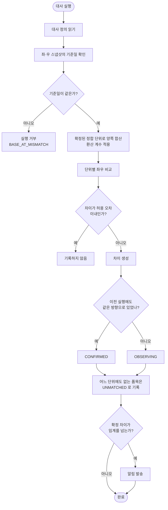
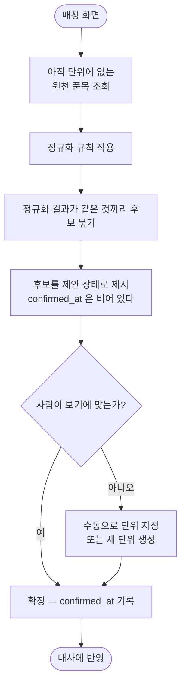

# 재고 정합성 대사 설계

> 이슈 #49. 전산 원천(ERP)과 물류 원천(3PL WMS)의 재고를 대조해 불일치를 찾아낸다.
> `palim-connector`(#53·#55) 위에 얹는다 — 원천에서 표준 모델까지는 이미 끝났고,
> 이 문서는 **표준 모델 위에서 도는 대사**를 다룬다.

## 1. 왜 이 설계인가

발주사는 두 시스템의 재고가 어긋난 것을 사람이 눈으로 찾고 있다. 어긋나는 방식은 두 가지다.

| 유형 | 상태 | 결과 |
|---|---|---|
| 발송 누락 반영 | 실제로 발송했는데 체크가 안 됨 | 전산엔 있는데 실물이 없다 → 판매 후 출고 불가 |
| 유령 발송 | 발송 안 했는데 발송한 것으로 되어 있음 | 전산엔 없는데 실물이 있다 → 팔 수 있는 걸 못 판다 |

**대사는 재고만의 문제가 아니다.** 두 집합을 같은 기준으로 묶어 수치를 비교하고 차이를 분류하는
일은 인사·회계·정산 어디서나 반복된다. 그래서 비교 축·비교 값·허용 오차를 코드에 박지 않고
**정의 데이터**로 받는다. 커넥터가 「적재 정의」를 행으로 뒀듯, 대사는 「대사 정의」를 행으로 둔다.

재고는 이 엔진의 첫 사용처다.

## 2. 실측으로 확인한 전제

설계 전에 실제 물류 원천 화면을 조회해 확인했다. 아래는 **설계를 바꾼 사실들**이다.

### 2.1 같은 물건이 원천마다 다른 개수로 잡힌다

물류 원천은 유통기한이 다르면 **별개 품목**으로 등록한다. 품명 안에 기한이 들어간다.

```
00085   제품A 227g (27.04.07)
00087   제품A 227g (27.05.14)
00086   제품A 425g (27.04.13)
00088   제품A 425g (27.04.14)
```

전산 원천이 이것을 「제품A 227g」 하나로 잡으면 대사는 1:1 비교가 아니라 **N:1 합산 비교**가 된다.

> 전산 원천 화면은 헤드리스 브라우저에서 열리지 않아 직접 확인하지 못했다. 다만 **어느 쪽이든
> 설계는 같다** — 전산이 기한별로 나눠 잡으면 1:1, 안 나누면 N:1이고, 엔진은 두 경우를 모두
> 지원해야 다음 발주사에서 다시 막히지 않는다. 확인되면 매핑 데이터가 채워질 뿐 코드는 그대로다.

### 2.2 집계 축은 같은 시스템 안에서도 다르다

물류 원천의 현재 재고 화면에는 로트 구분이 있지만, 과거 재고 화면에는 로트 컬럼이 아예 없다.
**집계 축을 코드에 박으면 화면 하나 바뀔 때마다 코드가 깨진다.** 축은 대사 정의가 갖는다.

### 2.3 기준일을 지정해 다시 뽑을 수 있다

물류 원천에 「과거 재고 조회」가 있다. 날짜를 지정하면 그날 기준 재고를 정상/불량으로 나눠 주고,
그 기간의 입고·출고·발주·배송 수량을 함께 준다. 엑셀 다운로드도 된다.

```
공급처 | 상품코드 | 상품명 | 옵션 | 원가 | 판매가 | 입고 | 출고 | 발주 | 배송 | {날짜} 정상 | {날짜} 불량
```

**이것이 시점 정합의 1차 방어선이다.** 기준일을 맞춰 다시 뽑을 수 있으므로, 기준일이 어긋난
스냅샷을 억지로 비교할 이유가 없다.

### 2.4 출력 양식은 상대도 매핑으로 다룬다

물류 원천의 발주 화면에는 `기준헤더 | 발주서 헤더` 열이 있다. 거래처마다 엑셀 컬럼명이 달라서
그쪽도 하드코딩을 못 하고 매핑 테이블을 둔 것이다. 필수 표시가 붙은 기준헤더는 `주문번호`·
`상품코드`·`수량`·`수령자명` 네 개다.

→ 발주서 출력은 **이번 범위에서 제외**하되(9장), 이 사실 때문에 출력도 템플릿을 데이터로 두는
설계가 확정됐다.

## 3. 범위

### 이번에 만드는 것

- 정합 단위(대사 기본 단위)와 원천 품목 연결 — 환산 계수 포함
- 품명 정규화 규칙과 매칭 후보 자동 제안
- 대사 정의 · 대사 실행 · 차이 분류
- 관찰중 → 확정 승격
- 조치 상태 추적
- 화면: 정합 단위 관리, 대사 실행·결과, 정규화 규칙
- 임계 초과 시 알림

### 이번에 하지 않는 것

| 제외 | 이유 |
|---|---|
| 발주서 출력 | 범위가 커서 별도 스펙으로 뗀다. 붙일 자리는 9장에 남긴다 |
| 원천 API 직접 수집 | 전산 원천 인증키는 회사 마스터 권한이 필요하고, 물류 원천 API는 유료 결정이 안 났다. 엑셀 업로드로 완주된다 |
| 재고 예측·발주량 산정 | 데이터가 쌓인 뒤 |
| 전산 원천 재고 입력 자동화 | 발주사가 당분간 수동 유지 |

## 4. 모듈

**새 모듈 `palim-reconcile`.**

`palim-automation`에 넣지 않는다 — 그쪽은 인플루언서 코드가 113개 파일로 차 있고 성격이 다르다.
`palim-connector`에도 넣지 않는다 — 커넥터는 "원천을 표준 모델로 들이는 일"만 알아야 하고,
대사는 그 위 계층이다.

```
palim-connector   원천 → 표준 모델        (도메인을 모른다)
palim-reconcile   표준 모델 → 차이         (원천을 모른다)
palim-web         화면
```

의존 방향은 `reconcile → common`뿐이다. reconcile 은 connector 를 의존하지 않는다 — 둘 다
표준 모델 테이블을 통해서만 만난다. 동결 도메인(`palim-sku` 등)은 건드리지 않는다.

## 5. 데이터 모델

모든 테이블에 `tenant_id`가 있고 `@Filter`로 격리된다(#55와 동일). 시각은 전 계층 `Instant`,
DB `timestamptz`. `JdbcClient` 바인딩에는 `OffsetDateTime`을 쓴다.

### 5.1 정합 단위

```
reconcile_unit
  id, tenant_id
  code            식별자 (예: "제품A-227g")
  name            표시명
  base_unit       이 단위의 기준 단위 (EA 등)
  is_active
  created_at, updated_at
  UNIQUE (tenant_id, code)

reconcile_unit_member
  id, tenant_id
  unit_id         → reconcile_unit
  source          원천 이름 (스냅샷의 source 와 같은 값)
  item_ref        그 원천에서의 품목 식별자
  factor          환산 계수 numeric(19,6) NOT NULL DEFAULT 1
  confirmed_at    확정 시각. NULL 이면 제안 상태 — 대사에 쓰지 않는다
  created_at, updated_at
  UNIQUE (tenant_id, source, item_ref)   -- 한 품목은 한 단위에만 속한다
```

`factor`가 세트 상품을 흡수한다. "1세트 = 본품 2 + 사은품 1"과 "전산 1품목 = 물류 3품목"이
같은 구조가 된다. 별도 세트 기능을 만들지 않는다.

`UNIQUE (tenant_id, source, item_ref)`는 한 품목이 두 단위에 붙는 것을 막는다. 붙으면 그 품목
수량이 두 번 세어지고, **대사 결과가 조용히 틀린다.**

`confirmed_at`이 자동 제안과 확정을 가른다. 제안은 행으로 남지만 대사에는 들어가지 않는다.

### 5.2 정규화 규칙

```
normalization_rule
  id, tenant_id
  name            "괄호 안 유통기한 분리"
  pattern         정규식
  replacement     치환 문자열
  sort_order      적용 순서
  is_active
  created_at, updated_at
```

규칙은 순서대로 적용된다. 원본 품명은 `std_stock_snapshot.raw_item_name`에 이미 보존되어 있어
규칙을 바꾼 뒤 다시 계산할 수 있다.

### 5.3 대사 정의

```
reconcile_definition
  id, tenant_id
  code, name
  left_source     좌측 원천 이름
  right_source    우측 원천 이름
  target_table    비교 대상 표준 모델 (기본 std_stock_snapshot)
  compare_field   비교할 수치 필드 (기본 base_quantity)
  tolerance       허용 오차 numeric(19,3) NOT NULL DEFAULT 0
  alert_threshold 알림 임계. NULL 이면 알리지 않는다
  is_active
  created_at, updated_at
  UNIQUE (tenant_id, code)
```

`compare_field`를 정의로 받기 때문에 금액 대사(`amount`)나 가용수량 대사(`available_quantity`)로
바꿔도 코드를 고치지 않는다.

### 5.4 실행과 차이

```
reconcile_run
  id, tenant_id
  definition_id
  base_at         대사 기준일 (양쪽 스냅샷이 공유하는 시각)
  status          RUNNING | SUCCESS | FAILED
  left_count, right_count, diff_count, unmatched_count
  started_at, finished_at
  message         실패 사유
  created_at, updated_at

reconcile_diff
  id, tenant_id
  run_id
  unit_id         NULL 이면 미매칭 (아직 어느 단위에도 속하지 않은 품목)
  unit_code       조회 편의용 스냅샷 값
  left_quantity, right_quantity, delta        numeric(19,3)
  diff_type       LEFT_MORE | RIGHT_MORE | UNMATCHED_LEFT | UNMATCHED_RIGHT
  state           OBSERVING | CONFIRMED | RESOLVED | IGNORED
  action_status   UNCHECKED | CHECKING | DONE | IGNORED
  action_note     조치 메모
  first_seen_run_id   이 차이가 처음 관찰된 실행
  amount          금액 환산값. 정렬용
  created_at, updated_at
  INDEX (tenant_id, run_id)
  INDEX (tenant_id, unit_id, diff_type)
```

`first_seen_run_id`가 승격 판정의 근거다. 이전 실행에서 같은 단위·같은 방향의 차이를 찾을 때 쓴다.

## 6. 대사 흐름



### 6.1 합산

```sql
SELECT m.unit_id,
       sum(s.base_quantity * m.factor) AS qty
  FROM std_stock_snapshot s
  JOIN reconcile_unit_member m
    ON m.tenant_id = s.tenant_id
   AND m.source    = s.source
   AND m.item_ref  = s.item_ref
   AND m.confirmed_at IS NOT NULL
 WHERE s.tenant_id = :tenantId
   AND s.source    = :source
   AND s.base_at   = :baseAt
 GROUP BY m.unit_id
```

`confirmed_at IS NOT NULL`이 제안 상태를 걸러낸다. 이 조건이 빠지면 **사람이 확인하지 않은
추측으로 재고를 합산**하게 되고, 그 결과가 맞는지 아무도 모른다.

## 7. 시점 정합 — 조용히 비교하지 않는다

**기준일이 다른 스냅샷은 비교를 거부한다.**

두 재고를 다른 시각에 뽑으면 그 사이 출고분만큼 무조건 차이가 난다. 억지로 맞춰 비교하면 그
차이가 진짜인지 시간 탓인지 영영 알 수 없고, 그런 결과는 몇 번 어긋나는 순간 아무도 보지 않게
된다. **대사가 신뢰를 잃는 것이 대사가 없는 것보다 나쁘다** — 있는데 아무도 안 보는 화면이 되면,
문제가 있다는 사실 자체가 가려진다.

거부가 막다른 길이 아닌 이유는 2.3이다. 기준일을 지정해 다시 뽑을 수 있다.

그 위에 **관찰중 → 확정** 승격을 얹는다.

| 회차 | 상태 | 뜻 |
|---|---|---|
| 처음 | `OBSERVING` | 반영 지연일 수 있다. 알리지 않는다 |
| 다음 실행에도 같은 단위·같은 방향 | `CONFIRMED` | 시간으로 설명되지 않는다. 알린다 |

반영 지연은 다음 회차에 사라지고 진짜 불일치만 남는다.

## 8. 매칭



정규화는 **후보를 좁힐 뿐 확정하지 않는다.** 규칙이 틀리면 엉뚱한 품목을 합쳐놓고 "재고가
맞는다"고 보고하는데, 이건 불일치를 못 찾는 것보다 나쁘다 — 틀렸다는 사실조차 드러나지 않는다.

## 9. 발주서 출력 — 이번엔 만들지 않는다

2.4에서 확인했듯 출력 양식은 거래처마다 다르고, 상대 시스템도 매핑 테이블로 다룬다. 나중에
붙일 때는 아래 형태가 된다.

```
output_template        어느 표준 모델을 어떤 컬럼 순서로 내보내나
output_template_field  기준 필드 ↔ 출력 헤더명, 필수 여부
```

`std_outbound_order`가 이미 `order_no`·`item_ref`·`quantity`·`receiver_name`·`receiver_phone`·
`receiver_address`·`postal_code`·`delivery_memo`를 갖고 있어 **출력 필드는 표준 모델에서 그대로
나온다.** 이번 설계는 이 확장을 막지 않는다 — 대사는 `std_stock_snapshot`만 읽고, 출력은
`std_outbound_order`를 읽으므로 서로 간섭하지 않는다.

## 10. 화면

| 경로 | 내용 |
|---|---|
| `/reconcile` | 대사 정의 목록 — 마지막 실행 결과를 뱃지로 |
| `/reconcile/{id}/run` | 즉시 실행. 기준일 선택 |
| `/reconcile/runs/{runId}` | 결과 — 차이 목록, 금액순 정렬, 유형·상태 필터 |
| `/reconcile/units` | 정합 단위 목록·생성 |
| `/reconcile/units/{id}` | 단위에 붙은 원천 품목, 환산 계수 편집 |
| `/reconcile/match` | **매칭 화면** — 미매칭 품목, 자동 후보, 확정 |
| `/reconcile/rules` | 정규화 규칙 |

차이 목록에서 조치 상태와 메모를 바로 바꾼다. 조치가 화면 밖(메신저·구두)에서만 이뤄지면
같은 불일치를 매일 다시 조사하게 된다.

## 11. 실패 처리

**미매칭은 실패가 아니라 결과의 한 유형이다.** 매칭 안 된 품목 하나 때문에 대사 전체를 중단하면
품목이 늘어날수록 대사가 안 돌아간다. `UNMATCHED_LEFT`/`UNMATCHED_RIGHT`로 분류해 결과에 싣고
대사는 완주한다. 대신 화면에서 눈에 띄게 두고 건수를 실행 요약에 넣는다.

예외는 `BusinessException` + `ErrorCode`만 쓴다. 새 예외 클래스를 만들지 않는다.

| ErrorCode | 상황 |
|---|---|
| `RECONCILE_DEFINITION_NOT_FOUND` | 대사 정의 없음 |
| `BASE_AT_MISMATCH` | 좌우 기준일이 다름 |
| `SNAPSHOT_NOT_FOUND` | 해당 기준일 스냅샷 없음 |
| `UNIT_MEMBER_DUPLICATED` | 한 품목을 두 단위에 붙이려 함 |
| `UNIT_HAS_NO_MEMBER` | 멤버 없는 단위로 대사 시도 |
| `INVALID_NORMALIZATION_PATTERN` | 정규식이 잘못됨 |

접두사는 `ErrorCode` 표에 새 문자 하나를 추가해 배정한다(#53에서 `K` 추가와 같은 방식).
`ErrorCodeIntegrationTest`의 접두사 화이트리스트에도 함께 넣는다 — 빠뜨리면 빌드가 깨진다.

## 12. 알림

`palim-notification`의 아웃박스를 그대로 쓴다. 새 채널을 만들지 않는다.

- 확정(`CONFIRMED`) 차이의 금액 합계가 `alert_threshold`를 넘을 때만 발송
- 관찰중은 알리지 않는다 — 반영 지연으로 매일 알림이 오면 알림을 끄게 된다
- 페이로드에 실행 ID·건수·상위 금액 항목을 담아 화면으로 바로 연결

## 13. 테스트

Testcontainers 실 PostgreSQL. 인메모리 DB를 쓰지 않는다.

반드시 덮는 것:

| 테스트 | 왜 |
|---|---|
| N:1 합산 | 유통기한별로 나뉜 품목이 하나로 합산되는가 |
| 환산 계수 | 세트 구성이 계수로 표현되는가 |
| 제안은 대사에 안 들어감 | `confirmed_at IS NULL`이 제외되는가 |
| 한 품목 두 단위 금지 | 유니크 제약이 실제로 막는가 |
| 기준일 불일치 거부 | 조용히 비교하지 않는가 |
| 관찰 → 확정 승격 | 두 번째 실행에서 올라가는가 |
| 반영 지연은 승격 안 됨 | 다음 회차에 사라지면 확정되지 않는가 |
| 미매칭이 대사를 멈추지 않음 | 완주하고 건수가 집계되는가 |
| 정규화 규칙 변경 후 재계산 | `raw_item_name`으로 다시 계산되는가 |
| 테넌트 격리 | 두 번째 테넌트를 만들어 확인 |

## 14. 남는 판단

이 설계로 확정하되, 실제 데이터를 받은 뒤 다시 볼 것:

- **전산 원천이 유통기한을 나눠 잡는가** — 나누면 매칭이 1:1이 되어 작업량이 크게 준다
- **정상/불량을 대사에 포함할지** — 물류 원천은 나눠 주는데 전산이 안 나누면 정상만 비교해야 한다.
  대사 정의에 필터 조건을 추가하는 형태로 흡수한다
- **허용 오차의 실제 값** — 0으로 시작하되 운영하며 조정한다
